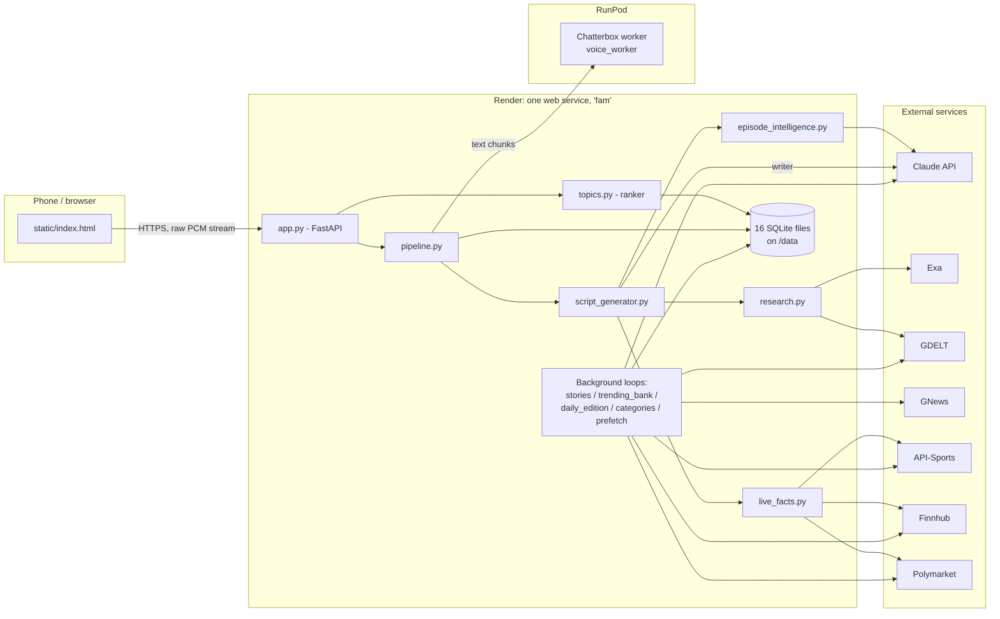
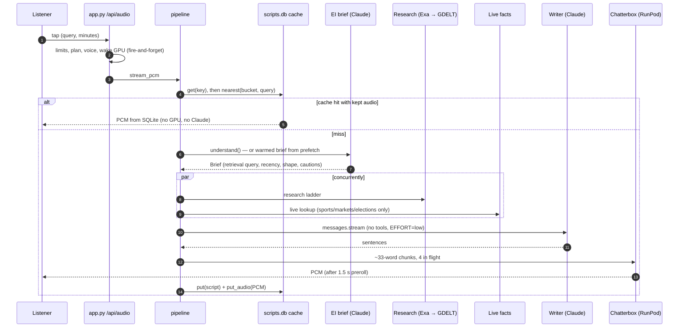
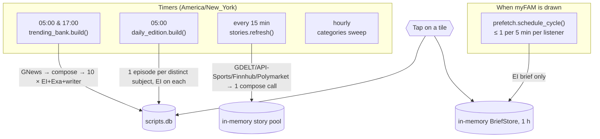
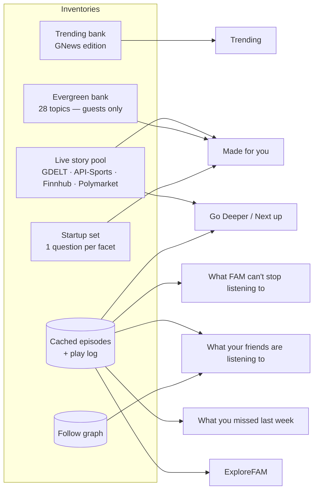
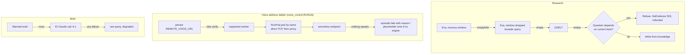

# FAM — Backend: latency, surfaces, and external services

| | |
|---|---|
| **Status** | Official documentation, v1 |
| **As of** | 2026-09-25 (code at `Main` after PR #59) |
| **Audience** | Engineers, and anyone who needs to know why a screen shows what it shows |
| **Companion docs** | [`FINANCIAL.md`](FINANCIAL.md), [`DATA.md`](DATA.md), `MYFAM.md`, `TRENDING.md`, `LIVE_FACTS.md`, `REMOTE_VOICE.md` |

The diagrams are Mermaid. They render on GitHub and in the published HTML
version of these docs.

---

## 1. System at a glance

---

## 2. Episode latency breakdown

### 2.1 The main pipeline: SearchFAM, tap to first audio

Search is the one surface where a model writes on the tap. The steps below run
**in order**. That order is a product rule (CLAUDE.md, §108): nothing is spoken
until the writer holds the brief and the evidence.

Each step is timed by `episode_marks.EpisodeMarks`. The server logs one
`episode timing` block per non-cached episode at first audio (`app.py:5383`),
and a second line when the stream ends.

| # | Stage (log name) | Marks | What happens | Code | Budget or measured time |
|---|---|---|---|---|---|
| 0 | **setup** | origin → `claude_start` | Rate limit, `_validated_plan`, quota reservation, voice choice, `_wake_remote_voice()` fired without waiting, cache lookup (exact key, then vector near-match) | `app.py:5202`, `pipeline.py:1209` | Near-match scan **8.93 ms** on a miss (measured) |
| 1 | **brief** | `brief_start` → `brief_ready` | One Claude call returning a JSON `Brief`: the query to run, recency window, story shape, what must not be assumed. **Skipped** when prefetch warmed it. | `script_generator.py:1181`, `episode_intelligence.py:745` | Timeout **8 s** (`EI_TIMEOUT_SECONDS`); on failure the raw query is used. Real duration **not yet measured.** |
| 2 | **evidence** | `evidence_start` → `evidence_ready` | `asyncio.gather(live_lookup, research)`. The live lookup runs only for sports, markets and elections. | `script_generator.py:1243` | Live: 1.5 s per source, 2.5 s total. Exa ≈ **0.5 s** (measured). |
| 2a | – search | → `retrieval_ready` | Exa (`fast`, 8 results) → Exa again without the recency window if the result is thin → GDELT | `research.py:581`, `:799` | GDELT rung waits ≤ 6 s for a slot |
| 2b | – live lookup | → `live_ready` | Provider catalogue → status (`scheduled`/`in_progress`/`final`/`unknown`) | `live_facts.py:745` | ≤ 2.5 s |
| 3 | **writer thinking** | `writer_request` → `claude_first_token` | Streaming writer call. It reasons (hidden thinking, `EFFORT=low`) before its first token. | `script_generator.py:1390` | §129 expects this to be **the largest single step**. Not yet measured. |
| 4 | **first sentence** | → `first_sentence` | Tokens accumulate until a sentence ends. `OpeningGuard` drops meta-disclaimers in the first 6 sentences. | `script_generator.py:222` | Model text runs ~16x faster than speech |
| 5 | **voice queue** | → `first_tts_start` | The sentence is chunked (~33 words) and queued | `pipeline._speak_chunk`, `speech_assembly.py` | |
| 6 | **first synthesis** | → `first_tts_complete` | RunPod call (serverless `/runsync` or pod `/synth`) | `remote_voice.py:696` | Warm: ~2 s/chunk. Cold worker: boot + ~10 s model load (timeout 180 s). |
| 7 | **first audio** | preroll | The server buffers `PREROLL_SECONDS=1.5` of PCM, then sends headers and streams | `config.py:1257` | |

**What is known about the total.**

| Measurement | Result |
|---|---|
| Before §82 and §108 moved research and planning ahead of the first word | **0.5 s to first audio** (measured) |
| Phase 6, search to first listen on a warm RTX 4090 | **2.99 s** (measured, `episode_marks.py` docstring) |
| After §108 | "Several seconds by construction". The reported worst case was up to 45 s (§128). |

**No real post-§128 episode has been timed.** To get the answer, read the
`episode timing` lines in the Render logs, or run `tools/latency_probe.py`.

**The loading screen shows these steps** (§148). `/api/progress` maps the marks
to five checkboxes:

| Checkbox | Mark |
|---|---|
| contextualizing | `brief_ready` |
| retrieving | `evidence_ready` |
| verifying | `claude_first_token` |
| finalizing | `first_sentence` |
| generating the audio | client-side, when audio arrives |

Each checkbox stays on screen for at least 2 s. A replay ticks all five at
once.

### 2.2 The background browse path

On every surface except search, the expensive work happens **before the tap**.

| Background job | When | What it produces | Cost of a later tap, in time |
|---|---|---|---|
| **Trending edition** (`trending_bank.py:771`) | 05:00 and 17:00 ET, boot + 60 s stagger | 10 whole **scripts** in the cache (`origin="trending"`), kept until the edition expires (≤ 36 h) | **Cache hit**: no Claude, no Exa. The first play voices it (GPU). Every later play streams from SQLite. |
| **DailyFAM edition** (`daily_edition.py:498`) | 05:00 ET, plus immediately when a mix is saved (`_write_mix_ahead`) | One whole **script** per distinct subject (`origin="dailyfam"`), told its earlier editions' titles | **Cache hit**, the same as above. The server owns the dated prompt and the minutes, so the tap's key matches. |
| **Story pool** (`stories.py:1352`) | Every 15 min, and whenever `/api/myfam` finds it stale | Tiles only: a title and an angle. **No script.** | A tap is a real generation, minus the brief if prefetch warmed it |
| **Prefetch** (`prefetch.py:922`) | On `/api/myfam`, at most once per 5 min per listener, while no live episode is generating | Warmed **briefs** (`PREFETCH_LEVEL=brief`) for up to 6 likely taps | Removes stage 1 from the tap |
| **Category sweep** (`categories.py`) | Hourly | The ranking vocabulary (no episodes) | n/a |

Every browse episode is fixed at **2 minutes** (`BROWSE_MINUTES`). That is what
lets a background-written script match the key a tap asks for.

---

## 3. Where each section comes from

Every browse rail is built by `topics.build_feed`, called from `/api/myfam`
(`app.py:4210`). That route makes **no model call** and awaits nothing
external. It reads the event log, the cache and the in-memory pools, records
impressions, and schedules prefetch.

**Common rules:**

- Every choosing rail shows exactly `SECTION_SIZE = 4` tiles.
- The pipeline for a choosing rail is: taste → `ready_first`, which puts tiles
  with a cached script first as a sort and never a filter → drop repeats
  (`is_repeat`).
- The fill order is `missed → from_history → followers → might_like →
  most_played` (`topics.py:1416`). Trending is reserved before any of them.

### Trending

| | |
|---|---|
| **Source** | The GNews **Trending edition** (`trending_bank.stories_now()`), and nothing else (§139) |
| **Path** | GNews top headlines: 9 categories + 5 countries + 12 corroborating searches → `stories.compose` (1 Claude call) → 10 episodes pre-written → `world_inventory()` → `rank_world()`, which ranks on popularity and the listener's country only (`WORLD_LOCAL_SLOTS=2`), one tile per facet. A story the listener has already heard becomes a "what's new since you listened" follow-up after 6 h, or is dropped (`trending_for`). |
| **Fallback** | **None, by design.** An empty edition gives an empty row with a stated reason (`trending_bank.empty_reason()`). Only `TRENDING_BANK=0` restores the older live-pool Trending. |
| **View more** | `trending_groups`: Worldwide, then the listener's region, then everywhere else |

### Made for you

| | |
|---|---|
| **Source** | `browse_inventory()` (`topics.py:1318`). **Guest:** live pool + evergreen bank (28). **Account:** live pool + startup set. |
| **Path, warm listener** | `taste()` profile → `rank_from_history`: affinity + semantic term (numpy, `taste_vectors`) × fatigue × freshness × broad-match penalty × local boost × engagement, then `RELEVANCE_FLOOR`, then an optional learned re-order (`learned_rank`) → `ready_first` → `diversify` → no repeats. See `DATA.md` §5. |
| **Path, cold listener** (no profile) | `rank_startup` over the startup set, ordered by `popular_facets`, under the heading **"Start here"** |
| **Fallback** | `RAIL_MINIMUM = {"from_history": 4}`: `_rail_fallback` tops the rail up from the listener's inventory by affinity, then `STARTUP_TOPICS + TOPIC_BANK` |

### Go Deeper (after an episode, and the "Pick up where you left off" card)

| | |
|---|---|
| **Sources** | (1) The `<<NEXT:>>` line the writer produced for this episode, stored in the cache's `thread` column and served by `/api/next`. No extra model call. (2) `rank_next_up` (`topics.py:4769`) over `browse_inventory`. (3) `/api/godeeper`: saved progress, open threads, and "similar". |
| **Path** | Countdown tile: the album's next episode if there is one → the predicted `<<NEXT:>>` follow-up → the ranking's first pick. Grid tiles: `rank_from_history` (with the just-heard episode's tags seeded at `JUST_HEARD_WEIGHT`) → `rank_followers` → `rank_most_played` → the inventory ignoring "already played". |
| **Fallback** | That chain is the fallback. `/api/godeeper` is account-only and empty until something has been played. Not shown on Explore. |

### What FAM can't stop listening to

| | |
|---|---|
| **Source** | The play log (`myfam.db` events) joined to **cached** episodes |
| **Path** | `rank_most_played` (`topics.py:2729`): listens per normalised question over 30 days, a finished listen counted once, cached episodes only. Bank tiles count if they were really played. |
| **Fallback** | **None** (§125, §141). An unplayed deployment gives an empty row with a sentence. `tools/seed_demo.py` fills it for a demo. |

### What your friends are listening to

| | |
|---|---|
| **Source** | `social.circle_of(user)`: mutual friends first, then anyone they follow → their plays within `FRIENDS_WINDOW` (14 d) **or** episodes they authored (`scripts.author`) |
| **Path** | `rank_friends` (`topics.py:3320`), cached only |
| **Fallback** | **None.** An empty circle gives an empty rail that names the two taps that fix it. It never shows strangers. |

### What you missed last week

| | |
|---|---|
| **Source** | Other listeners' plays 3-7 days ago (`MISSED_WINDOW`, `MISSED_QUIET`) that this listener has never heard |
| **Path** | `rank_missed` (`topics.py:3264`). It excludes anything written from a live feed (Polymarket, Finnhub, API-Sports), the story pool and Trending. Ordered by listens → listener count → affinity. First in the fill order. |
| **Fallback** | **None**, and no top-up (§141) |

### SearchFAM

| | |
|---|---|
| **Source** | The typed question (plus attachments), or a spoken one (§151): the browser's own speech recognition turns it into text on the phone, and only that text reaches FAM, through the same `runSearch()` path as typing. Nothing is searched until send is pressed. |
| **Path** | The full pipeline in §2.1. `origin="search"`. The listener picks the voice. Minutes are whatever they chose, 1-10. |
| **Fallbacks** | Exact cache → near-match cache → generate. **Brief:** Claude → raw query (`degraded`). **Evidence:** Exa → Exa without recency → GDELT → **refuse** (`NoEvidence`, HTTP 503, refunded), and only if the question depends on current facts. Evergreen questions are answered from knowledge. **Voice:** see §4. An attached episode is never cached. |

### DailyFAM

| | |
|---|---|
| **Source** | `mixes.db`: the subjects a listener follows (`f:nfl`, `f:nfl~Eagles`, typed questions) and other listeners' public mixes (`/api/mixes/public`) |
| **Path** | `daily_edition` writes one episode per distinct subject at 05:00 ET (§2.2). `/api/mixes` serves each item's dated `prompt` and `minutes`, so the tap is a cache hit. |
| **Fallback** | If the edition did not write it (a failure, the cap was hit, the subject is new), the tap writes it, exactly like a search, and `with_earlier_editions` still applies. Account-gated. |

### ExploreFAM

| | |
|---|---|
| **Source** | `scripts.db`, through `cache.recent(exclude_author=listener, origin="search")` (`cache.py:1446`): searched episodes by **other** listeners, anything kept (≤ 7 days), labelled with when it was sourced |
| **Path** | `/api/explore` (`app.py:4788`). Playback sends `cached_only=1`. |
| **Fallback** | **It never generates.** A missing entry gives `NotCached` → HTTP 409. An empty cache gives "Nothing here yet". |

---

## 4. External services: every call site

The table below is where each service is called, can be called, and is used as
a crutch. The diagram after it shows what happens when a service fails.

| Service | Called from | Conditions | Used for | Fallback when it fails |
|---|---|---|---|---|
| **Claude** | `episode_intelligence.py:745` (brief) | `EPISODE_INTELLIGENCE=1` (default) | Every search, prefetch, Trending and DailyFAM episode | Raw query, `Brief.degraded` |
| | `script_generator.py:1390` (writer) | Always, for a new episode | Every new episode | None: with no key, `DEMO_MODE` serves a canned script and says so |
| | `script_generator.py:1460` (top-up) | `ALLOW_TOPUPS=1` (off) | Padding a short script | n/a |
| | `stories.py:1028` (compose) | `STORIES_COMPOSE=1` | Tiles for the story pool and the Trending edition | Templated tile (`template()`) |
| | `categories.py:1209` (placer) | `CATEGORIES=1` | Placing new vocabulary nodes in the tree | Keyless, shallower tree |
| | `admin_tracker.py:701` | An admin asks a question | One read-only SELECT | Recipes, then the error |
| | `cache.py:1638` (Haiku key) | `CACHE_SEMANTIC_KEY=1` (off) | A canonical cache key | Exact key |
| | `app.py:140` | Boot | Confirms the key is accepted (free) | Reported on `/api/health` |
| **Exa** | `research._retrieve_blocking`, `_second_look` | `EXA_API_KEY` set; `RESEARCH_BACKEND=exa` (default) | Rung 1 of every episode's research | Rung 2: GDELT |
| **GDELT** | `research.retrieve_with_gdelt` → `gdelt.retrieve` | `GDELT=1` (on in `render.yaml`) | **Crutch**: research rung 2 | `NoEvidence` (current questions) or knowledge (evergreen) |
| | `story_sources.GdeltSignals` (`gdelt.discover`, `news_clusters`) | `GDELT=1`, at most every 600 s | Story pool discovery and popularity (distinct outlets) | Other pool sources |
| | `gdelt.GdeltTrendingSource` | `TRENDING_BANK=0` only | The old live Trending | n/a |
| | cross-check | `GDELT_CROSS_CHECK=1` (off) | Additive evidence | n/a |
| **GNews** | `trending_bank.collect` → `gnews.Client` | `GNEWS_KEY`, `TRENDING_BANK=1` | The **only** source for Trending | **None**: empty row with a reason |
| **API-Sports** | `live_sources.ApiSportsSource` | `API_SPORTS_KEY` | Live scores inside a sports episode | Outcome recorded; the episode never states a result it lacks |
| | `story_sources.ApiSportsSignals` | `STORIES_SPORTS` | Game tiles, with the score line on the card (`live_line`) | Other pool sources |
| **Finnhub** | `live_sources.FinnhubSource` | `FINNHUB_KEY`; the subject looks like a listing | Delayed quotes inside a markets episode | As above |
| | `story_sources.FinnhubSignals` | `FINNHUB_WATCHLIST` | Tiles for large market moves | Other pool sources |
| **Polymarket** | `live_sources.PolymarketSource` | `LIVE_ELECTIONS_PROVIDER=polymarket` | Odds and state inside an elections episode | As above |
| | `story_sources.PolymarketSignals` | `STORIES_POLYMARKET=1` | Prediction-market tiles | Other pool sources |
| **RunPod** | `remote_voice.RemoteChatterboxEngine` via `voice_control` | `VOICE_BACKEND=remote` | Hosting the voice | Next rung of the address ladder, then a placeholder tone (announced) |
| | `_wake_remote_voice` (`app.py:638`) | No kept audio for this episode | Warming a sleeping serverless worker | n/a |
| | `voice_control` pod discovery (REST/GraphQL) | `RUNPOD_API_KEY`, `RUNPOD_POD` | Finding a moved pod by name | Registered / serverless rungs |
| **Chatterbox** | `voice_worker/synth.py` on RunPod; `tts.ChatterboxEngine` in-process on a GPU host | A worker is reachable | Every first voicing | **Placeholder tone**, never a lesser voice. `/api/health` says `interim: true`. |
| **Render** | Not called; it is the host | n/a | `RENDER_GIT_COMMIT` feeds `/api/health`'s `build`. `X-Forwarded-Proto` builds share links. The `/data` disk holds every database. | n/a |

### Failure ladders

Every fallback is recorded: in `notes.research`, `fell_back_from`,
`Brief.degraded`, the log, and `/api/health`. Falling back silently is the one
thing the code forbids.

---

## 5. Where to look when something is wrong

| Symptom | First check |
|---|---|
| Search is slow | Render log `episode timing` block: which stage is largest |
| Trending row empty | `/api/health` → trending bank; GNews key activated? (§144) |
| Placeholder tone instead of a voice | `/api/health` → voice; `python tools/voice_doctor.py --url …` |
| Explore empty | Normal on a fresh database; `tools/seed_demo.py` |
| Scores stale on cards | API-Sports daily allowance (100/day on the free plan) |
| Data vanished after a deploy | `/api/health` → `storage`; `python tools/storage_doctor.py --url …` |
