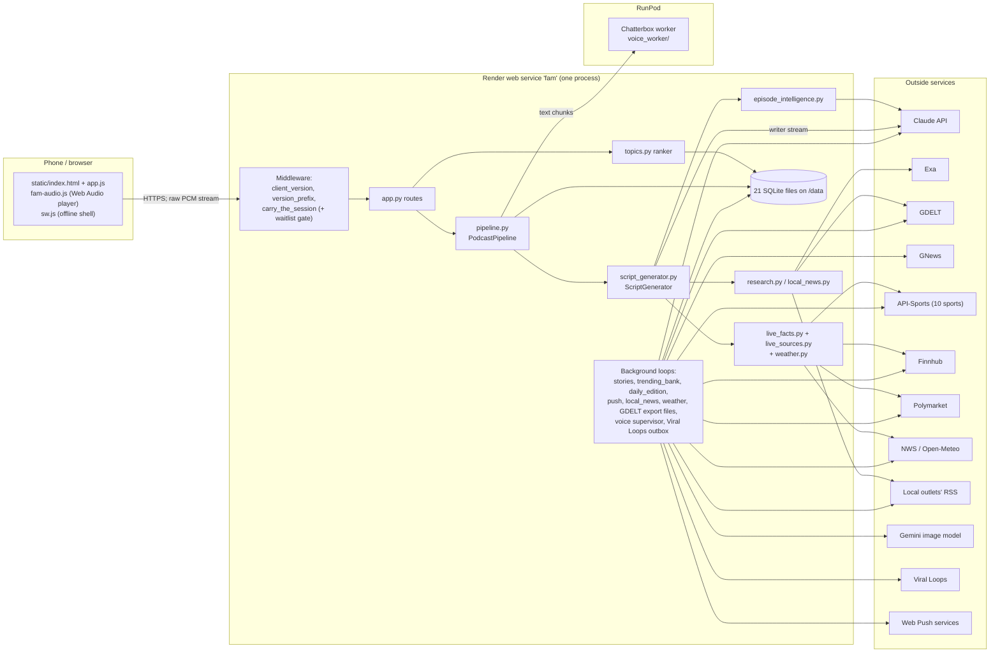
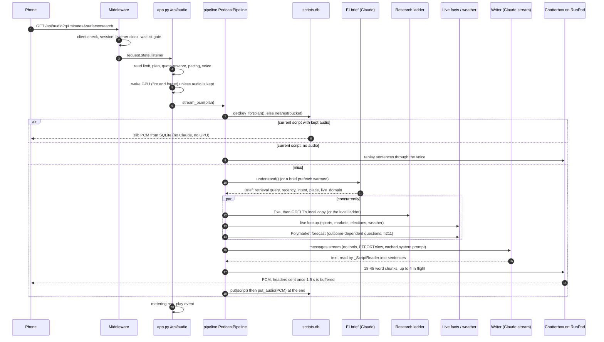
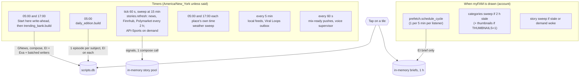
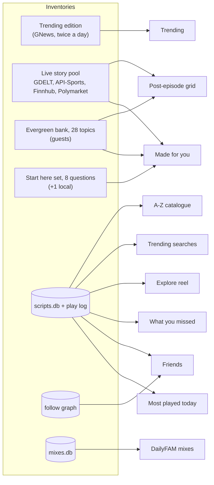

# FAM — Backend: how the server is wired

| | |
|---|---|
| **Status** | Official documentation, v2 |
| **As of** | 2026-10-05 (code at `Main` after PR #103, plus PROBLEMS.md §207) |
| **Audience** | Engineers joining FAM, and anyone who needs to know why a screen shows what it shows |
| **Companion docs** | [`ONBOARDING.md`](ONBOARDING.md) (start here), [`FRONTEND.md`](FRONTEND.md) (the app that calls these routes), [`PRODUCT_HISTORY.md`](PRODUCT_HISTORY.md) (why each piece exists), [`FINANCIAL.md`](FINANCIAL.md) (what each call costs), [`SCALING_TIMELINE.md`](SCALING_TIMELINE.md) (when to change each service), [`DATA.md`](DATA.md) (what is stored), [`algorithm/ALGORITHM.md`](algorithm/ALGORITHM.md) (how Made for you ranks, generated from the code), and the topic files `MYFAM.md`, `TRENDING.md`, `LIVE_FACTS.md`, `LOCAL_NEWS_AND_WEATHER.md`, `REMOTE_VOICE.md`, `WAITLIST.md`, `STAGING.md`, `METERING.md` |

How to read this document:

- Code is cited as `file.py:function` or `file.py:CONSTANT`. Line numbers are
  avoided because they rot; `grep -n` finds any name in a second.
- Every number is labelled: **code** (a constant or default, with where it
  lives), **measured** (from `PROBLEMS.md`), or **estimate**. Prices live in
  `FINANCIAL.md`, not here.
- Where this document and the code disagree, the code wins. Fix the document.
- **Names.** Since §185 the listener sees the rails screen as "DailyFAM" and
  the mixes screen as "myFAM". The code, the API and this document keep the
  old names: **myFAM = the rails** (`/api/myfam`, `topics.py`), **DailyFAM =
  the mixes** (`/api/mixes`, `daily_edition.py`).
- The diagrams are Mermaid. They render on GitHub and in the published HTML.

---

## 1. System at a glance

One FastAPI process (`app.py`) on Render serves the web app, the API, the
admin pages and every background job. Speech is synthesised on RunPod. Every
store is a SQLite file on Render's `/data` disk.

```mermaid
flowchart LR
  subgraph Client["Phone / browser"]
    UI["static/index.html + app.js<br/>fam-audio.js (Web Audio player)<br/>sw.js (offline shell)"]
  end
  subgraph Render["Render web service 'fam' (one process)"]
    MW["Middleware:<br/>client_version, version_prefix,<br/>carry_the_session (+ waitlist gate)"]
    APP["app.py routes"]
    PIPE["pipeline.py<br/>PodcastPipeline"]
    GEN["script_generator.py<br/>ScriptGenerator"]
    EI["episode_intelligence.py"]
    RES["research.py / local_news.py"]
    LF["live_facts.py + live_sources.py<br/>+ weather.py"]
    RANK["topics.py ranker"]
    BG["Background loops:<br/>stories, trending_bank, daily_edition,<br/>push, local_news, weather, GDELT export files,<br/>voice supervisor, Viral Loops outbox"]
    DB[("21 SQLite files on /data")]
  end
  subgraph Ext["Outside services"]
    CL["Claude API"]
    EXA["Exa"]
    GD["GDELT"]
    GN["GNews"]
    AS["API-Sports (10 sports)"]
    FH["Finnhub"]
    PM["Polymarket"]
    WX["NWS / Open-Meteo"]
    FEEDS["Local outlets' RSS"]
    GEM["Gemini image model"]
    VL["Viral Loops"]
    WP["Web Push services"]
  end
  subgraph RunPod
    TTS["Chatterbox worker<br/>voice_worker/"]
  end
  UI -- "HTTPS; raw PCM stream" --> MW --> APP
  APP --> PIPE --> GEN
  GEN --> EI --> CL
  GEN --> RES --> EXA & GD & FEEDS
  GEN --> LF --> AS & FH & PM & WX
  GEN -- "writer stream" --> CL
  PIPE -- "text chunks" --> TTS
  APP --> RANK --> DB
  PIPE --> DB
  BG --> CL & GN & GD & AS & FH & PM & WX & FEEDS & GEM & VL & WP
  BG --> DB
```

### 1.1 What happens at boot (`app.py:lifespan`)

In order, and none of it can stop the server starting:

1. `spend_guard.check_loop` - confirms staging's network guard can see the
   event loop (uvloop goes round it, so staging runs `UVICORN_LOOP=asyncio`).
2. `tts.warm_up` - pays the in-process voice model's load cost (a no-op for
   `VOICE_BACKEND=remote`). The autocorrect word list warms in a thread.
3. `_verify_credentials` - one free `models.retrieve` call proves the Claude
   key works; on rejection it re-reads `FAM_SECRETS`, then fails over a key
   pool, then reports `credentials.state=rejected` on `/api/health`.
4. `_announce_research`, `_announce_storage` - loud log lines if research
   cannot run or a store would be erased by the next deploy.
5. Purges expired script rows and attachments (one `DELETE` each).
6. Installs registries: `live_sources.install()` (live-fact providers, plus
   `weather.WeatherSource` when `WEATHER=1`), `trending.install()`,
   `stories.install()` (story-pool sources), `prefetch_sources.install()`.
7. Seeds the category tree (`categories.apply_seed`, awaited, no network) and
   schedules one growth sweep and one story sweep.
8. Warms the ranker's tile vectors in a thread (`taste_vectors.warm`).
9. Starts the long-lived loops in §4.

### 1.2 The middleware stack, outermost first

Starlette runs the last-declared middleware first, so a request passes:

| Order | Middleware | What it does |
|---|---|---|
| 1 | `app.py:client_version` | Reads `X-FAM-Client`. A release that `releases/registry.json` marks `retired` gets **426** (except `/api/health`, `/api/client-status`); `deprecated` is served with `X-FAM-Client-Status`. Unknown or absent is always served. |
| 2 | `app.py:version_prefix` | Rewrites `/api/v1/x` to `/api/x`, so a shipped app's prefixed URL hits the same handler. |
| 3 | `app.py:carry_the_session` | Sets the **listener's clock** from `X-FAM-TZ` (`listener_clock.set_for_request`); resolves the session from the HttpOnly cookie or `Authorization: Bearer` (`ACCOUNTS.listener_for`); mints an anonymous session for `/` and `/api/*` (never for `MACHINE_PATHS`: `/api/health`, `/api/voice/register`); then runs the **waitlist gate** (`_waitlist_refusal`). |
| 4 | CORS | `API_ORIGINS`. |

The waitlist gate, while `WAITLIST=1` (code default `0`; set in the Render
dashboard, never in `render.yaml`): only an `active` account passes. Anyone
else gets a 302 to `/waitlist` (or `/waitlist/me`) for an app page (`/`,
`/index.html`, `/v/*`, `/m/*`), or a **403** with `X-FAM-Waitlist` for the
API. Open regardless: `/api/auth/*`, `/api/waitlist/*`, `/api/admin/*` (they
check their own credential), `/api/thumb/*`, `/api/health`,
`/api/voice/register`, `/api/client-status`, `/api/me`, `/api/preferences`,
`/api/welcome`, `/api/account` (deletion must always be reachable), the
exact audio of a shared episode (`_shared_episode_request`) and the exact
audio of a sign-up sample (`_welcome_sample_request`).

---

## 2. The life of a search episode

Search is the one surface where a model writes on the tap. Every other
surface does its expensive work **before** the tap (§4). The order of the
steps below is a product rule (CLAUDE.md `spec-amended-for-search`,
`nothing-before-material`): nothing is spoken until the writer holds the
brief and the evidence.

```mermaid
sequenceDiagram
  autonumber
  participant U as Phone
  participant M as Middleware
  participant A as app.py /api/audio
  participant P as pipeline.PodcastPipeline
  participant C as scripts.db
  participant E as EI brief (Claude)
  participant R as Research ladder
  participant L as Live facts / weather
  participant W as Writer (Claude stream)
  participant V as Chatterbox on RunPod
  U->>M: GET /api/audio?q&minutes&surface=search
  M->>M: client check, session, listener clock, waitlist gate
  M->>A: request.state.listener
  A->>A: read limit, plan, quota reserve, pacing, voice
  A->>A: wake GPU (fire and forget) unless audio is kept
  A->>P: stream_pcm(plan)
  P->>C: get(key_for(plan)), else nearest(bucket)
  alt current script with kept audio
    C-->>U: zlib PCM from SQLite (no Claude, no GPU)
  else current script, no audio
    P->>V: replay sentences through the voice
  else miss
    P->>E: understand() (or a brief prefetch warmed)
    E-->>P: Brief: retrieval query, recency, intent, place, live_domain
    par concurrently
      P->>R: Exa, then GDELT's local copy (or the local ladder)
      P->>L: live lookup (sports, markets, elections, weather)
      P->>L: Polymarket forecast (outcome-dependent questions, §211)
    end
    P->>W: messages.stream (no tools, EFFORT=low, cached system prompt)
    W-->>P: text, read by _ScriptReader into sentences
    P->>V: 18-45 word chunks, up to 4 in flight
    V-->>U: PCM, headers sent once 1.5 s is buffered
    P->>C: put(script) then put_audio(PCM) at the end
  end
  A->>A: metering row, play event
```

### 2.1 Step by step

| # | Step | Code | What happens | When it fails |
|---|---|---|---|---|
| 1 | **Client check** | `app.py:client_version` | Retired release → 426 with the store link. | n/a |
| 2 | **Session and clock** | `app.py:carry_the_session` | Listener id from the cookie or bearer token, **never** from a parameter (`?user=` is ignored). `X-FAM-TZ` sets what "today" means for every model call this request makes. | A session that cannot be written leaves the request anonymous and unrecorded; it never fails. |
| 3 | **Waitlist gate** | `app.py:_waitlist_refusal` | §1.2. | 403 + `X-FAM-Waitlist`; the app follows it to `/waitlist`. |
| 4 | **Read limit** | `app.py:_read_limit` | `READ_LIMIT_PER_WINDOW` = 60 requests per 10 s per client (code, `config.py`). | 429 |
| 5 | **Plan** | `app.py:_validated_plan` → `script_generator.plan_episode` | Surface from `_play_surface`. Browse surfaces are forced to `BROWSE_MINUTES` = 2 (code, `config.py`); a tier caps the minutes (`entitlements.max_minutes`, 10 on every tier, code). `episode=` (a history replay, §173) pins one exact episode. | 400/422 on a malformed request, before anything is reserved. |
| 6 | **Pacing** | `app.py:_rate_limit` | A token bucket, `RATE_LIMIT_BURST` = 3, refilled one per `RATE_LIMIT_SECONDS` = 3 s (code). **Skipped** for anything that provably cannot call a model: `cached_only`, `episode=`, or a script already written (`_already_written`). | 429 |
| 7 | **Quota reserve** | `app.py:_reserve` → `quotas.QuotaStore.reserve` | Counts **episodes, not requests** (`episode_key`), against `episode` or, for `cached_only`, the looser `explore` allowance. Enforced only when `ENFORCE_QUOTAS=1` (code default 0; **1 on production** in `render.yaml`, §207). Free tier: 5 episodes and 25 Explore replays a day (code, `entitlements.py`, `FREE_EPISODES_PER_DAY`, `FREE_EXPLORE_PER_DAY`). Admin accounts are `unlimited` (`app._tier`). | 429 with `X-FAM-Quota` (the whole verdict) and a sentence naming what the listener was doing (`entitlements.service_label`). |
| 8 | **Voice and pipeline** | `app.py:_episode_voice`, `_make_pipeline` | Search uses the listener's chosen voice; every other surface draws one from the bank (`voice_bank.random_slug`) and keeps it with the episode. `pipeline.origin` records the surface (`search`, `myfam`, ...). | No speech engine at all → 503, refunded. |
| 9 | **Guest gate** | `app.py:_guest_play_gated` | A guest's tap on a myFAM or sample-mix tile plays only **kept audio**. | 403 `X-FAM-Refused-By: account` → the sign-up screen; refunded. |
| 10 | **Wake the GPU** | `app.py:_wake_remote_voice` → `RemoteChatterboxEngine.wake` | Fire-and-forget, so a serverless worker boots while Claude writes. Skipped when the audio is already kept. | Never raises; a miss costs only the cold start. |
| 11 | **Cache lookup** | `pipeline.py:_stream_pcm`, `key_for`, `bucket_for` | `key_for` is **the only key** (query words, minutes, context, research flag; never the voice, never the listener's clock). A new request is served a row only while it is **current** (`cache.ttl_for`); a replay surface (`cached_only`, `episode=`) plays anything **kept** (a week). On a miss, `nearest(bucket, query)` tries a vector near-match (`CACHE_VECTOR`, on). An attached or personal question (`cache.is_shareable`) has no key and is never cached. | `cached_only` / `episode=` with nothing kept → `NotCached` → **409**, refunded. |
| 12 | **Kept audio** | `cache.get_audio`, `pipeline._play_stored` | A current hit whose audio was kept in this voice streams zlib PCM out of SQLite: no Claude, no GPU (§132). Otherwise the stored sentences are replayed through the voice and the audio is kept this time. | |
| 13 | **Earlier editions** | `daily_edition.with_earlier_editions` | A dated DailyFAM prompt nobody wrote ahead is told the earlier editions' titles, exactly as the background edition is. | Local reads only. |
| 14 | **EI brief** | `ScriptGenerator.understand` → `episode_intelligence.understand` | One Claude call (`EI_MODEL`, default `claude-haiku-5-5` since §227) returning a JSON `Brief`: the retrieval query and a broader one, recency window, intent, story shape, `live_domain` (sports / markets / elections / weather), `place` (a one-town question), `outcome_dependent`, cautions, pronunciations, a provisional title. **Skipped** when prefetch warmed a brief (`prefetch.warm_brief`). `gate` and `apply_named_slot` (e.g. "Sunday Night Football") run on the answer. | Timeout `EI_TIMEOUT_SECONDS` = 8 s (code). Any failure → `fallback_brief(query)`, `Brief.degraded`; the episode continues on the raw query. |
| 15 | **Evidence** | `ScriptGenerator.prepare` | `asyncio.gather(live_lookup, research, forecast_lookup)` - independent, so they run together. | See 15a-15d. |
| 15a | - research ladder | `ScriptGenerator.research`, `research.ladder`, `research.retrieve` | **Exa** (`fast`, `EXA_NUM_RESULTS` = 8, 3 sources × 2 highlights in the packet, code) → if empty or missing what the brief must establish, **one** second Exa search without the window on `Brief.broader` → **GDELT** on the broader query, searched in FAM's local copy of GDELT's export files (`gdelt.retrieve`: titles and names, ≥ 2 shared words; only if `GDELT=1`; on in production). `screen_results` drops simulated-league pages and, on sports, unknown outlets once two known ones answered. Every rung that ran is metered. | Each rung is caught (`_retrieve`) and recorded (`fell_back_from`). GDELT is a local read and never reaches GDELT (§211); an empty or stale (> 1 h) copy is recorded as an outage (`ExportStale`). |
| 15b | - local ladder | `ScriptGenerator._research_local`, `local_news.research_local`, `places.resolve` | When the brief names one `place` (§194): the town's own outlets' RSS → the county's → Exa restricted to known outlets (`include_domains`, results must name the town). **Never GDELT.** The weather is fetched at the same time and used only if the town had nothing. A first question about a town reads its unread feeds inline, bounded at 2.5 s (code, `local_news.refresh_place`). | Town empty → `local_news.gap_line` opens the episode ("no news updates about …"), then the weather, then county news. Nothing at all → `NoEvidence`. |
| 15c | - live lookup | `ScriptGenerator.live_lookup` → `live_facts.lookup` | Only when the brief has a `live_domain`. Providers: API-Sports (sports; records, last and next games counted in code from the schedule), Finnhub (markets), Polymarket (elections), `weather.WeatherSource` (NWS then Open-Meteo, plus live NWS alerts). Seven outcomes (`FACTS`, `NOT_CONFIGURED`, `NO_ENTITY`, `NO_FACTS`, `PROVIDER_FAILED`, `TIMEOUT`, `STALE`); stale data is withheld. **Beside it (§211)**, `live_facts.forecast` asks Polymarket for every question EI marks `outcome_dependent` (not live-domain elections, weather, or a town question): `EpisodePlan.forecast`, rendered after the live block (the articles win), credited as "prediction market - a forecast, not a result", never evidence for the refusal and never `plan.live`. | `LIVE_TIMEOUT_SECONDS` = 1.5 s per source, `LIVE_TOTAL_TIMEOUT_SECONDS` = 2.5 s (code). The writer is told which outcome happened and never states a result it lacks. |
| 15d | - weather question | `ScriptGenerator.research` | `live_domain == "weather"` skips the article index entirely; the forecast is the evidence. | |
| 16 | **Refusal check** | `ScriptGenerator._refuse_without_evidence` | No evidence and no live facts, on a question that asks for a result or a recent window (or, on a degraded brief, the keyword heuristic) → refuse. Evergreen questions and attachments are never refused. | `NoEvidence` → **503**, **refunded whatever was billed**. |
| 17 | **Writer** | `ScriptGenerator.stream_prepared` | One `messages.stream` call (`MODEL`, `EFFORT=low`, **no tools**). The house rules and style example are one cacheable system block (`writer_system`, `PROMPT_CACHE=1`, `PROMPT_CACHE_TTL=5m`, §179); the brief, evidence and question are the user turn. | Exception before the first audio → **502** with `friendly_error`; refunded only if nothing was billed. |
| 18 | **Reading the stream** | `script_generator._ScriptReader` | `<<SAY: Name = respelling>>` lines (before the script) feed the pronunciation lexicon; text after `<<` is held back; sentences are cut on terminal punctuation and passed through `clean_for_speech` (which removes slurs, `content_filter.py`); `OpeningGuard` drops meta-disclaimers in the first `WINDOW` = 6 sentences (code) and logs each drop; a 1.35× word budget is the safety valve. At the end it extracts `<<TITLE>>`, `<<NEXT>>`, `<
>`, `<<CATEGORY>>`. | Nothing but disclaimer → spoken anyway (`rescue`), never silence. |
| 19 | **Chunking** | `speech_assembly.py` (Phase 6, `STREAMING_PIPELINE=phase6`) | The first complete sentence goes to the voice at once, whatever its length; after that chunks of min 18 / target 28 / cap 45 words (code). | |
| 20 | **Voice** | `pipeline._speak_chunk` → `engine.synth(speakable(respell(text)))` | Numbers and initialisms rewritten for speech (`spoken_text.speakable`), hard names respelled (`pronunciation.respell`) - only in what the voice hears; captions, cache and title keep the real text. `RemoteChatterboxEngine` sends the chunk to the endpoint `voice_control` resolved: RunPod serverless `/runsync`, or a pod's `/synth`. Up to `REMOTE_VOICE_CONCURRENCY` = 4 in flight (code). Chunks are seeded from (reference, text), so a sentence is the same audio every time (§176). | `REMOTE_VOICE_TIMEOUT` = 180 s (code, `render.yaml`). A failed endpoint is demoted and the ladder walks on (§3). No engine at all → placeholder **tone**, said everywhere. |
| 21 | **Preroll and stream** | `app.py:audio` | Chunks are pulled until `PREROLL_SECONDS` = 1.5 s of PCM exists (code), so a failure before that is a proper HTTP error. Then a `StreamingResponse` of raw `audio/L16` (or WAV). Headers: `X-FAM-Cache`, `X-FAM-Episode` (the id the history keeps), `X-FAM-Keepable` (may the phone keep it offline), `X-Sample-Rate`, `X-Stage-Seconds`, `X-Episode-Marks`. | Empty episode → 502, refunded. After the first byte a failure can only be logged; the player notices the short stream. |
| 22 | **Captions and progress** | `live_captions.py` | Each sentence is published as it is voiced, keyed on the cache key, with measured start times; `/api/transcript` reads it, `/api/progress` reads the marks. The title is replaced by the writer's own once it lands. | |
| 23 | **Cache store** | `pipeline._stream_pcm` tail, `cache.put`, `cache.put_audio` | Script, title, thread, summary, category, sources, `sourced_at`, `origin`, `author`, voice. **Current** for `ttl_for(...)`; **kept** for `CACHE_LIFE_SECONDS` = 7 days (code). Audio (zlib PCM) is kept only after the whole episode went out, only in a production voice, inside `AUDIO_CACHE_MAX_MB` = 512 (code), LRU. A key re-written with different words archives the old row and audio (`archive_key`). | Demo mode (no key) reads the cache and never writes it. |
| 24 | **Metering and events** | `app.py:_record_usage` → `metering.MeterStore`; `EVENTS.record(play)` | One ledger row per request at the end of the stream (disconnects included), with model tokens, Exa searches and audio seconds. A `play` event is logged only for an account (`_remembers`). Every outside request is also counted per provider per UTC day (`provider_usage.record`). | Recording never fails a request. |

**How `ttl_for` decides "current"** (`cache.py:ttl_for`, from what the episode
was built on, never from the question's words alone): live status
`in_progress` → never current; weather → 1 h (`WEATHER_TTL_SECONDS`); sports
`recap`/`update` short of `final` → never current; `scheduled`,
`outcome_dependent` or a ≤ 1-day window → `CACHE_TTL_VOLATILE` = 2 h; else the
keyword floor (`CACHE_TTL_SECONDS` = 7 days, or 2 h if the words look
volatile). All values code, `config.py`.

### 2.2 Latency, stage by stage

Each step is timed by `episode_marks.EpisodeMarks`. The server logs one
`episode timing` block per non-cached episode at first audio
(`EpisodeMarks.stage_report`, called from `app.py:audio`) and a second line
when the stream ends. The same breakdown rides on `X-Stage-Seconds`.

| # | Stage | Marks | Budget or measured time |
|---|---|---|---|
| 0 | setup: limits, plan, quota, voice, cache lookup | origin → `claude_start` | Near-match scan **8.93 ms** on a miss (measured) |
| 1 | brief | `brief_start` → `brief_ready` | Timeout **8 s** (code, `EI_TIMEOUT_SECONDS`). Real duration **not yet measured**. Zero when prefetch warmed it. |
| 2 | evidence | `evidence_start` → `evidence_ready` | Exa ≈ **0.5 s** (measured). Live: 1.5 s per source, 2.5 s total (code). GDELT: a local read (§211). Local ladder's inline feed read ≤ 2.5 s (code). |
| 3 | writer thinking | `writer_request` → `claude_first_token` | §129 expects this to be **the largest single step**. Not yet measured. Prompt caching shortens it (§179, unmeasured). |
| 4 | first sentence | → `first_sentence` | Model text runs ~16× faster than speech (estimate, §129) |
| 5 | first synthesis | → `first_tts_complete` | Warm: ~2-3 s per 28-41-word chunk on an RTX 4090 (**measured**, `speech_assembly.py`: 0.1086 s/word). Cold serverless worker: boot + ~10 s model load. |
| 6 | first audio | preroll | `PREROLL_SECONDS` = 1.5 s of audio buffered (code) |

| What is known about the total | Result |
|---|---|
| Before §82 and §108 put research and planning ahead of the first word | **0.5 s** to first audio (measured) |
| Phase 6, search to first listen on a warm RTX 4090 | **2.99 s** (measured, `episode_marks.py` docstring) |
| After §108 | "Several seconds by construction"; worst reported up to 45 s (§128) |

**No real post-§128 episode has been timed.** Read the `episode timing`
lines in the Render log, or run `tools/latency_probe.py`.

**The loading screen** (§148) shows the wait honestly. `GET /api/progress`
maps the episode's own marks to steps (`live_captions.PROGRESS_STEPS`):

| Step | Mark |
|---|---|
| contextualized | `brief_ready` |
| retrieved | `evidence_ready` |
| verified | `claude_first_token` |
| written | `first_sentence` |
| generating the audio | client-side, when audio arrives |

Each step stays on screen at least 2 s and audio is held to the fifth; a
replay (`X-FAM-Cache: hit`) skips them.

---

## 3. Failures and fallbacks, per stage

Falling back silently is the one thing the code forbids. Every fallback is
recorded in `notes.research` (`rungs`, `fell_back_from`), `Brief.degraded`,
the live lookup's outcome, the log, and `/api/health`.

| Stage | Failure | What happens | Listener sees |
|---|---|---|---|
| Middleware | Retired client | 426 + store link | Update prompt |
| Waitlist | Not an active account | 302 / 403 `X-FAM-Waitlist` | The waitlist page |
| Limits | Too fast / out of allowance | 429 (`X-FAM-Refused-By: quota` for an allowance) | A sentence saying what they were doing and when it resets |
| Guest | Tile with no kept audio | 403, refunded | Sign-up |
| Cache | Replay with nothing kept | 409, refunded | The card is dropped |
| Brief | Timeout, error, bad JSON | Raw query, `Brief.degraded` | Nothing; a less precise episode |
| Research | Exa error or empty | Second Exa look, then GDELT's local copy; each rung metered | Nothing |
| Research | Everything empty, question needs current facts | `NoEvidence`, 503, **refunded** | "FAM could not reach a single source …" |
| Research | Everything empty, evergreen question | Written from knowledge, no evidence block | An episode |
| Local | Town has nothing | Gap line + weather + county news | A short, honest episode |
| Local | Nothing and no weather | `NoEvidence` | "We couldn't find any recent news reports out of …" |
| Live facts | Provider down, slow or stale | Outcome recorded; writer told | No invented score |
| Writer | API error before audio | 502, `friendly_error`; refunded only if nothing was billed | The error sentence |
| Voice | Endpoint fails verification | Demoted; next rung | Nothing, or a slower start |
| Voice | No engine at all | Placeholder tone; `/api/health` `interim: true` | A tone, announced as one |
| Stream | Error after the first byte | Logged | A short episode the player flags |

```mermaid
flowchart TB
  subgraph Brief
    B1[Warmed brief from prefetch] -->|none| B2[EI Claude call, 8 s]
    B2 -->|any failure| B3[raw query, Brief.degraded]
  end
  subgraph Research["Research (research.ladder)"]
    E1[Exa, recency window] -->|empty or thin| E2[Exa again, no window,<br/>Brief.broader]
    E2 -->|empty| G1[GDELT local copy, broader query<br/>outage if empty or stale]
    G1 -->|empty| Q{Needs current facts?}
    Q -->|yes| NO[NoEvidence 503, refunded]
    Q -->|no| KN[Write from knowledge]
  end
  subgraph Local["Local ladder (one town)"]
    L1[Town outlets' RSS] -->|nothing names the town| L2[County outlets]
    L2 -->|nothing| L3[Exa on known outlets]
    L3 -->|nothing| L4[gap line, then weather,<br/>then county news]
    L4 -->|no weather either| NO2[NoEvidence]
  end
  subgraph Voice["Voice address (voice_control.RUNGS)"]
    V1[pinned REMOTE_VOICE_URL] -->|fails verify| V2[registered worker]
    V2 --> V3["RunPod pod by name<br/>REST v2, v1, GraphQL;<br/>direct TCP preferred"]
    V3 --> V4[serverless endpoint]
    V4 -->|nothing answers| TONE[episode fails with the reason]
  end
```

---

## 4. Background jobs

Every browse surface is built before the tap. These loops are started in
`app.py:lifespan` (or scheduled from a request) and **never awaited by a
request**. All of them catch their own exceptions.

| Job | Code | When (all code defaults) | Calls | Produces |
|---|---|---|---|---|
| **Story pool sweep** | `app.py:_refresh_stories_forever` → `stories.refresh` | Ticks every 60 s; sweeps when the pool is `STORIES_BACKGROUND_SECONDS` = 900 s old; also scheduled by `/api/myfam` when stale or when the first look after a quiet spell arrives (`stories.note_demand`). Each source keeps its own floor (below). | The sources due, then one Claude `compose` call (`stories.compose`, `STORIES_MODEL`, effort low, 45 s timeout) | Tiles only (title, angle, category, query) in an in-memory pool (`POOL_SIZE` = 40 shown, `POOL_STORE` = 96 held). **No script.** |
| - GDELT news | `story_sources.GdeltSignals` | Every `STORIES_NEWS_INTERVAL_SECONDS` = 2 h | `gdelt.discover`, `news_clusters`, read from the local export copy (§211); idle until the first file lands | Attention signals with outlet counts |
| - trending registry | `story_sources.TrendingRegistrySignals` | Every 2 h | `trending.py` registry (`TRENDING_SOURCE`; unset in production) | Attention signals |
| - Finnhub | `story_sources.FinnhubSignals` | Every `STORIES_MARKETS_INTERVAL_SECONDS` = 2 h, round the clock (§191) | 12 quotes (`WATCHLIST`) | Moves ≥ `STORIES_MARKET_MOVE_PERCENT` = 3% |
| - Polymarket | `story_sources.PolymarketSignals` | Every 2 h, only if `STORIES_POLYMARKET=1` (on in production) | Gamma API | Prediction-market tiles |
| - API-Sports | `story_sources.ApiSportsSignals` | **On demand only** (§191): an account drew myFAM within `STORIES_DEMAND_SECONDS` = 1800 s (`idle`), only `SWEPT_LEAGUES` (NFL, NCAA football; NBA, NCAA, WNBA; MLB, NCAA baseball; NHL; Champions League, Premier League, La Liga, Bundesliga, World Cup; every F1 race; numbered UFC cards). The card is read once per UTC day, then every `STORIES_SPORTS_INTERVAL_SECONDS` = 900 s only while a followed game is on or within 15 min of starting. | One request per sport per read; team catalogues once a day (`live_sources.league_teams`), a refused one not re-asked that day | Game tiles with a `live_line` |
| **GDELT export download** (§211) | `app.py` → `gdelt.run_forever` → `gdelt.sync` | Every `GDELT_EXPORT_POLL_SECONDS` = 900 s, only if `GDELT=1` | `lastupdate.txt`, then the newest GKG 2.1 file (and up to `GDELT_EXPORT_BACKFILL_FILES` = 8 behind it when the copy is behind); GDELT's domain-by-country list monthly. ~200 requests/day, whatever the traffic | `gdelt_export.db`: 24 h of articles (≤ 1,500 per file) and theme counts, read by every GDELT caller |
| **Trending edition** | `trending_bank.run_forever` → `build` | 05:00 and 17:00 `America/New_York` (`TRENDING_BANK_HOURS`), catching up on boot after `BOOT_STAGGER_SECONDS` = 60 s; wakes ≤ every 60 s. One worker wins a per-slot claim. | GNews (`trending_bank.collect`; `GNEWS_DAILY_REQUESTS` = 90 guard) → `stories.compose` (category + anchors, §188) → for each of `TRENDING_BANK_SIZE` = 10 stories: EI + research + writer, **writers batched** through the Message Batches API (`claude_batch.run`, `EDITION_BATCH=1`, ≤ `EDITION_BATCH_WAIT_SECONDS` = 3600 s, then live from the prepared plan) | 10 whole scripts in `scripts.db` (`origin="trending"`), current until the edition can no longer be shown (`TRENDING_BANK_MAX_AGE_HOURS` = 36 h + 1 h grace) |
| **Start here write-ahead** | `trending_bank.write_startup` | Same loop, same slots, **before** the edition (§179) so its deadline is met; `STARTUP_WRITE_AHEAD=1`; needs no GNews key | EI + research + writer (live, not batched) for the 8 `startup.STARTUP_TOPICS` | 8 scripts per slot, current until the next slot + 1 h; the local ninth question is never written (personal). Outcome-dependent briefs and live scores are left for the tap. |
| **DailyFAM edition** | `daily_edition.run_forever` → `build` | 05:00 `America/New_York` (`DAILY_EDITION_HOURS`), boot catch-up after 2 × 60 s; and `daily_edition.schedule_mix` the moment a mix is saved with new subjects (`app._write_mix_ahead`) | One episode per distinct subject across every mix (`daily_edition.subjects`), EI on each, told earlier editions' titles; `CONCURRENCY` = 3; writers batched as above; ceilings `DAILY_EDITION_MAX_EPISODES` = 300, `DAILY_EDITION_MAX_DOLLARS` = $15 (batched writers reserve $0.02 each up front) | Scripts in `scripts.db` (`origin="dailyfam"`) under the key the tap computes; the slot is marked `ready` |
| **"Your mix is ready" pushes** | `push.run_forever` → `push.tick` | Every `TICK_SECONDS` = 60 s, only if VAPID keys and `pywebpush` are present (none deployed yet) | Web Push (`pywebpush`) to each subscription | One push per mix per day at or after its `listen_at` in its own zone, **only once the edition is `ready`**, within `GRACE_SECONDS` = 3 h; claimed in `push_sent`; only `active` accounts while the waitlist runs |
| **Category sweep** | `app.py:_grow_categories` → `categories.sweep` | Once at boot, then whenever `/api/myfam` finds it stale (`SWEEP_INTERVAL` = 2 h, `categories.py`). **Not on a timer of its own.** | Claude placer (`categories.py`, `CATEGORIES_PLACE`) for new nodes | Vocabulary nodes in `categories.db`. A typed subject needs `MIN_LISTENERS` = 3 people (code). |
| **Tile pictures** | `thumbnails.backfill` | After each category sweep, only if `THUMBNAILS=1` (**0** in production) and a Gemini key; up to `THUMBNAILS_PER_SWEEP` = 20; also on demand from `/admin/thumbnails` | Claude scene writer → Gemini image model (`gemini-3.1-flash-image`, falls back to the best image model the key lists) → Claude checker | Pictures per tree node in `thumbnails.db`; flagged ones wait for a person |
| **Prefetch** | `prefetch.schedule_cycle` (from `/api/myfam`) | At most once per `PREFETCH_CYCLE_SECONDS` = 300 s per listener, only after `PREFETCH_QUIET_SECONDS` = 20 s without a live generation | Sources: trending, stories, mixes, feed, threads (`prefetch_sources.py`); `PREFETCH_LEVEL=brief` runs **EI only**; up to `PREFETCH_PER_CYCLE` = 6; ceilings 400 briefs, 50 episodes, $2 a day. Never calls `live_lookup`, never warms anything personal or outcome-dependent. | Briefs in memory for `PREFETCH_BRIEF_TTL_SECONDS` = 1 h; a tap skips stage 1 |
| **Local news collector** | `local_news.run_forever` → `poll_due` | Every 300 s; only feeds of places asked about in the last 30 days (`DEMAND_SECONDS`), each paced by the outlet's own rhythm; `LOCAL_NEWS=1` | Outlets' RSS (conditional GET, robots.txt obeyed, 8 s timeout), teaser articles fetched | Items in `local_news.db`; feed states (new, healthy, stale, broken, no_feed, blocked, disallowed, excluded, retired) |
| **Weather sweep** | `weather.run_forever` → `sweep_due` | Wakes every 15 min; sweeps a place at 05:00 and 17:00 in **that place's own time**, while it was asked about in the last 30 days; `WEATHER=1` | NWS (US) then Open-Meteo | Structured forecasts in `local_news.db`; never prefetched into an episode |
| **Voice supervisor** | `voice_control.supervise_forever` | Every `VOICE_SUPERVISE_SECONDS` = 60 s, only with `VOICE_BACKEND=remote` | Verifies the ladder with a real call; RunPod pod listing at most once a minute | The held endpoint, so a moved pod is found before a listener arrives |
| **Viral Loops outbox** | `app.py:_drain_viral_loops_forever` → `viral_loops.drain` | Every 300 s while `VIRAL_LOOPS_API_TOKEN` is set; also kicked on each sign-up (`_kick_viral_loops`) | Viral Loops register / flag | Delivered outbox rows; 4xx other than 408/429 finished with the error kept |
| **Provider counts flush** | `provider_usage.py` | A background thread, at most every `FLUSH_SECONDS` = 10 s | none | Per-provider per-UTC-day counts in `provider_usage.db` |

```mermaid
flowchart TB
  subgraph Timers["Timers (America/New_York unless said)"]
    T1["05:00 and 17:00<br/>Start here write-ahead, then trending_bank.build"]
    T2["05:00<br/>daily_edition.build"]
    T3["tick 60 s, sweep at 15 min<br/>stories.refresh: news, Finnhub, Polymarket every 2 h;<br/>API-Sports on demand"]
    T4["05:00 and 17:00 each place's own time<br/>weather sweep"]
    T5["every 5 min<br/>local feeds, Viral Loops outbox"]
    T6["every 60 s<br/>mix-ready pushes, voice supervisor"]
  end
  subgraph OnView["When myFAM is drawn (account)"]
    D1["prefetch.schedule_cycle<br/>(1 per 5 min per listener)"]
    D2["categories sweep if 2 h stale<br/>(+ thumbnails if THUMBNAILS=1)"]
    D3["story sweep if stale or demand woke"]
  end
  T1 -->|GNews, compose, EI + Exa + batched writers| CACHE[("scripts.db")]
  T2 -->|1 episode per subject, EI on each| CACHE
  T3 -->|signals, 1 compose call| POOL[("in-memory story pool")]
  D1 -->|EI brief only| BRIEFS[("in-memory briefs, 1 h")]
  TAP{{Tap on a tile}} --> CACHE
  TAP --> BRIEFS
```

Every browse episode is **2 minutes** (`BROWSE_MINUTES`, code). That is what
lets a background-written script match the key a tap asks for. The one
exception is a Go Deeper follow-up, which carries its own 1-5 minutes (§170).

---

## 5. Where each section comes from

Every rail is built by `topics.build_feed`, called from `GET /api/myfam`. That
route makes **no model call** and awaits nothing outside the process: it reads
the event log, the cache and the in-memory pools, ranks, records impressions,
and schedules the jobs in §4. A **guest** gets `topics.guest_feed()` - the
evergreen bank on every rail - and nothing on that path can spend.

The ranking of Made for you (taste profile, subject tree, chosen interests,
weights, field and variety rules, the learned re-order) is documented in
[`algorithm/ALGORITHM.md`](algorithm/ALGORITHM.md), which
`tools/algorithm_docs.py` generates from the code. It is not repeated here.

**Common rules** (code, `topics.py`):

- Every rail shows `SECTION_SIZE` = 4. View more (`GET /api/myfam/section`)
  shows `VIEW_MORE_PAGE` = 8 at a time; Refresh deals the next 8 of the same
  ranking (`page_section`).
- A choosing rail runs taste → `ready_first` (written tiles first; a sort,
  never a filter) → no repeats (`is_repeat`).
- Fill order: Trending first (outside the loop), then `FILL_ORDER` =
  `missed → from_history → followers → might_like → most_played`. Display
  order: Made for you, Trending, What you missed, Most played today, Friends.
  `might_like` is ranked but `UNSHELVED`.
- Only Made for you is topped up (`RAIL_MINIMUM`). Every other rail is
  honestly empty rather than invented.
- A written live-story or startup tile is renamed and re-categorised from its
  episode (`app._name_written_tiles`, `_categorise_written_tile`, §161/§189).

```mermaid
flowchart LR
  subgraph Inventories
    TB["Trending edition<br/>(GNews, twice a day)"]
    LP["Live story pool<br/>GDELT, API-Sports, Finnhub, Polymarket"]
    BANK["Evergreen bank, 28 topics<br/>(guests)"]
    ST["Start here set, 8 questions<br/>(+1 local)"]
    CACHE[("scripts.db + play log")]
    GRAPH[("follow graph")]
    MIX[("mixes.db")]
  end
  TB --> TR[Trending]
  LP --> MFY[Made for you]
  BANK --> MFY
  ST --> MFY
  CACHE --> MP[Most played today]
  CACHE --> FR[Friends]
  GRAPH --> FR
  CACHE --> MI[What you missed]
  CACHE --> EX[Explore reel]
  CACHE --> TS[Trending searches]
  CACHE --> CAT[A-Z catalogue]
  MIX --> DF[DailyFAM mixes]
  LP --> NX[Post-episode grid]
  BANK --> NX
```

| Section (listener's name) | Endpoint | Source | Path | Fallback / empty state |
|---|---|---|---|---|
| **Made for you** | `/api/myfam` | `browse_inventory`: guest = live pool + bank; account = live pool + startup set. `made_for_you_candidates` ranks every live story the pool holds. | `taste` → `rank_from_history` (or `rank_startup` with no history, heading **Start here**, `taste_source: startup`) → `diversify(strict=True)`, ≤ `MAX_PER_FACET` = 2 per heading → no repeats. A live story only when it names something followed (`_is_broad_match`, `_in_field`); no minor-league game from another continent unless followed (`_far_minor_league`). See ALGORITHM.md. | Topped up to 4 from evergreen tiles (`_rail_fallback`, `_fill_to_minimum`), **never the live pool**. |
| **Trending** | `/api/myfam` | The GNews edition only (`trending_bank.stories_now`) | `trending_for` (a heard story becomes a "what's new" follow-up after 6 h, or is dropped) → `world_inventory` → `rank_world` on outlet count and country only (`WORLD_LOCAL_SLOTS`). Cards carry no place. View more groups by continent, Worldwide first (`geography.continent_for`). | **None by design**: empty row with `trending_bank.empty_reason()`. |
| **What you missed last week** | `/api/myfam` | Cached episodes others played 3-7 days ago (`MISSED_WINDOW` = 7 d, `MISSED_QUIET` = 3 d) that this listener never heard | `rank_missed`; excludes live-feed, story-pool and Trending episodes | None, no top-up |
| **Most played episodes today** | `/api/myfam` | Play log joined to **cached** episodes | `rank_most_played`, `MOST_PLAYED_WINDOW` = 24 h, a finished listen once per question | None. `tools/seed_demo.py` fills it for a demo. |
| **What your friends are listening to** | `/api/myfam` | `social.circle_of`: mutual follows first, then follows; their plays within `FRIENDS_WINDOW` = 14 d or episodes they authored | `rank_friends`, cached only | Empty with `has_circle`; ends in "Find new friends". Never strangers. |
| **Friends' faces row** | `/api/circle` | `_circle_row`: friends with a vibe in the last 24 h first (`CIRCLE_VIBE_WINDOW`), up to `CIRCLE_MAX` = 12 | Same rows as `/api/profile`'s `circle` | `[]` for a guest or nobody followed |
| **Pick up where you left off** | `/api/godeeper` | `saved.progress` (episodes under 60% heard, `RESUME_MAX_FRACTION`) and `EVENTS.open_threads` (finished episodes' `<<NEXT>>` prompts), last `GO_DEEPER_WINDOW_SECONDS` = 24 h | Read only; X writes `dismissed` (`/api/godeeper/dismiss`), which nothing else reads | Fewer than four is honest; account only |
| **DailyFAM mixes** (shown as "myFAM") | `/api/mixes`, `/api/mixes/public` | `mixes.db`: followed subjects (`f:nfl`, `f:nfl~Eagles`), typed topics; other listeners' public mixes | Each item carries the server's dated `prompt` and `minutes`, so the tap hits the 05:00 edition's script | Not written ahead (new, over a ceiling, failed) → the tap writes it like a search. Account only; guests see `/api/mixes/sample`. |
| **Explore reel** | `/api/explore` | `cache.recent(exclude_author=listener, origin="search")`: other listeners' **searched** episodes, anything kept | Vibed-by-a-friend first, then vibed, then newest. Picture from `/api/episode/card`; comments from `/api/comments`; "Interested?" ✕/✓ log `skip`/`pick` via `/api/event`. Plays with `cached_only=1`. | **Never generates**: a vanished entry is 409; an empty cache says so. |
| **Go Deeper** | `/api/next` | The episode's `<<NEXT>>` line (`scripts.thread`), read with `cached_only` | Offered on every player and Explore card with a 1-5 minute length; sending it writes a new episode with the parent as `context` on surface `other` | No thread → the client builds a suggestion from the title |
| **Post-episode grid** | `/api/nextup` | `browse_inventory` | Lead = Go Deeper's suggestion (client), then the album's next, then `rank_next_up`: `rank_from_history` seeded with the just-heard tags at `JUST_HEARD_WEIGHT` = 3 → `rank_followers` → `rank_most_played` → the inventory ignoring "played". First auto-starts in 15 s. A queued episode plays first. | The chain is the fallback. Not on Explore. |
| **Trending searches** | `/api/searches/trending` | Searches by distinct listeners in the last `TRENDING_SEARCHES_WINDOW` = 2 h (`EVENTS.searches_since`), joined to **current**, searched, non-explicit cached episodes whose key a bare search would compute | Up to `TRENDING_SEARCHES_MAX` = 8 returned (the client draws 5) | Empty list, drawn as nothing |
| **A-Z catalogue** (bookshelf button) | `/api/myfam/catalog` | `cache.recent(1000, exclude_author=listener)`, every surface | One row per title, A to Z with a letter | Empty or "could not load" with Try again |
| **Search DailyFAM** | `/api/myfam/search` | Same rows | `cache.rank_similar`: word overlap, then embedding cosine, then plays | "Search FAM for it" |
| **Sign-up samples** | `/api/welcome` | Top of `rank_most_played` with **kept audio**, `WELCOME_SAMPLES` = 3, memoised 60 s | Played replay-only, also on `/waitlist` | Hidden when none |
| **Interest page** | `/api/interest` | Kept episodes on one interest, freshest first | | Generates nothing |
| **SearchFAM** | `/api/audio?surface=search` | The typed or spoken question (spell-corrected whole at send) plus attachments | §2 | §3 |

---

## 6. Outside services: every call site

| Service | Called from | Conditions | Used for | When it fails |
|---|---|---|---|---|
| **Claude** | `episode_intelligence.understand` | `EPISODE_INTELLIGENCE=1` (default) | The brief, on every search, prefetch, Trending, Start here and DailyFAM episode | Raw query, `Brief.degraded` |
| | `ScriptGenerator.stream_prepared` | Every new episode | The writer (stream, cached system prompt) | 502; demo mode (no key) serves a canned script and says so |
| | `claude_batch.run` | `EDITION_BATCH=1` | The two editions' writers at batch price | Whatever is unanswered is written live from the prepared plan |
| | `ScriptGenerator.top_up` | `ALLOW_TOPUPS=1` (off) | Padding a short script | n/a |
| | `stories.compose` | `STORIES_COMPOSE=1` | Tiles for the story pool and the Trending edition | `stories.template()` tiles |
| | `categories.py` placer | `CATEGORIES=1` | Placing new vocabulary nodes | Keyless, shallower tree |
| | `thumbnails.py` (scene writer, checker) | `THUMBNAILS=1` or an admin Paint | Picture prompts and inspection | Run stops with the reason in `last_run` |
| | `admin_tracker.py` | An admin asks a question | One read-only SELECT | Built-in recipes, then the error |
| | `cache.py` canonical key | `CACHE_SEMANTIC_KEY=1` (off) | A canonical cache key | Exact key |
| | `app.py:_verify_credentials` | Boot | `models.retrieve` (free) | `credentials.state` on `/api/health` |
| **Exa** | `research._retrieve_blocking`, `_second_look` | `EXA_API_KEY`; `RESEARCH_BACKEND=exa` (default) | Rung 1 of every researched episode | GDELT rung |
| | `ScriptGenerator._research_local` (`include_domains`, `must_name`) | A one-town question | Rung 3 of the local ladder; files new outlets as `mention` | Gap line |
| **GDELT** | `gdelt.run_forever` → `gdelt.sync` | `GDELT=1`, every `GDELT_EXPORT_POLL_SECONDS` = 900 s | The only job that downloads from GDELT: the newest 15-minute GKG export file (named by `lastupdate.txt`), ≤ 8 behind it when behind, ~200 requests/day; 24 h kept in `gdelt_export.db` (§211) | Failures counted on `/api/health`; readers report the copy stale |
| | `research.retrieve_with_gdelt` → `gdelt.retrieve` | `GDELT=1` (on in production) | Research rung 2, from the local copy | `NoEvidence` or knowledge |
| | `story_sources.GdeltSignals`, `GdeltTrendingSource` | `GDELT=1`, every 2 h | Story-pool discovery and outlet counts, from the local copy | Other pool sources |
| | cross-check | `GDELT_CROSS_CHECK=1` (off) | Additive evidence | n/a |
| **GNews** | `trending_bank.collect` → `gnews.Client` | `GNEWS_KEY`, `TRENDING_BANK=1`; `GNEWS_DAILY_REQUESTS` = 90 | The **only** source for Trending | Empty row with a reason; last edition stays up |
| **API-Sports** (10 products: soccer, American football, basketball, baseball, hockey, rugby, volleyball, AFL, Formula 1, MMA) | `live_sources.ApiSportsSource` | `API_SPORTS_KEY`; a sports brief | Live state, team records, last/next games inside an episode | Outcome recorded; never a result it lacks |
| | `story_sources.ApiSportsSignals` | On demand, followed leagues only (§4) | Game tiles with `live_line` | Other pool sources; failures kept in `SPORT_FAILURES` |
| | budgets | One `RequestBudget` per sport (`budget_for`), plan per sport (`API_SPORTS_TIER`, `API_SPORTS_TIERS`; free = 100/day), reads the provider's `x-ratelimit-*` headers | | `BudgetSpent` |
| **Finnhub** | `live_sources.FinnhubSource` | `FINNHUB_KEY`; the subject looks like a listing | Delayed quotes inside a markets episode | As above |
| | `story_sources.FinnhubSignals` | Every 2 h | Market-move tiles | Other pool sources |
| **Polymarket** | `live_sources.PolymarketSource` (`live_facts.forecast`) | `LIVE_ELECTIONS_PROVIDER=polymarket` (production) | Odds inside an elections episode, and since §211 a forecast beside every outcome-dependent episode; markets found by Gamma's `/public-search` on the brief's subject words, else the 100 busiest | As above; never evidence |
| | `story_sources.PolymarketSignals` | `STORIES_POLYMARKET=1` (production) | Prediction-market tiles | Other pool sources |
| **NWS** | `weather.fetch` (points → forecast, alerts, latest observation) | `WEATHER=1`; a US place | Weather episodes, local-gap weather, the sweep; live alerts on every US ask (`WEATHER_LIVE_ALERTS=1`) | Open-Meteo |
| **Open-Meteo** | `weather.fetch`; `places.resolve` (geocoding) | `OPEN_METEO_API_KEY` (production) or `OPEN_METEO_KEYLESS=1` (dev only) | Weather outside the US or when NWS fails; place names → county and coordinates | No county / no weather for an unknown town |
| **Local outlets** | `local_news.poll`, `refresh_place` | `LOCAL_NEWS=1`; places asked about in 30 days | Town and county news | Feed state machine; `/api/admin/local-news` |
| **Gemini (image)** | `thumbnails.py` | `GEMINI_API_KEY`; `THUMBNAILS=1` or admin Paint | Tile pictures | The line drawing |
| **Viral Loops** | `viral_loops.drain` | `VIRAL_LOOPS_API_TOKEN` | Waitlist referrals, fraud flags, email | Outbox retries; `/api/health` `waitlist.outbox_pending` |
| **Web Push** | `push.py` via `pywebpush` | VAPID keys + `VAPID_SUBJECT` | "Your mix is ready" | `/api/push` says `available: false` and why |
| **Google / Apple** | `oauth.py` (JWKS) | Configured audiences | Verifying sign-in tokens | `/api/health` `oauth` says why |
| **RunPod** | `remote_voice.RemoteChatterboxEngine.synth` via `voice_control.current` | `VOICE_BACKEND=remote` (production; `REMOTE_VOICE_TRANSPORT=runpod`) | Every first voicing | Next rung; then the episode fails with the reason |
| | `_wake_remote_voice` | No kept audio for this episode | Warming a sleeping serverless worker | n/a |
| | `voice_control._runpod_pods` | `RUNPOD_API_KEY` + `RUNPOD_POD`; ≤ once a minute | Finding a moved pod: REST v2 (`RUNPOD_API_URL`), then v1 until 2026-11-15, then GraphQL until January 2027 | Registered / serverless rungs |
| **Chatterbox** | `voice_worker/` on RunPod; `tts.ChatterboxEngine` in-process on a GPU host | A worker that passes `verify` (and matches `VOICE_REFERENCE_FINGERPRINT` when set) | Speech | **Placeholder tone**, never a lesser voice |
| **Render** | Not called; it is the host | n/a | `RENDER_GIT_COMMIT` feeds `/api/health` `build`; `X-Forwarded-Proto` builds share links; the `/data` disk holds every store | n/a |

Every request to API-Sports (and per sport), Exa, GDELT, Polymarket, GNews,
Finnhub, NWS, Open-Meteo and the local feeds is counted, with failures,
per UTC day in `provider_usage.db` and drawn on `/admin`.

---

## 7. Every HTTP route

148 routes, generated from `@app.<method>` in `app.py`, plus the static mount
at `/` (`static/`). Every `/api/x` is also served at `/api/v1/x`. "Account"
means the handler refuses a guest (`_require_account`, 401); "admin" means
`_require_admin` (admin session cookie or `FAM_ADMIN_TOKEN`, else **404**).

### Listening

| Method | Path | What it does |
|---|---|---|
| GET | `/api/audio` | Stream an episode (§2). `cached_only`, `episode`, `surface`, `context`, `voice`, `attach`, `topic_id`. |
| POST | `/api/script` | Write a script without audio (paced, counted as an episode). |
| GET | `/api/progress` | Which loading steps the episode being made has passed. |
| GET | `/api/transcript` | The episode's sentences and start times, for captions. |
| GET | `/api/sources` | Who the episode's facts came from (provenance). |
| GET | `/api/next` | The `<<NEXT>>` follow-up, title, `explicit`; `cached_only` reads only. |
| GET | `/api/episode/card` | The player's picture (`thumbnails.pick_for_player`) and the searcher's handle if `searches_public`. |
| GET | `/api/episode/topic` | The topic an episode falls under, for the player's (+) (`topics.episode_subject`). |
| GET | `/api/episode/stats` | Plays, vibes, likes, dislikes now. |
| POST | `/api/rate` | Like an episode (installed clients may still send a dislike). |
| POST | `/api/attach` | Extract a document, photo or link once, at attach time. |
| DELETE | `/api/attach` | Drop an attachment. |
| GET | `/api/voices` | Voices this server can speak in, and the listener's. |
| POST | `/api/voices/choice` | Keep the voice searches are spoken in. |
| POST | `/api/spell` | Autocorrect a word or a whole question. |

### Browse

| Method | Path | What it does |
|---|---|---|
| GET | `/api/myfam` | The rails (§5). No model call. |
| GET | `/api/myfam/section` | One rail at full length, eight at a time (View more). |
| GET | `/api/myfam/search` | Others' cached episodes most like the typed words. |
| GET | `/api/myfam/catalog` | Others' cached episodes A to Z. |
| GET | `/api/nextup` | The post-episode grid's four tiles. |
| GET | `/api/explorenew` | Episodes adjacent to a taste (`might_like`), reachable but unshelved. |
| GET | `/api/explore` | The Explore reel's cards. |
| GET | `/api/interest` | Kept episodes on one interest. |
| GET | `/api/topics` | The whole bank, for the mix topic picker. |
| GET | `/api/welcome` | The three sign-up samples. |
| GET | `/api/searches/trending` | The two-hour trending searches. |
| GET | `/api/godeeper` | Pick up where you left off (account). |
| POST | `/api/godeeper/dismiss` | The X on one of those tiles. |
| GET | `/api/circle` | The friends' faces row. |
| GET | `/api/thumb/{node_id}` | An approved tile picture. |

### Listening record

| Method | Path | What it does |
|---|---|---|
| POST | `/api/event` | Log one interaction (`search`, `play`, `complete`, `skip`, `pick`, `share`, `vibe`, `save`, `mix_add`); accounts only are kept. |
| POST | `/api/progress` | How far through an episode the listener got (and its real duration). |
| POST | `/api/history` | Add a started episode to Recent listening history. |
| GET | `/api/history` | Two weeks of history; pins each named episode (`keep_until`). |

### Mixes and notifications

| Method | Path | What it does |
|---|---|---|
| GET | `/api/mixes` | The listener's mixes with each item's dated prompt and minutes. |
| GET | `/api/mixes/sample` | The example mix for a guest. |
| POST | `/api/mixes` | Create a mix (account); writes new subjects ahead and logs `mix_add`. |
| PATCH | `/api/mixes/{mix_id}` | Edit, reorder, set `listen_at` / `listen_tz`. |
| DELETE | `/api/mixes/{mix_id}` | Delete a mix. |
| GET | `/api/mixes/public` | Other listeners' public mixes. |
| GET | `/api/mixes/public/{mix_id}` | One public mix. |
| POST | `/api/mixes/{mix_id}/add` | Copy someone's mix (starts private). |
| DELETE | `/api/mixes/{mix_id}/add` | Take that copy back out. |
| POST | `/api/mixes/{mix_id}/share` | Share a mix. |
| GET | `/api/mixes/{mix_id}/card` | A shared mix's story image (SVG). |
| GET | `/m/{mix_id}` | A shared mix link lands in the app on that mix. |
| GET | `/api/push` | Whether this server can send pushes, its VAPID key, or why not. |
| POST | `/api/push/subscribe` | Store a Web Push subscription. |
| DELETE | `/api/push/subscribe` | Remove it. |

### Social and messages

| Method | Path | What it does |
|---|---|---|
| POST | `/api/me` | Name, handle, picture. |
| GET | `/api/profile` | The listener's own counts, interests, taste tree, circle. |
| GET | `/api/person` | Another listener's published profile only. |
| GET | `/api/people` | Find someone by handle or name. |
| GET | `/api/friends` | Follows, followers, friends (mutual, derived). |
| POST | `/api/friends/follow` | Follow. |
| DELETE | `/api/friends/follow` | Unfollow. |
| POST | `/api/friends/announced` | A new-follower banner was shown. |
| POST | `/api/friends/seen` | The Friends tab was opened. |
| POST | `/api/vibe` | VIBE! an episode, with an optional caption (same handler as `/api/echo`). |
| DELETE | `/api/vibe` | Take a vibe back. |
| POST | `/api/echo` | The older name for `/api/vibe`. |
| DELETE | `/api/echo` | The older name for `DELETE /api/vibe`. |
| GET | `/api/vibes` | The listener's own vibes. |
| POST | `/api/vibes/file` | File a vibe in a folder. |
| GET | `/api/comments` | An episode's comments, keyed `(query, minutes)`; open to anyone. |
| POST | `/api/comments` | Post a comment or reply (account; slurs scrubbed, 500 chars). |
| POST | `/api/comments/{comment_id}/like` | Like a comment (account). |
| DELETE | `/api/comments/{comment_id}` | Delete your own comment. |
| GET | `/api/messages` | Conversations with unread counts. |
| GET | `/api/messages/thread` | One conversation (cursor is a row id); marks it read. |
| POST | `/api/messages` | Send a message or share an episode into a conversation. |
| DELETE | `/api/messages/thread` | Delete a chat for this listener only. |
| POST | `/api/messages/typing` | The typing indicator. |
| GET | `/api/notifications` | What has happened since the last poll (messages, follows). |

### Saved for later

| Method | Path | What it does |
|---|---|---|
| GET | `/api/saved` | The shelf, or whether one episode is on it. |
| POST | `/api/saved` | Save an episode (a pointer). |
| DELETE | `/api/saved` | Unsave by episode. |
| DELETE | `/api/saved/{item_id}` | Remove one row. |
| POST | `/api/saved/{item_id}/played` | Note a play, for ordering. |
| POST | `/api/saved/{item_id}/move` | Move into a folder. |
| POST | `/api/saved/folders` | Create a folder (`saved` or `vibe` shelf). |
| POST | `/api/saved/folders/{folder_id}` | Rename a folder. |
| DELETE | `/api/saved/folders/{folder_id}` | Delete a folder (unfiles, never deletes). |

### Sharing

| Method | Path | What it does |
|---|---|---|
| GET | `/api/share/targets` | Where an episode can be sent. |
| POST | `/api/share` | Make a share link and its words per destination. |
| GET | `/api/share/card` | The story image (SVG). |
| GET | `/api/share/{share_id}` | One share, for anyone with the link. |
| POST | `/api/share/{share_id}/open` | Count an open. |
| GET | `/s/{share_id}` | The landing page: one episode, head rendered server-side, open past the waitlist. |

### Accounts, settings, plans

| Method | Path | What it does |
|---|---|---|
| GET | `/api/auth/me` | Who the server thinks is asking; `home` (`APP_HOME_URL`). |
| POST | `/api/auth/signup` | Attach an account (a browser already holding one gets a fresh listener id, §190). |
| POST | `/api/auth/login` | Sign in; moves the browser onto that account's id. |
| POST | `/api/auth/provider` | Google or Apple sign-in. |
| POST | `/api/auth/logout` | Drop the session. |
| POST | `/api/auth/password` | Change password; signs every device out. |
| POST | `/api/auth/password/set` | First password for a Google/Apple account. |
| GET | `/api/account` | Settings screen data. |
| POST | `/api/account` | Change name, email, phone, birth date. |
| DELETE | `/api/account` | Delete the account and everything held about it (open past the waitlist). |
| POST | `/api/account/signout-everywhere` | Drop every other session. |
| DELETE | `/api/account/identity` | Remove one sign-in route. |
| GET | `/api/preferences` | Interests on offer and chosen; `searches_public`, location. |
| POST | `/api/preferences` | Store them (account). |
| GET | `/api/entitlements` | What this listener may do and how much is left. |
| GET | `/api/plans` | Every tier and feature; `enforced`, `checkout`. |

### Waitlist

| Method | Path | What it does |
|---|---|---|
| GET | `/waitlist` | The landing page (`static/waitlist.html`). |
| GET | `/waitlist/me` | The status page. |
| POST | `/api/waitlist/join` | Sign up **always waitlisted** (§192), credit a referral, queue Viral Loops. |
| GET | `/api/waitlist/me` | Place in line, invite link, profile details. |

### Platform and clients

| Method | Path | What it does |
|---|---|---|
| GET | `/api/health` | §10. No session minted. |
| GET | `/api/client-status` | Supported, deprecated or retired, for the calling client. |
| GET | `/v/{version}` | A kept web release's shell. |
| GET | `/v/{version}/{name}` | A kept web release's files. |
| POST | `/api/voice/register` | A voice worker announcing its address (`VOICE_REGISTRY_TOKEN`, else 404). |
| POST | `/api/feedback` | A bug report, with the playing episode's snapshot. |

### Admin

| Method | Path | What it does |
|---|---|---|
| GET | `/admin` | The tracker page (`admin_ui/tracker.html`); always opens on the sign-in form. |
| POST | `/api/admin/login` | Admin sign-in with an admin account's email and password. |
| POST | `/api/admin/logout` | End the admin session. |
| GET | `/api/admin/tracker` | Every headline number, live from the stores (admin). |
| GET | `/api/admin/schema` | Every store, table, column, row count (admin). |
| POST | `/api/admin/ask` | A question in words: a recipe, else Claude writes one SELECT (admin). |
| POST | `/api/admin/query` | One read-only SELECT in the sandbox (admin). |
| POST | `/api/admin/wipe` | Remove demonstration data (`demo_data`); accounts and metering are never wiped (admin). |
| GET | `/api/usage` | The billing and usage report (admin). |
| POST | `/api/admin/plan` | Move an account between plans by email, phone or id (§207, admin). |
| GET | `/api/admin/episodes` | Most-played kept episodes, for replay to staging (admin). |
| GET | `/api/admin/episodes/{key}` | Export one kept episode with its audio (admin). |
| POST | `/api/admin/episodes` | Import one; refused (409) unless this server is zero spend (admin). |
| GET | `/api/admin/voices` | The voice bank (admin). |
| POST | `/api/admin/voices` | Add a voice (admin; recording checks). |
| DELETE | `/api/admin/voices/{slug}` | Remove a voice (admin). |
| GET | `/api/admin/pronunciations` | The name lexicon (admin). |
| POST | `/api/admin/pronunciations` | Fix how a name is said; never overridden by a model (admin). |
| DELETE | `/api/admin/pronunciations/{name}` | Forget one (admin). |
| GET | `/api/admin/feedback` | The feedback inbox (admin). |
| POST | `/api/admin/feedback/{report_id}/resolve` | Resolve or reopen (admin). |
| GET | `/api/admin/local-news` | Every local outlet and its feed state (admin; API only, no page). |
| POST | `/api/admin/local-news/outlets` | File an outlet for a town or county (admin). |
| POST | `/api/admin/local-news/exclude` | Never read a publisher again (admin). |
| GET | `/admin/thumbnails` | The picture review page (`admin_ui/thumbnails.html`). |
| GET | `/api/admin/thumbnails` | Every picture row and the nodes without one (admin). |
| GET | `/api/admin/thumbnails/{node_id}/image` | Any picture, whatever its status (admin). |
| POST | `/api/admin/thumbnails/decide` | Approve or reject a held picture (admin). |
| POST | `/api/admin/thumbnails/run` | Paint now, in the background, inside the daily ceiling (admin). |
| GET | `/admin/waitlist` | The waitlist admin page (`admin_ui/waitlist.html`). |
| GET | `/api/admin/waitlist` | The whole line and summary numbers (admin). |
| POST | `/api/admin/waitlist/grant` | Let one, several or the top N in; flagged to Viral Loops (admin). |
| POST | `/api/admin/waitlist/cutoff` | Set the place up to which people get in (admin). |

---

## 8. Admin surfaces

All of them answer **404** to anyone who is not an admin, so an unconfigured
deployment does not advertise them. Admins are named by
`FAM_ADMIN_ACCOUNTS` (email, phone or id; checked against the admin session
`/api/admin/login` mints, never the app's own session) or hold
`FAM_ADMIN_TOKEN` (for a terminal or a machine).

| Surface | What is on it |
|---|---|
| **`/admin`** (tracker) | New accounts (30 days), top searches (7 days), newest accounts, the **feedback inbox** (with each report's episode snapshot), **outside services, requests per day** (today, yesterday, 7-day average, the limit and the next plan; API-Sports split per sport with the provider's own "left" count; a red flag on any free plan in commercial use, `provider_usage.licences`), the **voice bank**, **how names are said**, every store with row counts, "Ask the database" (recipe or one Claude-written SELECT) and a raw SELECT box. Loading the page ends any admin session, so it always asks for the password. |
| **`/admin/waitlist`** | The line (invites, then join time), place numbers, grant one / several / top N, the cutoff, the Viral Loops outbox (pending, failed, refused). |
| **`/admin/thumbnails`** | Every tree node's picture: live, waiting for review, failed; approve / reject / repaint; Paint with the last run's outcome. |
| **Local news** | `GET/POST /api/admin/local-news*`: feeds and states, add an outlet, exclude a publisher. API only; `tools/local_outlets.py` files a county's outlets from Wikidata. |
| **Plans** | `POST /api/admin/plan` with `{"who": <email, phone or id>, "plan": <free, plus or unlimited>}`. There is no checkout yet. |
| **Usage** | `GET /api/usage` (or `python tools/usage_report.py`): the per-listener ledger. |
| **Episodes** | `/api/admin/episodes*` and `tools/replay_episodes.py`: move kept episodes from production to staging. |

---

## 9. Staging and production

Both are Docker services from one `render.yaml`, each with its own 1 GB disk
at `/data`, sharing nothing (`STAGING.md`). Feature branches merge into
`staging`, then a batched PR goes into `Main`.

| | `fam` (production) | `fam-staging` |
|---|---|---|
| Branch | `Main` | `staging` |
| `FAM_ENV` | `production` | `staging` → **zero spend** |
| Quotas | `ENFORCE_QUOTAS=1` | code default 0 |
| Waitlist | `WAITLIST` set in the dashboard (`sync: false`) | off |
| Voice | `VOICE_BACKEND=remote`, RunPod serverless | forced `chatterbox` → placeholder tone |
| Research | Exa + `GDELT=1` (export files, §211) | Exa key scrubbed; `GDELT=0` |
| Live providers | API-Sports, Finnhub (by key), Polymarket (named) | all forced off |
| Trending | GNews key, `GNEWS_DAILY_REQUESTS=90` | key scrubbed → empty row |
| Local news / weather | on (`OPEN_METEO_API_KEY`) | `LOCAL_NEWS=0`, `WEATHER=0` |
| Pictures | `THUMBNAILS=0` (paint by hand from `/admin/thumbnails`) | forced off |
| Event loop | uvicorn default | `UVICORN_LOOP=asyncio`, so the socket guard holds |

**Zero spend** (`spend_guard.py`, also switched on by `ZERO_SPEND=1`): every
credential in `PAID_CREDENTIALS` is removed from the environment before
`Settings` exists, every switch in `FORCED` is overridden, `FAM_SECRETS` is
never read, and `socket.socket.connect` refuses any non-loopback address. With
no Claude key the app runs the canned writer through the real pipeline. Real
content reaches staging only by replaying exported episodes.
`tests/test_spend_guard.py` derives every `*_KEY`/`*_TOKEN` the code reads and
fails on one that is neither scrubbed nor listed in `NOT_SPEND`.

**Old clients**: `client_versions.py` + `releases/registry.json`; a contract
per release is replayed in CI; web releases are kept whole and served at
`/v/<version>/`.

---

## 10. `/api/health`

Polled by Render (`healthCheckPath`), mints no session, and answers even when
a subsystem cannot. Its keys, in order:

| Key | Says |
|---|---|
| `status`, `build` | `ok`; commit, branch and where they came from (`RENDER_GIT_COMMIT`, `FAM_COMMIT`, git) |
| `environment` | `spend_guard.report()`: production or staging, zero spend, what was scrubbed, `network_guard` |
| `clients` | Releases served and versions seen since boot |
| `mode`, `model`, `api_key_configured`, `credentials` | live or demo; the writer model; whether the Claude key was accepted and where it came from |
| `http`, `sample_rate`, `min_minutes`, `max_minutes` | Transport and episode bounds |
| `tts` | The voice engine, ladder, fingerprint (`unpinned` when not set), `interim: true` for a tone |
| `research` | Backend, whether it can run, the ladder, `backend_replaced` |
| `episode_intelligence` | On or off, model, timeout |
| `live_facts`, `live_sources` | Providers per domain, configured vs installed, problems |
| `local_news`, `weather` | Collector and weather providers (§194) |
| `trending`, `stories`, `trending_bank` | The registry, the story pool (sources, outcomes, templated tiles), the edition (slot, written, failures, empty reason) |
| `thumbnails`, `daily_edition` | Picture counts and `last_run`; edition slot, written, ceilings |
| `categories` | Tree size, learned vs seeded, `stale` |
| `gdelt` | `source: "export files"`, `endpoint`, `keep_hours`, `last_ok`, `last_attempt`, `failures_in_a_row`, `last_error`, `last_file`, and once the copy exists `files`, `articles`, `newest_age_seconds` (§211) |
| `licences` | `commercial_ready` and which services are on a non-commercial plan (§207); the plans, prices and what to buy are on `/admin` only |
| `prefetch`, `prefetch_sources` | Level, ceilings, hit rate, sources |
| `streaming_pipeline`(`_default`), `search_mode`(`_source`), `writer_effort`(`_source`), `writer_savings` | Settings that can be overridden in a dashboard, and where each value came from |
| `research_words`, `cache` | Keyword floor; cache size, audio kept, hit counts |
| `ranking` | `ALGO_VERSION` stamp, semantic model, learned re-order |
| `tiers`, `quotas` | Whether limits are enforced and the tier table |
| `databases`, `storage` | Every store with a real read, and whether a redeploy would erase it (`st_dev`) |
| `waitlist` | `gate`, `viral_loops`, `outbox_pending` |
| `voice_store`, `api`, `oauth`, `sharing`, `mix_notifications` | Voice files; API version and CORS; Google/Apple readiness; share-link host; Web Push readiness |

Per-provider request counts are **not** here; they are on `/admin`.

---

## 11. Where to look when something is wrong

| Symptom | First check |
|---|---|
| Search is slow | Render log `episode timing` block: which stage is largest |
| "FAM could not reach a single source" | `/api/health` → `research` and `gdelt` (`newest_age_seconds`, `last_error`); `/admin` outside services |
| Trending row empty | `/api/health` → `trending_bank` (`empty_reason`); GNews key and daily count on `/admin` |
| Start here cards say "A Big Company's Newest Bet" | `STARTUP_WRITE_AHEAD`, and the log line for the last slot's startup episodes |
| Placeholder tone instead of a voice | `/api/health` → `tts`; `python tools/voice_doctor.py --url …` |
| A town's episode is only weather | `/api/admin/local-news` for that county's outlets; `python tools/measure_local_news.py` |
| Explore or the catalogue empty | Normal on a fresh database; `tools/seed_demo.py` |
| Scores stale on cards | Nobody drew myFAM recently (on demand, §191), or a sport's allowance on `/admin` |
| 429 for every episode | `/api/entitlements`; `/api/admin/plan` to move the account |
| Data vanished after a deploy | `/api/health` → `storage`; `python tools/storage_doctor.py --url …` |
| Charging money | `/api/health` → `licences.commercial_ready` |
