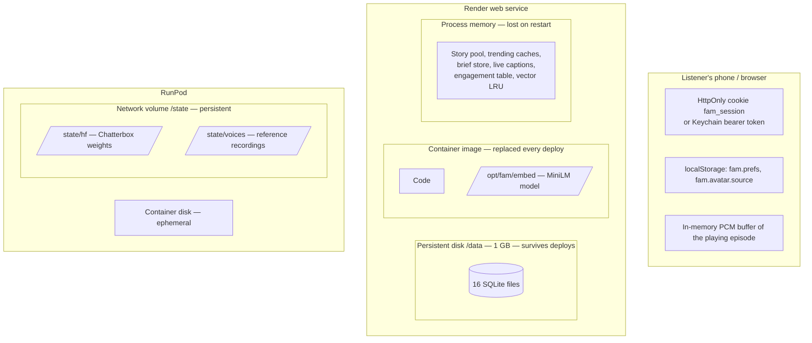
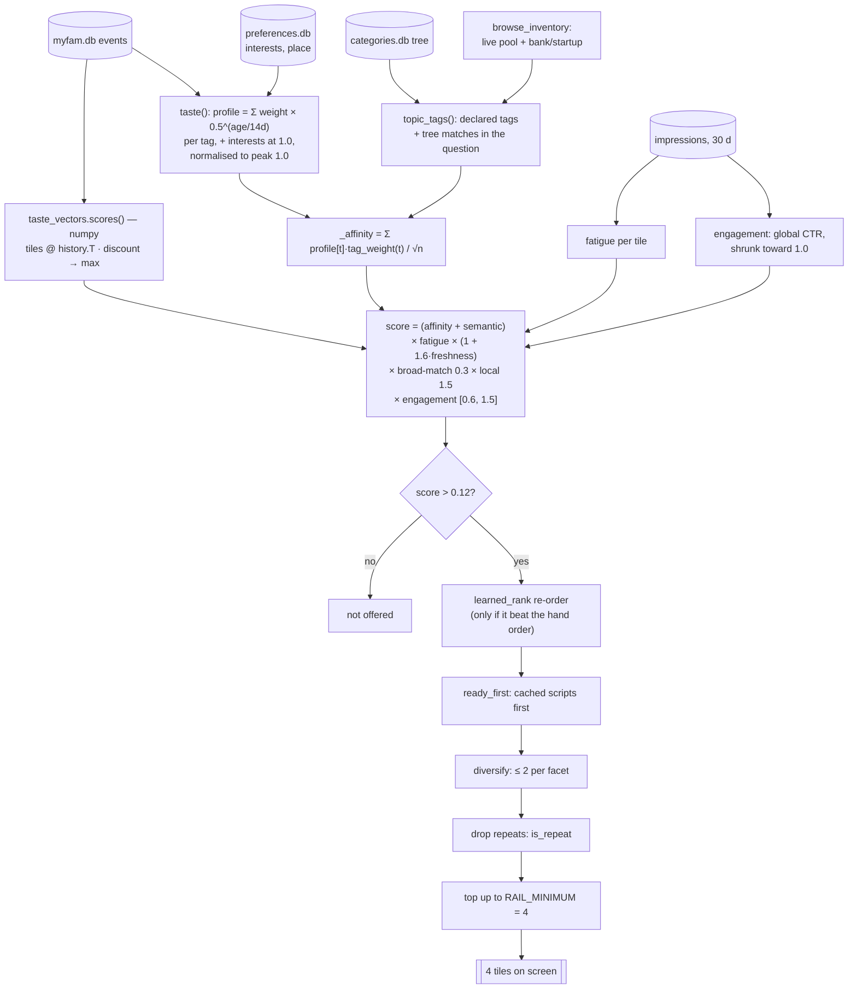

# FAM — Data: what is stored, where, for how long, and how the algorithm reads it

| | |
|---|---|
| **Status** | Official documentation, v1 |
| **As of** | 2026-09-25 (code at `Main` after PR #59) |
| **Audience** | Engineers, and anyone answering a privacy, retention or capacity question |
| **Companion docs** | [`FINANCIAL.md`](FINANCIAL.md), [`BACKEND.md`](BACKEND.md), `DATABASE.md` (the design reasoning) |

`DATABASE.md` is out of date in four places, and where it disagrees with this
document, this document follows the code:

- It says "fourteen" stores. There are **sixteen**: `voice_bank.db` and
  `trending_bank.db` are missing from its table.
- It says the `share` event is dropped. It is not.
- It says location is not stored. It is.
- It says the embedding model is never run. It is.

---

## 1. Where everything lives



| Location | Holds | Survives a deploy? |
|---|---|---|
| **Render persistent disk** `/data` (disk `fam-data`, **1 GB**, `render.yaml:195-198`) | All 16 SQLite databases, including the kept episode audio and the voice-bank recordings | **Yes.** `/api/health` → `storage` measures this with `st_dev` rather than trusting config. |
| **Render container image** | Code, and the all-MiniLM-L6-v2 embedding model at `/opt/fam/embed` (`Dockerfile:51-55`) | Rebuilt every deploy (that is fine; nothing is written there) |
| **Render process memory** | Every cache in §3 | **No**, it is lost on restart or deploy, by design |
| **RunPod network volume** `/state` (~20 GB recommended) | Chatterbox weights (`/state/hf`), `reference_3.wav` and its rights file, bank voices materialised after a SHA and rights check | Yes |
| **RunPod container disk** | Nothing that matters | No |
| **The listener's device** | Session cookie or token, device-only settings (playback speed, first-run flag), the avatar crop source (≤ 1024 px) | Until cleared. **No IndexedDB**: downloads were removed. |
| **The browser vendor's speech service** | The audio of a voice search (§151). Chrome sends it to Google, Safari to Apple. FAM never receives or stores the audio; it gets only the recognised words, exactly as if they had been typed. | Under the vendor's own policy, not FAM's |
| **`~/.fam/`** (dev machines only) | `env` (API keys), `voices/`, `embed/` | n/a on Render |

**No listener data is stored on RunPod.** The worker receives text and a voice
id and returns PCM, and it keeps neither. The one exception is the all-in-one
`Dockerfile.gpu` image, which puts the SQLite files on `/state/data`. It is not
the Render deployment.

---

## 2. The sixteen SQLite databases

- **Files:** each database is one file owned by one module, opened in WAL mode.
  `paths.data_path()` resolves each one from an environment variable.
- **Location on Render:** the `Dockerfile` pins all sixteen to `/data`.
- **Joins:** there are no cross-file foreign keys. `user_id` is joined in
  Python.
- **Adding a store:** `tests/test_data_paths.py` derives the list of stores
  from the code, so a new store that is not pinned to the disk fails the
  tests.

| File | Owner | What it holds (main tables) | Per-listener? | Growth |
|---|---|---|---|---|
| **scripts.db** | `cache.py` | **The shared episode cache.** `scripts`: question, sentences, title, summary, `thread` (NEXT), sources, `vector` (float32 blob), author, origin, voice, `sourced_at`, `fresh_until`, plays. `episode_audio`: zlib-compressed PCM per (script, voice). | **No, shared by everybody** | The largest by far, because of audio |
| **myfam.db** | `topics.py` | `events`: every interaction of an **account** (search, play, complete, skip, pick, share, vibe, save, impression), with tags, section and algorithm version. `learned_rank`: the fitted ranking model (1 row). | Yes | Grows forever, except impressions |
| **preferences.db** | `preferences.py` | Interests, typed topics, hidden and pinned profile interests, language, **city / region / country** | Yes | 1 row per listener |
| **accounts.db** | `accounts.py` | Credentials (scrypt), `sessions` (token **hash**), `identities` (Google/Apple subject), plan | Yes | Small |
| **social.db** | `social.py` | `people` (name, handle, avatar ≤ 96 KB), `follows`, `echoes` (vibes), `ratings`, `announced` | Yes | Small |
| **messages.db** | `messages.py` | Direct messages (text ≤ 1,000 chars), read marks, per-side "Delete chat" marks | Yes | Grows forever |
| **saved.db** | `saved.py` | Save-for-later pointers, folders, resume positions (`progress`), 2-week listening `history`, dismissed tiles | Yes | Bounded by history pruning |
| **shares.db** | `sharing.py` | Share links (question, minutes, title) and an open counter | Yes | Grows forever |
| **mixes.db** | `mixes.py`, `daily_edition.py` | DailyFAM mixes (subjects, never audio), covers (≤ 200k chars), public flag; `daily_editions` build ledger | Yes | ≤ 30 mixes per listener |
| **quotas.db** | `quotas.py` | Usage counters and per-episode charges | Yes | Pruned after 60 days |
| **metering.db** | `metering.py` | One row per episode: tokens, Exa searches, live calls, audio seconds, cache hit, cost split between Claude, Exa and GPU | Yes | 1 row per episode, forever |
| **attachments.db** | `attachments.py` | Extracted text of attached documents (≤ 24k chars) | Yes | Purged after 6 h |
| **voice_registry.db** | `voice_registry.py` | RunPod workers that announced themselves (url, port, contract, last seen) | No | ≤ 20 rows |
| **voice_bank.db** | `voice_bank.py` | Cloned voices: the reference recording as a **BLOB** (≤ 8 MiB each) plus its rights record; each listener's search-voice choice | Mixed | A few MB per voice |
| **categories.db** | `categories.py` | The grown vocabulary tree (label, parent, depth, source, listener count) | No, shared | ≤ 4,000 nodes |
| **trending_bank.db** | `trending_bank.py` | Trending editions (the payload of each slot) and GNews spend per day | No, shared | 2 per day |

### 2.1 How much data: size estimates

These are estimates from the schema and constants. There is no production
database to measure.

| Item | Size per unit | At 10k listeners |
|---|---|---|
| Kept audio | ~2 MB per minute (2.65 MB/min raw × 0.74 after zlib level 1) | **Capped at 512 MB** (`AUDIO_CACHE_MAX_MB`), about 250 min |
| Script row, including the 1 KB vector | ~5-15 KB | 100k rows ≈ 1 GB. It needs a larger disk before then (see below). |
| Event row | ~200-400 bytes | 45 events/listener/month ≈ 150 MB/month |
| Metering row | ~300 bytes | 1 row per episode |
| Everything else | Small | < 100 MB |

**The 1 GB disk is the first capacity limit.** Audio stops at 512 MB by itself,
but script rows, events, messages and metering have no cap. At a few thousand
active listeners, grow the disk ($0.25/GB/month) *before* it fills. A full
disk stops every write in the app, not just the cache.

---

## 3. In-memory stores

These belong to one process and are rebuilt on restart. None of them is a
source of truth.

| Store | Module | Holds | Limit / TTL |
|---|---|---|---|
| Live captions | `live_captions.py` | Sentences and audio offsets of episodes being generated, plus the `/api/progress` marks | 64 tracks, 15 min |
| Brief store | `prefetch.py:412` | Warmed EI briefs | 1 h (`PREFETCH_BRIEF_TTL_SECONDS`); a degraded brief is never stored |
| Prefetch clocks | `prefetch.py:94` | Per-listener cycle timers | 2,000 listeners |
| Story pool | `stories.py:637-651` | `_POOL` (≤ 96 kept, ≤ 40 offered), `_RETIRED` (cooldowns), `_FIRST_SEEN` (each story's clock, kept apart from pool membership) | Shelf life by domain |
| Trending edition | `trending_bank._CURRENT` | The live edition, reloaded from `trending_bank.db` | Reload every 60 s |
| Trending feed (legacy) | `trending._FEED` | Old GDELT themes | 15 min |
| Live facts | `live_facts.FACT_CACHE` | Scores, quotes, odds | 10 s in progress / 5 min scheduled / 15 min final |
| GDELT volumes | `gdelt._VOLUMES` | Coverage counts | 20 min |
| Engagement table | `topics._ENGAGEMENT_CACHE` | Global click-through per tile | Rebuilt every 5 min |
| Tag memo | `topics._TAG_MEMO` | Tile → category tags | 2,000 entries; cleared when the tree changes |
| Semantic vectors | `taste_vectors._VECTORS` | MiniLM vectors of tiles and history texts | LRU of 5,000 |
| Learned model | `learned_rank._CACHE` | The active ranking model | 5 min |
| Typing indicator | `typing_indicator._TYPING` | "Is typing" flags | 5 s |

This state is per process, so it is also the reason FAM cannot simply run
more than one worker (see `FINANCIAL.md` §5.1).

---

## 4. Limits and guardrails in the code

### 4.1 Size caps on what a listener can store

| Field | Cap | Code |
|---|---|---|
| Message text / title / attached query | 1,000 / 200 / 500 chars | `messages.py:63-73` |
| Attachment upload / extracted text | 8 MiB / 24,000 chars | `attachments.py:38-44` |
| Display name / handle / avatar | 40 / 24 chars / 96,000 bytes | `social.py:47-57` |
| Mix name / typed subject / subjects per mix / mixes per listener | 60 / 200 / 20 / **30** | `mixes.py:49-62` |
| Mix cover | 200,000 chars | `mixes.py` |
| Saved folders / title / query | 40 / 200 / 500 | `saved.py:53-58` |
| Email / phone / password | 254 / 20 / 8-1,024 chars | `accounts.py:73-95` |
| Typed interests / profile pins / place names | 200 of ≤ 60 chars / 5 / 60 chars | `preferences.py:139-236` |
| Voice reference recording | 8 MiB | `voice_bank.py:76` |
| One RunPod synthesis request | 4,000 characters | `voice_worker/synth.py:75` |

### 4.2 Capacity and spend guardrails

| Guardrail | Value | Code |
|---|---|---|
| Kept audio | 512 MB, least-recently-played evicted first, **audio only**: the script stays | `config.py:981`, `cache.py:1303` |
| Near-match scan | 400 rows | `CACHE_VECTOR_SCAN` |
| Vocabulary | 4,000 nodes, ≤ 40 new per sweep, a phrase needs ≥ 3 listeners and ≥ 2 wordings | `categories.py:120-176` |
| Story pool | 40 offered / 96 kept / ≤ 5 per facet / ≤ 8 per source | `stories.py:152-176` |
| Writer output | 16,000 tokens; generation stops at 1.35x the target words | `config.py:282` |
| Episode length | 1-10 min for search; every other surface is 2 | `config.py:216` |
| Prefetch | 6 per cycle, 50 episodes, 400 briefs, **$2** per day | `config.py:825-837` |
| DailyFAM edition | 300 episodes, **$15** per day, 3 at a time | `config.py:686`, `daily_edition.py:91` |
| GNews | 90 requests per day | `render.yaml` |
| API-Sports | 100 requests per day, shared, per process | `config.py:769` |
| Pace per listener | 1 generation per 3 s, burst 3; 60 reads per window | `config.py:1185-1195` |
| Tier quotas | free 5/day, plus 150/week. **Built, off** (`ENFORCE_QUOTAS=0`). | `entitlements.py:219` |
| Admin SQL | Read-only SELECT, 500 rows, 4 s | `admin_tracker.py:62` |
| Account visibility | A listener id is only ever taken from the server-minted session, never from a parameter | `app._listener` |

---

## 5. Retention: how long each thing is kept

| Data | Kept for | Mechanism |
|---|---|---|
| **Episode script** | **7 days** from `sourced_at` (`CACHE_LIFE_SECONDS`). A play slides an evergreen row forward, up to **30 days** from the write. | `cache._clocks`, `_slide`. Expired rows and their audio are deleted at startup (`purge_expired`). |
| **When a script can be served to a new request** (`fresh_until`) | Game in progress: **0** (never). Scheduled game: ≤ 30 min. Result-dependent question, or recency ≤ 1 day: **15 min**. Volatile keyword: 15 min. Otherwise the whole 7 days. | `cache.ttl_for` (precedence: live status → outcome-dependent → recency window → keywords) |
| **Kept audio** | As long as its script, unless evicted by the 512 MB cap; deleted when the script is rewritten with different words | `cache.put_audio` |
| **Trending episodes** | Until the edition expires, ≤ 36 h | `TRENDING_BANK_MAX_AGE_HOURS` |
| **Events** (plays, searches, …) | **Indefinitely.** Taste weights them with a **14-day half-life**. | `topics.HALF_LIFE` |
| **Impressions** | 30 days, pruned at most hourly | `IMPRESSION_TTL` |
| **Listening history** | 14 days, pruned on write | `saved.HISTORY_SECONDS` |
| **Sessions** | 90 days | `accounts.SESSION_TTL` |
| **Quota ledger** | 60 days | `quotas.KEEP_SECONDS` |
| **Attachments** | 6 hours, purged at startup | `attachments.TTL_SECONDS` |
| **Vocabulary nodes** | 180 days since last seen. Parents and seeded nodes are exempt. | `categories.NODE_TTL` |
| **Live stories in the pool** | Sports 8 h, markets 18 h, attention 20 h, prediction 4 d from `first_seen`; then a 36 h cooldown | `stories.DOMAIN_SHELF_LIFE` |
| **Warmed briefs** | 1 hour, in memory | `PREFETCH_BRIEF_TTL_SECONDS` |
| **Metering, messages, shares, social, mixes** | **Indefinitely.** No automatic pruning. | — |

**A guest has no record in the event log.** A guest session is a device, not a
person (§127, `app._remembers`), so none of a guest's plays, searches or
impressions are written. Account deletion is built (`ACCOUNTS.md`). The
episodes a deleted listener generated stay in the shared cache, where they
have no identity attached except the `author` provenance column.

---

## 6. The algorithm, wired end to end

This is how one row in `myfam.db` becomes a tile on "Made for you".



### 6.1 Inputs

- **Event weights** (`topics.py:1513`):

  | Event | Weight |
  |---|---|
  | search | 1.0 |
  | play | 1.0 |
  | complete (≥ 85 % heard) | 2.5 |
  | skip | −1.5 |
  | pick | 1.6 |
  | share | 2.0 |
  | vibe | 2.0 |
  | save | 1.5 |

  **Impressions carry no weight.** An impression can make a tile *tired*; it
  can never create taste. Otherwise the feed would teach itself its own
  preferences.
- **Tags** (`tag_weight`):
  - A broad facet (one of 8) is worth **1.0**.
  - A hand-written subtag is worth **1.75**.
  - A grown category node is worth **1.75^depth**. So `sports → american
    football → nfl → cincinnati bengals` weighs the leaf at 1.75³ ≈ 5.4x the
    root.
- **Declared interests** start at `INTEREST_WEIGHT = 1.0` each, so behaviour
  outvotes them within weeks.

### 6.2 The multipliers

| Term | Value | Effect |
|---|---|---|
| `FRESHNESS_BOOST` | 1.6 | New live stories lead |
| `BROAD_MATCH_PENALTY` | 0.3 | A live story that matches only a whole facet, on words the listener has never used, and has no semantic match, is damped. It is never excluded. |
| `LOCAL_BOOST` | 1.5 | A live story naming the listener's city or region. **Country never ranks.** |
| Fatigue | `max(0.15, 1/(1 + 0.35·(occasions − 2)))` | A tile shown on more than 2 separate hours and never played sinks |
| Engagement | `rate = (took + 20·overall)/(shown + 20)`; lift clamped to **[0.6, 1.5]** | A global click-through rate, never per listener; a new tile scores exactly 1.0 |
| `RELEVANCE_FLOOR` | 0.12 | Below this a tile is not offered. The rail is then topped up to 4 from the fallback. |

### 6.3 The brute-force similarity step (numpy)

There are two nearest-neighbour searches in FAM. **Only one of them uses
numpy.**

**(a) Ranker semantic term: numpy matrix multiply** (`taste_vectors.py:309-332`)

Build three arrays:

| Array | Shape | Contents |
|---|---|---|
| `past_matrix` | (H, 384) float32 | MiniLM unit vectors of the listener's up-to-48 most recent positive events (searches, plays, completes …) |
| `discount` | (H,) | `0.5 + 0.5 × strength`, where strength is Σ weight × decay per text, scaled so the peak is 1 |
| `tiles` | (T, 384) float32 | Unit vectors of every candidate tile's question |

Then compute:

```python
best = (tiles @ past_matrix.T * discount).max(axis=1)       # (T,)
term = 0.6 * clip((best - 0.3) / (1 - 0.3), 0, None)        # SEMANTIC_WEIGHT, SEMANTIC_FLOOR
```

- **The multiply:** the vectors are already L2-normalised, so
  `tiles @ past_matrix.T` is a **T × H cosine-similarity matrix**, computed
  exactly in one BLAS call.
- **The weighting:** each column is weighted by how strongly and recently
  that history item was felt.
- **Max, not mean:** the **max** over history means a tile only has to be
  close to *one* thing the listener cared about. Averaging would reward bland
  tiles close to everything.
- **Where the term goes:** it is *added* to `_affinity`, and a positive term
  also exempts the tile from the broad-match penalty.
- **Why brute force:** at T ≈ 100 tiles and H ≤ 48, the matrix is about 5,000
  dot products. An index would cost more than the multiply.
- **Cost:**
  - **~2 ms per page** once vectors are cached (LRU of 5,000).
  - **~58 ms** on a new listener's first page (PROBLEMS.md §131).
  - At most 6 new texts are embedded inline per page. The rest are embedded
    in a background thread in batches of 16.
- **Off switch:** with no model installed, or `SEMANTIC_TASTE=0`, the term is
  `{}` and ranking is exactly the pre-§131 order.

**(b) Cache near-match: pure Python, not numpy** (`cache.py:1327-1354`, `embeddings.py`)

- **Candidates:** on a cache miss, FAM loads up to **400** current rows from
  the same `bucket`. The bucket is a hash of minutes, context, research mode,
  model, words per minute and embedding space, so incompatible episodes are
  never compared.
- **Comparison:** each stored vector (256-dim signed-hashing embedding,
  ~1 KB) is compared to the query with a plain-Python dot product.
- **Accepting a match:** it must score **≥ 0.68** *and* pass guards:
  - identical numbers
  - the same need for fresh facts
  - ≥ 60 % word overlap
- **Cost:** **8.93 ms** per miss (measured).
- **Recall:** it lifts re-phrasing recall from 9/41 to **23/41** with no false
  matches. The measurement showed the **guards, not the cosine**, carry that
  gain. That is why MiniLM is used by the ranker (a near miss costs a weaker
  tile) and not by the cache (a near miss would serve the wrong episode).
- **Why no vector database:** exact KNN over 384 dimensions measured 0.06 ms
  at 1k rows and 2.35 ms at 100k.

### 6.4 The learned re-order: numpy logistic regression (`learned_rank.py`)

- **Features:** six per offered tile, rebuilt point-in-time from the
  impression log:

  | Feature | Definition |
  |---|---|
  | affinity | `_affinity` |
  | semantic | the ranker semantic term |
  | fatigue | −log(damp) |
  | engagement | log(lift) |
  | live | whether the tile is a live story |
  | broad | whether it is a broad match |

- **Label:** whether the tile was tapped.
- **Fit:**
  1. Standardise the features.
  2. Run L2-regularised (λ = 1) **Newton-Raphson**, ≤ 50 iterations:
     `H = Xᵀ diag(p(1−p)) X + λI`, solved with `np.linalg.solve`.
- **Gate:**
  - It needs ≥ 200 rows and ≥ 20 taps on each side of a time split, holding
    out the newest 20 %.
  - It is **stored only if its held-out AUC beats the hand-tuned order by ≥
    0.01.**
- **Serving:** it may **re-order** tiles that already cleared the relevance
  floor. It may never admit a tile below it.
- **Commands:** `python tools/learn_rank.py` retrains; `LEARNED_RANK=0` turns
  it off.

### 6.5 After the score

| Step | Rule |
|---|---|
| `ready_first` | A stable sort that puts tiles whose script is already cached first, up to 24 deep. Never a filter. |
| `diversify` | ≤ 2 tiles per facet in a rail |
| `is_repeat` | A heard evergreen tile never returns. A heard live story returns only as a "what's new" follow-up (after 6 h) or not at all. A heard startup question may return only as a *different* episode, ≥ 24 h later. |
| `RAIL_MINIMUM` | Made for you is topped up to 4 from the fallback inventory. The crowd rails are never topped up. |

**The vocabulary tree** (`categories.py`, hourly) grows from listeners'
searches, the story pool's subjects and typed interests:

- A phrase is promoted when **≥ 3 listeners** used it in **≥ 2 different
  wordings**.
- A fragment whose support equals that of a longer phrase containing it is
  dropped.
- One Claude call per sweep places the new nodes under parents.
- About 180 seed nodes (`category_seed.py`) mean a fresh deployment is never
  vocabulary-less.
