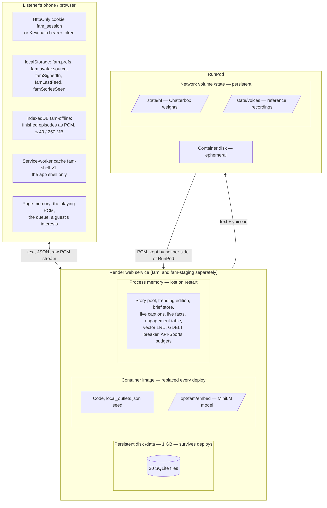
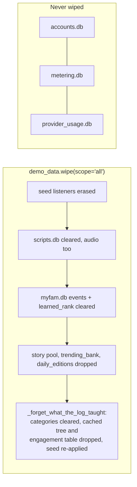
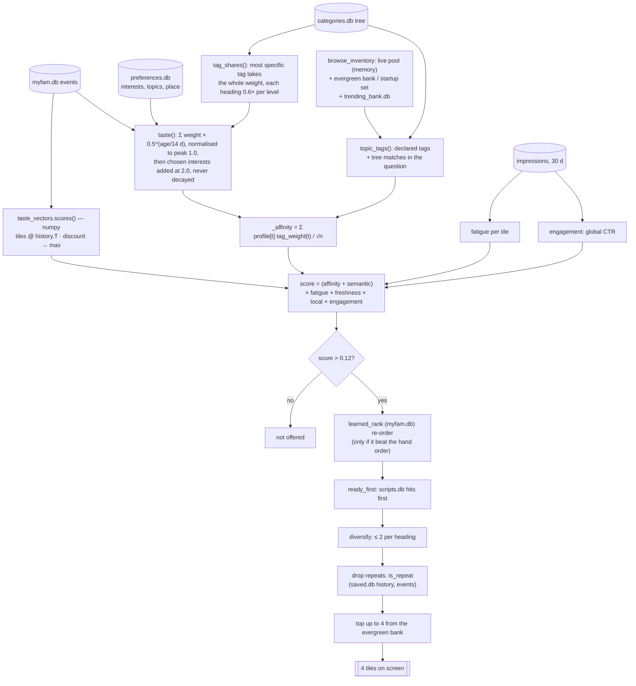

# FAM — Data: what is stored, where, for how long, and how the algorithm reads it

| | |
|---|---|
| **Status** | Official documentation, v2 |
| **As of** | 2026-10-05 (code at `Main` after PR #103, plus PROBLEMS.md §207) |
| **Audience** | Engineers new to FAM, and anyone answering a privacy, retention or capacity question |
| **Companion docs** | [`FINANCIAL.md`](FINANCIAL.md), [`BACKEND.md`](BACKEND.md), [`algorithm/ALGORITHM.md`](algorithm/ALGORITHM.md) (generated), `DATABASE.md` (the design reasoning) |

Every number here is labelled the way [`README.md`](README.md) requires:
**code** (a constant, with its file), **measured** (a result in `PROBLEMS.md`),
or **estimate** (with the working shown). Where this document and the code
disagree, the code wins: fix this document.

`DATABASE.md` is out of date in these places, and where it disagrees with this
document, this document follows the code:

- It says "fourteen" stores. There are **twenty** (§2). It is missing
  `voice_bank.db`, `trending_bank.db`, `thumbnails.db`, `provider_usage.db`,
  `feedback.db` and `local_news.db`.
- It says the `share` event is dropped. It is not; it is an event with a
  taste weight.
- It says location is not stored. It is (`preferences.city/region/country`).
- It says the embedding model is never run. It is (the ranker's semantic
  term, §7.3).

---

## 1. Where everything lives


```mermaid
flowchart TB
  subgraph Client["Listener's phone / browser"]
    C1[HttpOnly cookie fam_session<br/>or Keychain bearer token]
    C2[localStorage: fam.prefs, fam.avatar.source,<br/>famSignedIn, famLastFeed, famStoriesSeen]
    C3[IndexedDB fam-offline:<br/>finished episodes as PCM, ≤ 40 / 250 MB]
    C4[Service-worker cache fam-shell-v1:<br/>the app shell only]
    C5[Page memory: the playing PCM,<br/>the queue, a guest's interests]
  end
  subgraph Render["Render web service (fam, and fam-staging separately)"]
    subgraph Disk["Persistent disk /data — 1 GB — survives deploys"]
      D1[(20 SQLite files)]
    end
    subgraph Image["Container image — replaced every deploy"]
      I1[Code, local_outlets.json seed]
      I2[/opt/fam/embed — MiniLM model/]
    end
    subgraph Mem["Process memory — lost on restart"]
      M1[Story pool, trending edition, brief store,<br/>live captions, live facts, engagement table,<br/>vector LRU, GDELT breaker, API-Sports budgets]
    end
  end
  subgraph RunPod
    subgraph Vol["Network volume /state — persistent"]
      R1[/state/hf — Chatterbox weights/]
      R2[/state/voices — reference recordings/]
    end
    R3[Container disk — ephemeral]
  end
  Client <-- "text, JSON, raw PCM stream" --> Render
  Render -- "text + voice id" --> RunPod
  RunPod -- "PCM, kept by neither side of RunPod" --> Render
```

| Location | Holds | Survives a deploy? |
|---|---|---|
| **Render persistent disk** `/data` (disk `fam-data`, **1 GB**, code: `render.yaml:299-302`; staging has its own `fam-staging-data`, also 1 GB, `render.yaml:54-57`) | All 20 SQLite databases, including the kept episode audio, the voice-bank recordings and the tile pictures | **Yes.** `/api/health` → `storage` measures this with `st_dev` rather than trusting config (`storage-durability`). |
| **Render container image** | Code; the all-MiniLM-L6-v2 embedding model at `/opt/fam/embed` (`Dockerfile:53-57`); the seed list of local outlets (`local_outlets.json`) | Rebuilt every deploy. Nothing is written there. |
| **Render process memory** | Every cache in §3 | **No.** Lost on restart or deploy, by design |
| **RunPod network volume** `/state` | Chatterbox weights (`/state/hf`), `reference_3.wav` and its rights file (`/state/voices`), bank voices materialised after a SHA and rights check | Yes |
| **RunPod container disk** | Nothing that matters | No |
| **The listener's device** | See §4: session credential, device-only settings, an offline shelf of finished episodes (IndexedDB), the app shell (service worker) | Until cleared, or until log-out, which empties the shelf |
| **The browser vendor's speech service** | The audio of a voice search (§151). Chrome sends it to Google, Safari to Apple. FAM never receives or stores the audio; it gets only the recognised words. | Under the vendor's policy, not FAM's |
| **Outside services** | Viral Loops holds a waitlisted account's email and referral code once the outbox has sent it (§183). Nothing else FAM sends out is stored by FAM's choice. | Under Viral Loops' policy. Deleting an FAM account does **not** tell Viral Loops (known, §183). |
| **`~/.fam/`** (dev machines only) | `env` (API keys), `voices/`, `embed/` | n/a on Render |

**No listener data is stored on RunPod.** The worker receives text and a voice
id and returns PCM, and it keeps neither. The exception is the all-in-one
`Dockerfile.gpu` image, which puts SQLite on `/state/data`. It is not the
Render deployment; since §208 it pins all 20 stores there, as the Render
`Dockerfile` does to `/data` (`tests/test_data_paths.py` checks both).

---

## 2. The twenty SQLite databases

- **Files:** each database is one SQLite file, opened through
  `paths.data_path(ENV_VAR, filename)`. Unset, the file lands in the project
  root. Some files are shared by more than one module (`mixes.db`,
  `local_news.db`, `accounts.db`).
- **Location on Render:** the `Dockerfile` (lines 78-97) pins all twenty to
  `/data`.
- **Joins:** there are no cross-file foreign keys. `user_id` is joined in
  Python.
- **Adding a store:** `tests/test_data_paths.py` derives the list of stores
  from every `data_path("VAR", ...)` call in the code, so a new store that is
  not pinned to the disk fails the tests. `admin_tracker.discover_stores` uses
  the same derivation, so `/admin`'s read-only SQL sees every store
  automatically.

### 2.1 The table of stores

"Erase" is what account deletion (`app.erase_listener`) does to the store.
"Wipe" is what `demo_data.wipe(scope="all")` does (§2.3).

| File (env var) | Owner module(s) | Main tables | Per-listener? | Retention | Erase / Wipe |
|---|---|---|---|---|---|
| **scripts.db** (`CACHE_PATH`) | `cache.py` | `scripts`, `episode_audio` | **No, shared** (`author` is provenance) | 7 days per row; audio capped at 512 MB | `author` cleared on erase (§208) · **Wiped** |
| **myfam.db** (`MYFAM_DB`) | `topics.py`, `learned_rank.py` | `events`, `learned_rank` | Yes | Forever (impressions 30 days) | Erased · **Wiped** (events and the model) |
| **preferences.db** (`PREFS_DB`) | `preferences.py` | `preferences` | Yes | 1 row per listener | Erased · kept |
| **accounts.db** (`ACCOUNTS_DB`) | `accounts.py`, `waitlist.py` | `accounts`, `sessions`, `identities`, `waitlist_settings`, `waitlist_outbox` | Yes | Sessions 90 days | Erased · **never wiped** |
| **social.db** (`SOCIAL_DB`) | `social.py` | `people`, `follows`, `echoes`, `ratings`, `comments`, `comment_likes`, `announced` | Yes | Forever | Erased · kept |
| **messages.db** (`MESSAGES_DB`) | `messages.py` | `messages`, `reads`, `clears` | Yes | Forever | Erased (sent messages) · kept |
| **saved.db** (`SAVED_DB`) | `saved.py` | `folders`, `items`, `vibe_files`, `progress`, `history`, `dismissed` | Yes | History 14 days | Erased · kept |
| **shares.db** (`SHARES_DB`) | `sharing.py` | `shares` | Yes | Forever | Erased · kept |
| **feedback.db** (`FEEDBACK_DB`) | `feedback.py` | `reports` | Account id only | Forever | **Anonymised** · kept |
| **mixes.db** (`MIXES_DB`) | `mixes.py`, `push.py`, `daily_edition.py` | `mixes`, `push_subscriptions`, `push_sent`, `daily_editions` | Yes (mixes, push) | ≤ 30 mixes per listener | Erased · `daily_editions` **wiped** |
| **quotas.db** (`QUOTAS_DB`) | `quotas.py` | `counters`, `charges` | Yes | 60 days | Erased · kept |
| **metering.db** (`METERING_DB`) | `metering.py` | `usage` | Yes, until anonymised | Forever | **Anonymised** · **never wiped** |
| **attachments.db** (`ATTACHMENTS_PATH`) | `attachments.py` | `attachments` | Yes | 6 hours | Erased · kept |
| **voice_registry.db** (`VOICE_REGISTRY_DB`) | `voice_registry.py` | `workers` | No | ≤ 20 rows | n/a |
| **voice_bank.db** (`VOICE_BANK_DB`) | `voice_bank.py`, `pronunciation.py` | `voices`, `choices`, `pronunciations` | `choices` only | Forever | `choices` erased · kept |
| **categories.db** (`CATEGORIES_DB`) | `categories.py` | `categories` | No, shared | ≤ 4,000 nodes; 180 days unseen | n/a · **Wiped and re-seeded** |
| **trending_bank.db** (`TRENDING_BANK_DB`) | `trending_bank.py` | `editions`, `spend` | No, shared | 2 editions per day (+ startup slots) | n/a · **Wiped** |
| **provider_usage.db** (`PROVIDER_USAGE_DB`) | `provider_usage.py` | `calls` | No, shared | Forever | n/a · **never wiped** (like metering) |
| **thumbnails.db** (`THUMBNAILS_DB`) | `thumbnails.py` | `thumbnails`, `spend`, `runs` | No, shared | ≤ 1 picture per tree node | n/a · kept |
| **local_news.db** (`LOCAL_NEWS_DB`) | `local_news.py`, `places.py`, `weather.py` | `outlets`, `items`, `demand`, `excluded`, `places`, `weather` | No (no `user_id`) | Items pruned daily past 30 days (`LOCAL_NEWS_KEEP_DAYS`, never below the 14-day window; each outlet keeps its newest 200, §208); demand 30 days | n/a · kept |

### 2.2 Each store: what it holds, who writes it, who reads it

**scripts.db — the shared episode cache** (`cache.py`, `SqliteScriptCache`)

- `scripts`, one row per cache key (`pipeline.key_for` is the only key):
  `query`, `sentences`, `minutes`, `title`, `summary`, `category` (the
  writer's `<<CATEGORY:>>`), `thread` (the `<<NEXT:>>` prediction),
  `sources`, `bucket` and `vector` (float32 blob, the near-match index),
  `author` (the first writer's listener id, provenance only), `origin`
  (`search`, a browse surface, or `archive`), `voice`, `sourced_at`,
  `fresh_until`, `expires`, `ttl`, `plays`, `hits`.
- `episode_audio`, keyed `(key, voice)`: zlib PCM, `sample_rate`, sentence
  `starts`, `bytes`, `played` (the LRU clock). Production voice and whole
  episodes only (`keeps_audio`).
- **Heard-episode archive (§173).** Every served episode has an id,
  `cache.episode_id(key, sourced)`, sent as `X-FAM-Episode`. When a key is
  written again with *different* words, the old row and its audio move to
  `archive_key(key, sourced)` with `origin = "archive"`, `fresh_until` 1
  (never current), no bucket or vector (never a near match) and `ttl` 0
  (never slides). `/api/audio?episode=` resolves an id (`resolve_episode`) and
  replays it without writing; `/api/history` pins what a history row names
  for 14 days (`keep_until`, `app._pin_heard`).
- Written by: the pipeline on every episode (search, tiles, DailyFAM and
  Trending editions, prefetch at `script` level), and the staging-only
  `POST /api/admin/episodes` (import).
- Read by: every surface that plays an episode; Explore and the A-Z catalogue
  (`cached_only`, `recent()`); trending searches (`recent(origin="search")`,
  the last 2 h); the sign-up samples; `/api/next`; `/api/transcript`.

**myfam.db — the event log and the learned model** (`topics.EventStore`)

- `events`: `user_id`, `kind`, `topic_id`, `text`, `tags`, `thread`,
  `section` (which rail it was on), `algo` (`ALGO_VERSION`, now
  `2026-10-05.1`), `at`. Kinds: search, play, complete, skip, pick, share,
  vibe, save, `mix_add` (new in §202, logged by `app._record_mix_adds`), and
  impression. `hide` is no longer accepted (§171); old rows are ignored.
- `learned_rank`: the fitted re-ranking model, one active row.
- **Only accounts are logged.** A guest's events are never written
  (`app._remembers`, `account-gates-kept`).
- Read by: `taste`, every myFAM rail (Most played reads `plays_since` over
  24 h; What you missed reads plays 3-7 days old), the engagement table,
  `learned_rank` training, the vocabulary sweep, the sign-up samples.

**preferences.db** (`preferences.py`): one row per listener: `interests`
(facets), `topics` (chosen subjects, newline-separated, §170), `hidden_interests`,
`profile_interests` (the five pinned), `language` (kept, no picker),
`city`/`region`/`country`, `searches_public` (§190, default off),
`weekly_recap`, `intro_done`. A guest's interests are never written here; they
live in page memory (§4).

**accounts.db** (`accounts.py`, `waitlist.py`)

- `accounts`: `user_id`, `email`, `phone`, `password` (scrypt), `plan`,
  `display_name`, `birth_date`, and since §183 the waitlist columns:
  `status` (`waitlisted` / `active`), `referral_code`, `referred_by`,
  `vl_referral_code`, `vl_participant_id`, `waitlist_joined_at`,
  `access_granted_at`.
- `sessions`: the **hash** of each session token, `expires` (90 days,
  `accounts.SESSION_TTL`). `identities`: Google/Apple subject per account.
- `waitlist_settings` (the admin's `access_cutoff`) and `waitlist_outbox`:
  every Viral Loops call to make, with `attempts`, `next_at`, `last_error`,
  `done_at`. Retries at 60 s, 5 min, 15 min, 1 h (`waitlist.RETRY_DELAYS`); a
  4xx other than 408/429 is finished with its error kept. A signup is never
  lost to an outage.

**social.db** (`social.py`)

- `people`: `name`, `handle`, `avatar` (≤ 96,000 bytes), `joined`,
  `last_seen`, `followers_seen`.
- `follows` (asymmetric; a friend is the mutual case, derived never stored),
  `announced` (followers already announced).
- `echoes`: vibes, with `caption` (≤ 150 chars, `social.MAX_CAPTION`, §203).
  Kept indefinitely (§162); the story ring shows the last 24 h.
- `ratings`: likes (and old dislikes from installed clients), keyed
  `(user_id, query, minutes)`.
- `comments` and `comment_likes` (§203): keyed `(query, minutes)` so every
  listener reads one thread; one level of replies (`parent_id`); text ≤ 500
  (`MAX_COMMENT`), slurs removed. Read by anyone, written with an account.

**messages.db** (`messages.py`): `messages` (text ≤ 1,000 chars, or an
episode), `reads` (read marks), `clears` (per-side "Delete chat", as a row id).

**saved.db** (`saved.py`): `items` (Save for later pointers; the old
`downloaded`/`bytes` columns are unused), `folders` (kind `saved` or `vibe`,
§162), `vibe_files` (which folder a vibe is filed in), `progress` (resume
position with `duration` and `context`, which feeds Pick up where you left
off), `history` (14 days, with `episode` since §173), `dismissed`.

**shares.db** (`sharing.py`): one row per share link, `query`, `minutes`,
`title`, `opens`. `/s/<id>` reads it; `ShareStore.is_shared` lets exactly a
shared episode through the waitlist gate.

**feedback.db** (`feedback.py`): Instant feedback reports: `text` (≤ 4,000),
`screen`, `build`, `page`, `viewport`, `agent`, `episode` (a snapshot of what
was playing: transcript ≤ 30,000 chars, ≤ 30 sources, §175), `resolved_at`,
`note`.

**mixes.db** (`mixes.py`, `push.py`, `daily_edition.py`)

- `mixes`: `name`, `items` (followed subjects such as `f:nfl~Eagles`, typed
  topics, picks; never audio), `public` (new mixes public), `cover`
  (≤ 200,000 chars), `source_id`/`source_user` (copies), `listen_at` and
  `listen_tz` (§184, when the "ready" push is sent).
- `push_subscriptions` (endpoint, keys) and `push_sent` (one row per mix per
  day).
- `daily_editions`: the 05:00 Eastern edition's build ledger (claimed, built).

**quotas.db**: `counters` and per-episode `charges` per window. Enforced in
production since §207 (`ENFORCE_QUOTAS=1` on `fam` in `render.yaml`).

**metering.db**: `usage`, one row per episode: tokens (including
`cache_read_tokens`/`cache_write_tokens`, §179), Exa searches, live calls,
`audio_seconds`, `cache_hit`, and cost split `claude_usd` / `exa_usd` /
`gpu_usd`. Since §207 the GPU line uses the measured Chatterbox speed
(`SYNTHESIS_REALTIME_FACTOR` 4.6) at `GPU_USD_PER_HOUR` 0.69.

**attachments.db**: extracted text of attached documents (≤ 24,000 chars),
purged after 6 h. An attached episode is never cached.

**voice_registry.db**: RunPod workers that registered themselves (url, port,
contract, sample rate, engine, commit, last seen).

**voice_bank.db** (`voice_bank.py`): `voices` (the reference recording as a
**BLOB**, ≤ 8 MiB, with its SHA-256 and rights record), `choices` (each
listener's search voice), `pronunciations` (the lexicon of respelled names,
from EI, the writer or an admin, §165; a personal episode's names are never
stored).

**categories.db**: the vocabulary tree: `label`, `parent_id`, `depth`,
`source` (`seed`, `search`, `story`, `interest`, `model`), `uses`,
`listeners` (a count, never ids), `first_seen`, `last_seen`. Since §202 the
seed (`category_seed.py`) includes 90 NFL/NBA/MLB/NHL teams under their
leagues. This tree is also the **taste tree**: a listener's profile is drawn
over it (`topics.taste_tree`, served by `/api/profile`) but is **never
stored**; it is computed from `events` and `preferences` on each request.

**trending_bank.db**: `editions` (one per slot, 05:00 and 17:00 ET, plus
`startup:` slots for Start here; `payload` is the written edition) and
`spend` (GNews requests per day).

**provider_usage.db** (`provider_usage.py`, §179): `calls` per UTC day per
provider: `api_sports` (and `api_sports/<sport>` per sport, §180), `exa`,
`gdelt`, `polymarket`, `gnews`, `finnhub`, `nws`, `open_meteo`, `local_feeds`.
Counted in memory and flushed at most every 10 s (`FLUSH_SECONDS`). Feeds
`/admin`. The licence check (§207, `provider_usage.licences()`) stores
nothing: it reads `GNEWS_PLAN`, `FINNHUB_PLAN` and whether an Open-Meteo key
is set, and reports `commercial_ready` on `/api/health`.

**thumbnails.db** (§160): one tile picture per category-tree node (a ~30 KB
WebP **BLOB**), its scene, prompt, the checker's verdict, status; `spend`
(one row per image requested) and `runs`.

**local_news.db** (§194; three modules, one file)

- `outlets` (`local_news.py`): the outlet registry: name, homepage, feed,
  town/county/region/country, `scope` (town, county, mention), feed `state`
  (new, healthy, stale, broken, no_feed, blocked, disallowed, excluded,
  retired), polling clocks (`etag`, `next_poll`, `typical_gap`). Seeded from
  `local_outlets.json`; grows from `tools/local_outlets.py` and the Exa rung.
- `items`: collected feed items (title, summary, body, published). Only items
  within `LOCAL_NEWS_WINDOW_DAYS` (14) are used as evidence.
- `demand`: which towns were asked about (no listener id); polling and
  weather sweeps cover places asked about in the last 30 days.
- `excluded`: publishers that asked not to be read.
- `places` (`places.py`): resolved places (county, region, country,
  coordinates), kept permanently; never resolved from a model or from a
  listener's saved location.
- `weather` (`weather.py`): one structured forecast snapshot per place,
  fetched on first ask and swept at 05:00 and 17:00 local time. US warnings
  are asked live, not stored.

### 2.3 What a wipe and an account deletion do


```mermaid
flowchart LR
  subgraph Wipe["demo_data.wipe(scope='all')"]
    W1[seed listeners erased] --> W2[scripts.db cleared, audio too]
    W2 --> W3[myfam.db events + learned_rank cleared]
    W3 --> W4[story pool, trending_bank, daily_editions dropped]
    W4 --> W5["_forget_what_the_log_taught:<br/>categories cleared, cached tree and<br/>engagement table dropped, seed re-applied"]
  end
  subgraph Never["Never wiped"]
    N1[accounts.db] --- N2[metering.db] --- N3[provider_usage.db]
  end
```

- **`scope="seed"`** removes the three demonstration listeners (through
  `erase_listener`) and the scripts they authored.
- **`scope="all"`** additionally empties the script cache and the event log,
  and everything derived from the log (`wipe-derived`). It does not touch
  other real listeners' social, saved, mixes or messages, and never touches
  accounts, credentials or metering.
- **Account deletion** (`app.erase_listener`) empties every per-listener store
  (events, mixes and push, social including comments and likes, preferences,
  attachments, quotas, messages, saved, shares, voice choice, waitlist
  outbox, then the account, identities and sessions). It **anonymises**
  metering and feedback rather than deleting them. It keeps every episode in
  the shared script cache but clears this listener's id from the `author`
  column of the scripts they wrote (`anonymise_author`, §208). A seed wipe
  drops the seed's scripts *before* erasing the seed's listeners, so it can
  still find them.

### 2.4 How much data: size estimates

These are **estimates** from the schema and constants. There is no production
database to measure.

| Item | Size per unit | At 10k listeners |
|---|---|---|
| Kept audio | ~2 MB per minute (2.65 MB/min raw × 0.74 after zlib level 1) | **Capped at 512 MB** (code: `AUDIO_CACHE_MAX_MB`, `config.py:1225`), about 250 min |
| Tile pictures | ~30 KB per node | ≤ 4,000 nodes ≈ **≤ 120 MB** |
| Script row, including the 1 KB vector | ~5-15 KB | 100k rows ≈ 1 GB |
| Event row | ~200-400 bytes | 45 events/listener/month ≈ 150 MB/month |
| Local news item (with body) | ~2-5 KB | Grows with every polled outlet; no pruning |
| Metering row | ~300 bytes | 1 row per episode |
| Everything else | Small | < 100 MB |

**The 1 GB disk is the first capacity limit.** Audio (512 MB) and pictures
(≤ 120 MB) together can take ~630 MB by themselves; script rows, events,
messages, comments, local news items and metering have no cap. Grow the disk
($0.25/GB/month) *before* it fills. A full disk stops every write in the app,
not just the cache.

---

## 3. In-memory stores

These belong to one process and are rebuilt on restart. None of them is a
source of truth.

| Store | Module | Holds | Limit / TTL (code) |
|---|---|---|---|
| Live captions | `live_captions._TRACKS` | Sentences and audio offsets of episodes being generated, plus the `/api/progress` marks | 64 tracks (`MAX_TRACKS`) |
| Brief store | `prefetch.BriefStore` | Warmed EI briefs | 1 h (`PREFETCH_BRIEF_TTL_SECONDS`); a degraded brief is never stored |
| Story pool | `stories._POOL`, `_RETIRED`, `_FIRST_SEEN` | Live stories (≤ 96 kept, ≤ 40 offered), cooldowns, each story's clock kept apart from membership | Shelf life by domain; 36 h cooldown |
| Trending edition | `trending_bank._CURRENT` | The live edition, reloaded from `trending_bank.db` | Reload every 60 s |
| Trending feed (legacy) | `trending._FEED` | Old GDELT themes | 15 min |
| Live facts | `live_facts.FACT_CACHE` | Scores, quotes, odds | Short, by status (in progress shortest) |
| API-Sports budgets | `live_sources.API_SPORTS_BUDGET` and per sport | Requests used today, per sport (§180) | Per UTC day, per process |
| GDELT breaker | `gdelt` | Failures in a row, `paused_until` (§207) | 5 failures → 1,800 s pause |
| GDELT volumes | `gdelt._VOLUMES` | Coverage counts | 20 min |
| Provider counts (pending) | `provider_usage._PENDING` | Requests not yet flushed to `provider_usage.db` | ≤ 10 s |
| Weather lookups | `weather._POINTS`, `weather._PLACES` | NWS grid points, resolved places | Process lifetime |
| robots.txt | `local_news._ROBOTS` | Per-host robots answers | Process lifetime |
| Engagement table | `topics._ENGAGEMENT_CACHE` | Global click-through per tile | Rebuilt every 5 min |
| Tag memo | `topics._TAG_MEMO` | Tile → category tags | Cleared when the tree changes |
| Semantic vectors | `taste_vectors._VECTORS` | MiniLM vectors of tiles and history texts | LRU of 5,000 |
| Learned model | `learned_rank._CACHE` | The active ranking model | 5 min |
| Sign-up samples | `app._WELCOME_MEMO` | The three samples on the sign-up screen | 60 s (`WELCOME_MEMO_SECONDS`) |
| Picture memos | `thumbnails._MEMO`, `_ASKED` | Which picture a tile uses, recent requests | Process lifetime |
| Typing indicator | `typing_indicator._TYPING` | "Is typing" flags | 5 s |

This state is per process, which is why FAM cannot simply run more than one
worker (see `FINANCIAL.md` §5.1).

---

## 4. What the phone or browser keeps

Nothing the ranking depends on is kept on the device for an account. The
device keeps only conveniences, and log-out (`forgetOfflineCopies`,
`forgetLocalPrefs`) empties them.

| Where | Key / name | Holds | Cleared |
|---|---|---|---|
| Cookie (web) | `fam_session` (HttpOnly) | The session token; the server stores only its hash. A browser never reads it. | Log-out; expires in 90 days |
| Keychain (iOS) | bearer token | The same token, sent as `Authorization: Bearer` | Log-out |
| localStorage | `fam.prefs` | Device-only settings: `speed`, `pitch_lock`, `wake_phrase` ("hey FAM"), `time_zone` (the pinned zone, sent as `X-FAM-TZ`), `entry`/`intro` (first-run state). **Never** `interests`, `topics` or `language`: those are stripped on read and write. | Log-out |
| localStorage | `fam.avatar.source` | The avatar crop source (bounded before storing) | Log-out |
| localStorage | `famSignedIn` | Whether this device was signed in | Log-out |
| localStorage | `famLastFeed` | The last myFAM page drawn, for an offline open | Log-out |
| localStorage | `famStoriesSeen` | Which friends' vibe stories were watched | Log-out |
| IndexedDB `fam-offline` | stores `meta`, `audio` (`OfflineShelf`) | **Finished episodes as raw PCM** (not a file, not MP3), for offline listening. ≤ 40 episodes, ≤ 250 MB, oldest-played out first. | Log-out; eviction |
| Cache Storage `fam-shell-v1` | `sw.js` | The app shell only (`/`, `/index.html`, `/fam-audio.js`). Network first; nothing under `/api/` and no audio. | Next service-worker version |
| Page memory | — | The playing episode's PCM; the queue (client state only, §190); a guest's interests and chosen subjects (gone when the page closes) | Page close |

The legacy `fam_uid` key (a client-made id) is removed on load: a listener id
is never accepted from the client (`listener-id-server`).

---

## 5. Limits and guardrails in the code

### 5.1 Size caps on what a listener can store

| Field | Cap | Code |
|---|---|---|
| Message text / title / attached query | 1,000 / 200 / 500 chars | `messages.py:63-65` |
| Comment / vibe caption | 500 / 150 chars | `social.py:112-114` |
| Attachment upload / extracted text | 8 MiB / 24,000 chars | `attachments.py:38-41` |
| Display name / handle / avatar | 40 / 24 chars / 96,000 bytes | `social.py:47-57` |
| Mix name / typed subject / subjects per mix / mixes per listener | 60 / 200 / 20 / **30** | `mixes.py:50-53` |
| Mix cover | 200,000 chars | `mixes.py:63` |
| Saved folders / title / query | 40 / 200 / 500 | `saved.py:53-58` |
| Feedback text / per listener per hour | 4,000 chars / 30 | `feedback.py:37-43` |
| Email / phone / password | 254 / 20 / 8-1,024 chars | `accounts.py:92-96` |
| Voice reference recording | 8 MiB | `voice_bank.py:76` |
| One RunPod synthesis request | 4,000 characters | `voice_worker/synth.py:75` |

### 5.2 Capacity and spend guardrails

| Guardrail | Value | Code |
|---|---|---|
| Kept audio | 512 MB, least-recently-played evicted first, **audio only**: the script stays | `config.py:1225`, `cache._evict_audio` |
| Near-match scan | 400 rows | `config.py:1236` (`CACHE_VECTOR_SCAN`) |
| Vocabulary | 4,000 nodes, ≤ 40 new per sweep, a phrase needs ≥ 3 listeners and ≥ 2 wordings, sweep every 2 h | `categories.py:120-178` |
| Story pool | 40 offered / 96 kept / ≤ 5 per facet / ≤ 8 per source | `stories.py:152-176` |
| Writer output | 16,000 tokens | `config.py:291` |
| Episode length | 1-10 min for search; every other surface 2 (a Go Deeper follow-up 1-5) | `config.py:1239-1240` |
| Prefetch | 6 per cycle, 50 episodes, 400 briefs, **$2** per day | `config.py:1065-1077` |
| DailyFAM edition | 300 episodes, **$15** per day, 3 at a time | `config.py:890-891`, `daily_edition.py:91` |
| GNews | 90 requests per day | `config.py:967` |
| API-Sports | Per sport, from each sport's tier (`API_SPORTS_TIERS`); `API_SPORTS_DAILY_REQUESTS` overrides (0 = the plan) | `config.py:992`, `live_sources.py` |
| GDELT breaker | 5 failures → pause 1,800 s | `config.py:819-820` |
| Pace per listener | 1 generation per 3 s, burst 3; 60 reads per window | `config.py:1456-1466` |
| Tier quotas | free 5 episodes/day (`FREE_EPISODES_PER_DAY`). **On in production** (`ENFORCE_QUOTAS=1` in `render.yaml`, §207), off by default in code. Admins are `unlimited`. | `config.py:1487`, `entitlements.py:224` |
| Waitlist referrals | ≤ 20 credited per code per hour | `WAITLIST_REFERRALS_PER_HOUR` |
| Admin SQL | Read-only SELECT, 500 rows, 4 s | `admin_tracker.py:62-64` |
| Account visibility | A listener id is only ever taken from the server-minted session, never from a parameter | `app._listener` |

---

## 6. Retention: how long each thing is kept

| Data | Kept for | Mechanism |
|---|---|---|
| **Episode script** | **7 days** from `sourced_at` (`CACHE_LIFE_SECONDS`, `config.py:1139`). A play slides an evergreen row forward, up to **30 days** from the write (`CACHE_MAX_AGE_SECONDS`, `config.py:1162`). | `cache._clocks`, `_slide`. Expired rows and their audio are deleted at startup (`purge_expired`). |
| **When a script can be served to a new request** (`fresh_until`) | Game in progress: **0** (never). A sports score or update (`recap`/`update`) short of `final`: **0** (§182). Weather: **1 h** (`WEATHER_TTL_SECONDS`, §194). Scheduled game, result-dependent question, evidence window ≤ 1 day, or volatile keyword: **2 h** (`CACHE_TTL_VOLATILE` 7,200, `config.py:1151`, since §173). Otherwise the whole 7 days. | `cache.ttl_for` (precedence: live status → weather → sports update → outcome-dependent → recency window → keywords) |
| **A heard episode** | 14 days while the listening history shows it | `app._pin_heard` → `cache.keep_until`; a rewritten key's old episode is archived, not overwritten (§173) |
| **Kept audio** | As long as its script, unless evicted by the 512 MB cap; moved with its script to the archive on a rewrite | `cache.put_audio`, `_evict_audio` |
| **Trending episodes** | Until the edition expires, ≤ 36 h | `TRENDING_BANK_MAX_AGE_HOURS` (`config.py:934`) |
| **Events** (plays, searches, …) | **Indefinitely.** Taste weights them with a **14-day half-life**; chosen interests never decay. | `topics.HALF_LIFE` |
| **Impressions** | 30 days, pruned at most hourly | `topics.IMPRESSION_TTL` |
| **Listening history** | 14 days, pruned on write | `saved.HISTORY_SECONDS` |
| **Vibes** | Indefinitely (the story ring shows 24 h) | §162 |
| **Comments, likes** | Indefinitely, until deleted by the author or account deletion | `social.py` |
| **Sessions** | 90 days | `accounts.SESSION_TTL` |
| **Waitlist outbox** | Done rows kept; failing rows retried on `RETRY_DELAYS` | `waitlist.py` |
| **Quota ledger** | 60 days | `quotas.KEEP_SECONDS` |
| **Attachments** | 6 hours, purged at startup | `attachments.TTL_SECONDS` |
| **Vocabulary nodes** | 180 days since last seen. Parents and seeded nodes are exempt. | `categories.NODE_TTL` |
| **Live stories in the pool** | Sports 8 h, markets 18 h, attention 20 h, prediction 4 d from `first_seen`; then a 36 h cooldown | `stories.DOMAIN_SHELF_LIFE` |
| **Warmed briefs** | 1 hour, in memory | `PREFETCH_BRIEF_TTL_SECONDS` |
| **Local news demand / weather sweeps** | Towns asked about in the last 30 days are polled and swept | `local_news.DEMAND_SECONDS`, `weather.DEMAND_SECONDS` |
| **Local news items** | **Indefinitely** (only 14 days count as evidence) | No pruning |
| **Places** | Permanently | `places.py` |
| **Device offline shelf** | ≤ 40 episodes / 250 MB, until log-out | `OfflineShelf` |
| **Metering, provider counts, messages, shares, social, mixes, feedback** | **Indefinitely.** No automatic pruning. | — |

**A guest has no record in the event log.** A guest session is a device, not a
person (§127, `app._remembers`), so none of a guest's plays, searches or
impressions are written. The episodes a deleted listener generated stay in the
shared cache.

---

## 7. The algorithm, wired to the data

The full description of how Made for you chooses, with every constant and a
worked example (a Bengals fan), is
**[`docs/algorithm/ALGORITHM.md`](algorithm/ALGORITHM.md)**. It is generated
from the code by `tools/algorithm_docs.py` (also as a PDF and a PPTX), and
`tests/test_algorithm_docs.py` fails when the code moves without it. **Read
it rather than copying numbers from here.** This section shows only which
stores feed which step.


```mermaid
flowchart TB
  EV[(myfam.db events)] --> TASTE
  PREF[(preferences.db<br/>interests, topics, place)] --> TASTE
  CAT[(categories.db tree)] --> SHARES
  SHARES["tag_shares(): most specific tag takes<br/>the whole weight, each heading 0.6× per level"] --> TASTE
  TASTE["taste(): Σ weight × 0.5^(age/14 d), normalised to peak 1.0,<br/>then chosen interests added at 2.0, never decayed"] --> AFF
  INV["browse_inventory: live pool (memory)<br/>+ evergreen bank / startup set<br/>+ trending_bank.db"] --> TAGS
  CAT --> TAGS["topic_tags(): declared tags<br/>+ tree matches in the question"]
  TAGS --> AFF["_affinity = Σ profile[t]·tag_weight(t) / √n"]
  EV --> SEM["taste_vectors.scores() — numpy<br/>tiles @ history.T · discount → max"]
  SEM --> SCORE
  AFF --> SCORE["score = (affinity + semantic)<br/>× fatigue × freshness × local × engagement"]
  IMP[(impressions, 30 d)] --> FAT[fatigue per tile] --> SCORE
  IMP --> ENG[engagement: global CTR] --> SCORE
  SCORE --> FLOOR{"score > 0.12?"}
  FLOOR -->|no| DROP[not offered]
  FLOOR -->|yes| LR["learned_rank (myfam.db) re-order<br/>(only if it beat the hand order)"]
  LR --> READY["ready_first: scripts.db hits first"]
  READY --> DIV[diversify: ≤ 2 per heading]
  DIV --> REP["drop repeats: is_repeat<br/>(saved.db history, events)"]
  REP --> MIN[top up to 4 from the evergreen bank]
  MIN --> TILE[[4 tiles on screen]]
```

### 7.1 Inputs, by store

| Input | Store | Note |
|---|---|---|
| Behaviour: search 1.5, play 1, complete 1.5, skip −0.5, pick 2.2, share 2, vibe 2.5, save 2, `mix_add` 2 | `myfam.db events` | code: `topics.EVENT_WEIGHT` (§202). Impressions carry no weight; they only make a tile tired. |
| Chosen interests (facets and named subjects) | `preferences.db` | Added **after** normalisation at `INTEREST_WEIGHT` 2.0, constant (§202) |
| The subject tree | `categories.db` (+ `category_seed.py`) | Specificity: facet 1.0, subtag 1.75, a grown node 1.75^depth. Taste spreads each signal up the tree at `ANCESTOR_SHARE` 0.6 per level. |
| City / region | `preferences.db` | `LOCAL_BOOST` 1.5 on a live story naming them. Country never ranks. |
| Impressions | `myfam.db events` | Fatigue per tile, and the global engagement rate |
| Semantic history | `myfam.db events` + MiniLM at `/opt/fam/embed` | The ranker semantic term (§7.3) |
| What is already written | `scripts.db` | `ready_first` is a sort, never a filter |
| What was heard | `saved.db history`, `myfam.db events` | `is_repeat` |
| The fitted re-order | `myfam.db learned_rank` | §7.4 |

The taste profile itself is never stored. `taste_tree` draws it over the
category tree for `/api/profile`, recomputed on each request.

### 7.2 The other rails

| Rail | Reads |
|---|---|
| Trending | `trending_bank.db` (the GNews edition), ranked by `rank_world` on outlet count and place only; no taste |
| Most played episodes today | `myfam.db` plays in the last 24 h, cached episodes only (`scripts.db`) |
| What you missed last week | `myfam.db` plays 3-7 days old that this listener never heard, cached only |
| Friends | `social.db follows` + their events, cached only; empty rather than strangers |
| Pick up where you left off | `saved.db progress` (< 60 % heard) and finished episodes' Go Deeper prompts, last 24 h |
| Explore / A-Z catalogue | `scripts.db` rows with `origin = search`, not your own (`author`) |
| Trending searches | `scripts.db recent(origin="search")`, last 2 h, still current |

`BACKEND.md` has each rail's fallbacks.

### 7.3 The brute-force similarity step (numpy)

There are two nearest-neighbour searches in FAM. **Only one uses numpy.**

**(a) Ranker semantic term: numpy matrix multiply** (`taste_vectors.py:325-332`)

| Array | Shape | Contents |
|---|---|---|
| `past_matrix` | (H, 384) float32 | MiniLM unit vectors of the listener's up-to-48 most recent positive events |
| `discount` | (H,) | `0.5 + 0.5 × strength`, strength being Σ weight × decay per text, scaled so the peak is 1 |
| `tiles` | (T, 384) float32 | Unit vectors of every candidate tile's question |

```python
best = (tiles @ past_matrix.T * discount).max(axis=1)       # (T,)
term = 0.6 * clip((best - 0.3) / (1 - 0.3), 0, None)        # SEMANTIC_WEIGHT, SEMANTIC_FLOOR
```

- The vectors are L2-normalised, so `tiles @ past_matrix.T` is a **T × H
  cosine matrix** in one BLAS call. Each column is weighted by how strongly
  and recently that item was felt. **Max, not mean**: a tile only has to be
  close to *one* thing the listener cared about.
- The term is *added* to `_affinity`. A near paraphrase
  (`SEMANTIC_NEAR_COSINE` 0.6) of something asked also counts as "names
  something followed" for a live story (§155).
- **Cost (measured, §131):** ~2 ms per page once vectors are cached (LRU of
  5,000); ~58 ms on a new listener's first page. At most 6 new texts are
  embedded inline; the rest in a background thread in batches of 16.
- With no model installed, or `SEMANTIC_TASTE=0`, the term is `{}`.

**(b) Cache near-match: pure Python, not numpy** (`cache.py`, `nearest`;
`embeddings.py`)

- On a cache miss, up to **400** current rows from the same `bucket` are
  compared (the bucket hashes minutes, context, research mode, model, words
  per minute and embedding space). Archived rows have no bucket and are never
  candidates.
- Each stored vector (256-dim signed-hashing embedding, ~1 KB) is compared
  with a plain-Python dot product. A match needs **≥ 0.68** *and* the guards:
  identical numbers, the same need for fresh facts, ≥ 60 % word overlap.
- **Measured:** 8.93 ms per miss; re-phrasing recall 9/41 → **23/41** with no
  false matches, carried by the guards rather than the cosine. That is why
  MiniLM serves the ranker (a near miss costs a weaker tile) and not the
  cache (a near miss would serve the wrong episode).

### 7.4 The learned re-order: numpy logistic regression (`learned_rank.py`)

- **Features**, six per offered tile, rebuilt point-in-time from the
  impression log: affinity, semantic, fatigue (−log damp), engagement
  (log lift), live, broad.
- **Label:** whether the tile was tapped.
- **Fit:** standardise, then L2-regularised (λ = 1) Newton-Raphson, ≤ 50
  iterations (`np.linalg.solve`).
- **Gate:** ≥ 200 rows (`MIN_ROWS`) and ≥ 20 taps (`MIN_POSITIVES`) on each
  side of a time split holding out the newest 20 %; stored in
  `myfam.db learned_rank` **only if its held-out AUC beats the hand order by
  ≥ 0.01**.
- **Serving:** it may re-order tiles that cleared the relevance floor, never
  admit one below it (`dec-embedding`).
- `python tools/learn_rank.py` retrains; `LEARNED_RANK=0` turns it off. A
  wipe drops it with the log.

### 7.5 How the vocabulary tree grows

`categories.py` sweeps every 2 h (`SWEEP_INTERVAL` 7,200 s) over listeners'
searches, the story pool's subjects and typed interests:

- A phrase is promoted when **≥ 3 listeners** used it in **≥ 2 wordings**.
- A fragment whose support equals a longer phrase containing it is dropped.
- One Claude call per sweep places new nodes under parents.
- The seed (`category_seed.py`) is a floor: broad headings plus, since §202,
  most NFL/NBA/MLB/NHL teams. A team whose name is also weather, nature, a
  place or the news is left to grow (`LEFT_TO_GROW`).
- Each node can carry a tile picture in `thumbnails.db`.

---

## Inconsistencies found while writing this (2026-10-05), and what became of them

- **`Dockerfile.gpu` pinned only 8 of 20 stores** to `/state/data`. **Fixed in
  §208:** it pins all twenty, and `tests/test_data_paths.py` now checks that
  image as well as the Render `Dockerfile`.
- **Account deletion left `scripts.author`** holding the deleted listener's
  id. **Fixed in §208:** `erase_listener` clears it (`anonymise_author`);
  the episodes stay.
- **`CLAUDE.md`'s `mfy-field-variety` weights** - already current in the
  repository (§202 values); the stale copy was the one an agent was given.
- **`DATABASE.md`** said fourteen stores. Fixed: it now defers to this document.
- **`local_news.db` items were never pruned.** **Fixed in §208:** pruned
  once a day past `LOCAL_NEWS_KEEP_DAYS` (30), never inside the evidence
  window, each outlet keeping its newest 200 for the collector's own checks.
