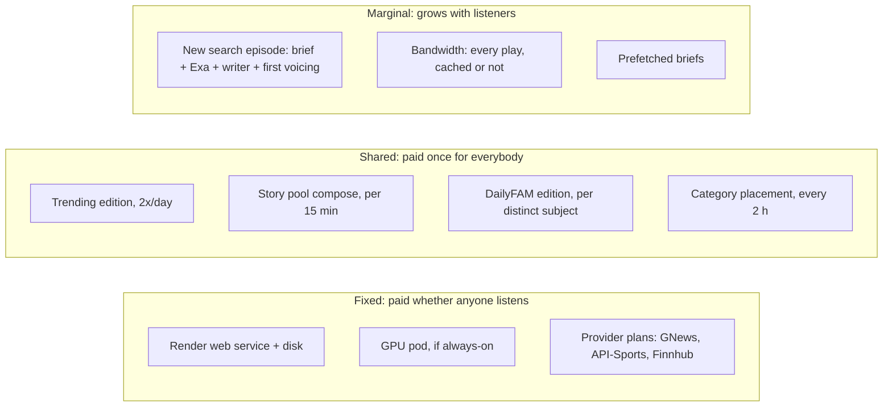

# FAM — Financial report: unit costs, scaling, and provider limits

| | |
|---|---|
| **Status** | Official documentation, v1 |
| **As of** | 2026-09-30 (code at `Main` after PR #81, plus §179: prompt caching, edition batching, RunPod REST v2, provider counts) |
| **Audience** | Founders, anyone pricing a plan or approving spend |
| **Companion docs** | [`SCALING_TIMELINE.md`](SCALING_TIMELINE.md) (when to change each service, by stage), [`BACKEND.md`](BACKEND.md) (what calls what), [`DATA.md`](DATA.md) (what is stored), `METERING.md` (the per-listener ledger) |

## How to read the numbers

Every figure here has one of four labels. A figure without a label is an error
in this document.

| Label | Meaning |
|---|---|
| **Code** | A constant in the repository. File and line are cited. |
| **Measured** | Recorded in `PROBLEMS.md` from a real run. Most were synthetic runs, not production traffic. |
| **List price** | The provider's public price, looked up on 2026-09-25. Re-check before signing anything. |
| **Estimate** | Derived in this document from the three labels above. The working is shown. |

**The most important caveat.** Nobody has measured a real production month.
`metering.py` records the true Claude and Exa bill for every episode
(`metering.db`), but every cost figure in the repo comes from a synthetic run.
Replace the estimates below with real numbers as soon as there is traffic:

```sh
python tools/usage_report.py --days 30            # real marginal cost per listener
python tools/usage_report.py --days 30 --price 4.99   # margin at a price
python tools/prefetch_report.py --live            # is prefetch paying for itself?
```

**The spreadsheet.** The working copy is the Google Sheet **FAM Financials**
(Costs, Marketing & Materials, Projections, Daily Spend). The same workbook is
built from the deployment's own records on every download: `/admin` →
**Financials (.xlsx)**, `GET /api/admin/financials.xlsx` with the admin token,
or `python tools/financials.py --remote <host>` (`financials.py`, PROBLEMS.md
§230). Costs lists every service with its monthly cost; Projections carries it
twelve months forward from listener numbers, with sports apart and the
marketing budget added. A service added to FAM gets a row in `financials.catalogue`.

---

## 1. The cost structure in one picture

Money leaves FAM three ways, and each one scales differently.


```mermaid
flowchart LR
  subgraph Fixed["Fixed: paid whether anyone listens"]
    R[Render web service + disk]
    G[GPU pod, if always-on]
    P[Provider plans: GNews, API-Sports, Finnhub]
  end
  subgraph Shared["Shared: paid once for everybody"]
    T[Trending edition, 2x/day]
    S[Story pool compose, per 15 min]
    D[DailyFAM edition, per distinct subject]
    C[Category placement, every 2 h]
  end
  subgraph Marginal["Marginal: grows with listeners"]
    M[New search episode: brief + Exa + writer + first voicing]
    B[Bandwidth: every play, cached or not]
    PF[Prefetched briefs]
  end
```

**The design that keeps this cheap.** The script cache (`scripts.db`) has no
listener id in its key. The first listener to ask a question pays for the
episode. Everyone after them gets a cache hit that costs no model call, no
search, and, since §132, no GPU, because the audio is kept beside the script.
So cost per listener *falls* as the audience grows, and the cache hit rate is
the most important number in this report.

---

## 2. Unit costs: what one episode costs

### 2.1 Claude (Anthropic)

The production model is `claude-sonnet-5`. It is set in `render.yaml`
(`MODEL`) and is the default in `config.py`, and the brief, tile composer,
category placer and thumbnail calls follow it (§248 - §227 had moved them to
Haiku 5.5 for about -30% of the Claude bill; the owner moved them back). Only
the profile-photo check runs on `claude-haiku-5-5` (§225, ~$0.0002 a photo).
`metering` prices each call at its own model's rates.

| Price (Code, `metering.py:81-96`, "checked against the rate card on 2026-09-09") | USD |
|---|---|
| Sonnet 5 input | $2.00 / M tokens |
| Sonnet 5 output (thinking tokens are billed as output) | $10.00 / M tokens |
| Prompt-cache read | 0.1x input |
| Prompt-cache write | 1.25x input |
| Haiku 5.5 (the photo check only, §225) | $0.10 in / $0.50 out |
| Haiku 4.5 (only for the optional canonical key) | $1.00 in / $5.00 out |

**Calls per new search episode: 2.**

1. **The episode-intelligence brief.** `episode_intelligence.py:745`.
   Settings: `EI_MAX_TOKENS=3000` (1200 until §247), `EI_EFFORT=low`, 8 s timeout.
2. **The script writer.** `script_generator.py:1390`. It streams, carries no
   tools, and runs with `EFFORT=low` and `MAX_OUTPUT_TOKENS=16000`.

The title, the summary and the `<<NEXT:>>` suggestion come out of the writer
call itself, so they cost no extra call.

**Estimated cost per call** (from prompt sizes measured in the code today):

| Call | Input | Output (incl. hidden thinking) | Cost |
|---|---|---|---|
| Brief | ~1,000 tokens (`EI_SYSTEM` is 2,526 chars, plus the question and schema) | 400-1,200 (capped at 1,200) | **$0.006-0.014** |
| Writer, 2 min | ~5,500 tokens: system 7,794 chars (~1,950 tok), style example 6,215 chars (~1,550 tok), brief + evidence packet (~2,000 tok) | ~1,500-2,500: script ~400, plus thinking at `low` | **$0.026-0.036** |
| Writer, 10 min | ~5,500 | ~3,000-4,000 | **$0.041-0.051** |

- **Estimate:** Claude costs about **$0.04 for a 2-minute episode** and about
  **$0.06 for a 10-minute episode**.
- **Cross-check:** the repo's long-standing figure is "~$0.03 per script"
  (CLAUDE.md, `VOICE_OPTIONS.md:27`), and one measured cache miss cost
  **$0.0096** (PROBLEMS.md §68). The estimate here is deliberately on the high
  side.
- **Replace it:** `metering.db` records the real token counts per episode.

**Where the $0.04 goes** (estimate, 2-minute search episode, before §179; the instructions measured at 10,241 characters on 2026-09-30):

| Part | Tokens | Cost | Share |
|---|---|---|---|
| Brief: instructions + question | ~1,000 in | $0.002 | 5% |
| Brief: output (mostly reasoning, then JSON) | ~800 out | $0.008 | 21% |
| Writer: house rules + style example (identical every call) | ~2,500 in | $0.005 | 13% |
| Writer: brief + evidence packet | ~2,000 in | $0.004 | 10% |
| Writer: reasoning before writing (`EFFORT=low`) | ~1,600 out | $0.016 | 41% |
| Writer: the script, title, `<<NEXT:>>` | ~400 out | $0.004 | 10% |

About 70% is output, and most of that is reasoning the spec amendment buys on
purpose (§129) - not a lever. The lever was the 13% paid again on every call
for the same instructions.

**Two savings shipped in §179, neither changing a word a listener hears:**

- **Prompt caching on the writer's instructions** (`PROMPT_CACHE=1`, default).
  The ~2,500 identical tokens are marked cacheable; a writer call inside five
  minutes of the last reads them at 0.1x input - about **-$0.0045 per episode
  (-11%)** once traffic keeps the cache warm, and a shorter wait before the
  first word. Below one writer call per five minutes each call pays the 1.25x
  write instead (+$0.0013): `PROMPT_CACHE_TTL=1h` suits sparse traffic (2x
  write, pays off at three calls an hour). The brief's instructions (~630
  tokens) are below Sonnet 5's 1,024-token cacheable minimum and are not marked.
- **Batch pricing on both editions** (`EDITION_BATCH=1`, default). Trending
  (10 episodes, twice a day) and DailyFAM (one per subject, 05:00) send their
  writer calls through the Message Batches API at **50% off every token**. The
  brief stays a live call (it has an 8 s timeout and decides the research).
  An edition finishes when its batch does - most within the hour; one not
  ended in `EDITION_BATCH_WAIT_SECONDS` (3600) is cancelled and its
  unanswered episodes are written live, so a saving never costs an episode.
  `metering` records the discount (`Usage.batch_discount`).

**Other Claude calls.** All are shared, which means one call per deployment
rather than one per listener.

| Call | Where | Frequency | Ceiling |
|---|---|---|---|
| Story/tile composer | `stories.py:1028` | Once per 15-min refresh, only if there are new stories. Also once per Trending edition. | 6,000 output tokens ≈ **$0.06/call max** |
| Category placer | `categories.py:1209` | At most every 2 h (`SWEEP_INTERVAL=7200`, §157), up to 40 new nodes | 4,000 output ≈ **$0.04/call max** |
| Admin question box | `admin_tracker.py:701` | Admin use only | 1,500 output |
| Startup key check | `app.py:140` (`models.retrieve`) | Once per boot | Free |
| Canonical cache key | `cache.py:1638`, Haiku | **Off** (`CACHE_SEMANTIC_KEY=0`) | ~$0.0002/request if turned on |

### 2.2 Exa (retrieval)

- **How it is used:** every new episode is researched (`SEARCH_MODE=always`).
  Each search is `type="fast"`, `num_results=8`, with highlights
  (`research.py:72`, `config.py:369-371`).
- **Retries:** a thin result buys one more search (`RESEARCH_RETRY=1`).
- **List price:** $7 / 1,000 searches (up to 10 results), plus $1 / 1,000 pages
  of contents. FAM asks for highlights on 8 results.
- **Estimate:** about **$0.015 per search** and **$0.015-0.03 per episode**.
- **Fallback price:** `research.COST_PER_SEARCH = 0.015` is used only when
  Exa's response omits `cost_dollars`. It was 0.005 - a third of list price -
  until §207.
- **Rate limit:** about 10 requests/s per key (`CREDENTIALS.md:159`). FAM will
  not reach it before 100k listeners (see §4).

### 2.3 Chatterbox on RunPod (the voice)

Chatterbox has open weights, so there is no per-character fee. The only cost
is GPU time.

**The GPU cost in `metering.py` is priced at the measured speed** (§207).
`SYNTHESIS_REALTIME_FACTOR` defaults to **4.6** - Chatterbox measured on an RTX
4090 (PROBLEMS.md §75) - and `GPU_USD_PER_HOUR` to **0.69**, RunPod's serverless
flex rate. Until §207 they were 330 (the old CPU voices' speed) and 0.60, which
under-reported every GPU line about 70x. Re-measure on the rented card with
`python verify_voice.py` and override either on Render if it differs.

**GPU time per episode at 4.6x realtime.** An episode is voiced once. Every
replay after that comes from `episode_audio` and never reaches RunPod
(§132, §134).

| Episode | GPU seconds | Serverless 24 GB flex (~$0.69/h, list) | Pod, L4 ($0.39/h, list) |
|---|---|---|---|
| 2 min (every browse surface; `BROWSE_MINUTES=2`) | ~26 s | **~$0.005** | ~$0.003 of a fixed rental |
| 5 min | ~65 s | ~$0.012 | |
| 10 min (the maximum) | ~130 s | ~$0.025 | |

A serverless worker that has gone idle also bills its cold start: container
boot plus a ~10 s model load (`render.yaml` comment). That adds roughly
**$0.002-0.004** to the first episode after an idle period.

**Fixed rental if the pod runs 24/7** (§118 deleted the nightly stop). The
figures are 730 h/month at list prices.

| Card (24 GB class, per `REMOTE_VOICE.md`) | $/h | $/month |
|---|---|---|
| RTX A5000 | 0.27 | **~$197** |
| L4 | 0.39 | **~$285** |
| RTX 4090 (the measurements were made on this) | 0.69 | **~$504** |
| *Default in `metering.py` (`GPU_USD_PER_HOUR=0.69`, §207)* | 0.69 | *$504* |

**The third option: a serverless active worker.** An always-warm worker on
the same serverless endpoint, billed every second at a ~40% discount on flex
(list, 24 GB class: **~$0.47/h, ~$343/month**). It removes the cold start for
the first listener after a quiet spell, and pay-per-second flex workers still
cover peaks above it. On cost alone it beats flex at about **16 GPU-hours a
day** ($11.28/day ÷ $0.69/h); on the one-second spec it is worth it the day
the public can tap. The owner's decision (2026-09-30): stay on pay-per-second
flex for now; `SCALING_TIMELINE.md` says when to add the first active worker.

| Option | $/h (list) | Idle cost | Cold start | Best for |
|---|---|---|---|---|
| Serverless flex (today) | 0.69 | $0 | boot + ~10 s model load | before launch |
| Serverless active worker + flex | 0.47 active, 0.69 flex | ~$343/mo per active worker | none for the first | launch onward |
| Always-on pod (A5000 / L4) | 0.27 / 0.39 | $197 / $285 per month | none | one card of steady load; you scale it yourself |

**RunPod's own API, and its deadlines.** Separate from what synthesis costs.
The app asks RunPod's API where a moved pod is (`voice_control._runpod_pods`,
the `runpod-pod` rung, used only when `RUNPOD_POD` is set). RunPod is retiring
the older surfaces:

| Date | What RunPod changes | What FAM does |
|---|---|---|
| 2026-09-17 | Staged rate limits on REST v1 and GraphQL begin | Nothing: at most one lookup a minute per server |
| **2026-10-27** | GraphQL limited to 43,200/day, 3,600/hour, 180/minute | Nothing: worst case ~1,440/day per server (3%) |
| **2026-11-15** | REST v1 (`rest.runpod.io/v1`) answers 410 Gone | Already asks **REST v2 first** (`RUNPOD_API_URL`, §179); v1 is a later rung until then |
| **January 2027** | GraphQL retired | Delete the v1 and GraphQL rungs (`_pods_over_rest`, `_pods_over_graphql`) |

Synthesis itself goes to the serverless endpoint API (`api.runpod.ai/v2/<id>/runsync`),
which none of this touches: its limits are 2,000 `/runsync` per 10 s and scale
with the worker count - at 100k MAU, peak use is roughly a sixth of it
(estimate). None of these limits has a price: the email changes no cost line.

**Pod or serverless?** `render.yaml` ships `REMOTE_VOICE_TRANSPORT=runpod`,
which is serverless. §118 describes an always-on pod. Confirm which one is
live: `/api/health` reports it.

- **Estimate, compute only:** serverless flex at $0.69/h costs the same as an
  L4 pod ($9.36/day) at about 13.5 GPU-hours/day. At 4.6x that is about 62
  hours of *new* audio a day.
- **In practice:** the 60 s idle timeout and cold starts pull the real
  break-even well below that. `REMOTE_VOICE.md`'s rule of thumb is "cheaper
  below ~4 hours of audio a day".
- **Recommendation:** serverless until the GPU line in `usage_report.py` is
  above about half a pod's monthly rent, then an always-on pod.

### 2.4 Total cost of one episode

| Event | Claude | Exa | GPU | Bandwidth | **Total (estimate)** |
|---|---|---|---|---|---|
| New 2-min search episode | $0.040 | $0.015 | $0.005 | $0.0008 | **≈ $0.06** |
| New 10-min search episode | $0.060 | $0.015 | $0.025 | $0.004 | **≈ $0.10** |
| Tap on a live-story tile, brief already warmed | $0.033 | $0.015 | $0.005 | $0.0008 | **≈ $0.055** |
| Trending / DailyFAM episode (written in the background, voiced on its first play) | $0.040 | $0.015 | $0.005 | $0.0008 | **≈ $0.06, once for everybody** |
| Replay of any cached episode with kept audio (Explore, a shared link, a repeat search, the 2nd+ play of a browse tile) | 0 | 0 | 0 | $0.0008 | **≈ $0.0008** |
| Warmed brief (prefetch) | $0.006-0.014 | 0 | 0 | 0 | **≈ $0.01** |

Bandwidth is 2.65 MB per minute of uncompressed PCM (`CREDENTIALS.md:176`),
priced at Render's $0.15/GB overage (list). That puts a 2-minute play at about
5.3 MB, or $0.0008.

**The two numbers that decide everything:**

- A **new** episode costs about **$0.06**.
- A **replayed** episode costs under a tenth of a cent.

So cost per listener is almost entirely the cache-miss rate times $0.06.

---

## 3. Fixed and shared costs per month

### 3.1 Platform

| Item | Setting in repo | List price | Monthly |
|---|---|---|---|
| Render web service | `plan: starter` (`render.yaml:10`): 512 MB RAM, 0.5 CPU, one uvicorn process | $7 | **$7** |
| Render persistent disk | `sizeGB: 1` at `/data` (`render.yaml:198`) | $0.25/GB | **$0.25** |
| Render workspace plan | Not in repo | Hobby includes 5 GB outbound; Pro 25 GB; $0.15/GB after that | varies |
| RunPod network volume | 20 GB recommended (`REMOTE_VOICE.md`) | ~$0.07/GB (verify) | ~$1.40 |
| GPU | See §2.3 | | **$0** serverless idle, or **$197-504** pod |

### 3.2 Data providers

| Provider | What FAM uses it for | Current plan in code | Free-tier ceiling | Next tier (list) |
|---|---|---|---|---|
| **GNews** | Trending edition only | `GNEWS_DAILY_REQUESTS=90`. Uses about 26 requests per edition, 2 editions/day ≈ **52/day** | 100 req/day, 10 articles per call. For development use; check the terms before charging money. | Essential **€49.99/mo**: 1,000/day, 25 articles |
| **API-Sports** | Live scores in episodes plus score lines on story cards, ten sports | A plan **per sport** (`API_SPORTS_TIER`/`API_SPORTS_TIERS`, §180), each shared between both uses, **per process** | 100 req/day **per sport** on the free plans; since §191 swept only for followed leagues while a game is on and somebody is looking (≤ every 15 min) | **$19/mo** for 7,500/day; $29 for 75k; $39 for 150k (`PROVIDER_ROLLOUT.md:108`) |
| **Finnhub** | Market facts plus market-move story cards | Story source every 2 h since §191 (~150 calls/day); quotes delayed 1,200 s | 60 req/min, **personal / non-commercial** | Paid plan per `PROVIDER_ROLLOUT.md` ($11.99/mo quoted there; verify, since Finnhub's commercial pricing is quote-based). Metered price in code: $0.80 / 1,000 calls (`live_sources.py:961`) |
| **Polymarket** | Prediction-market forecasts beside every outcome-dependent episode (§211), plus cards | Keyless; source every 1,800 s; asked beside the live lookup for every question EI marks `outcome_dependent` | Free | n/a |
| **GDELT** | Retrieval fallback rung, story pool discovery | `GDELT=1`; since §211 one background job downloads the 15-minute export files (~200 requests/day, whatever the traffic) into a local copy that everything reads | Free; the export files have no per-address limit (the DOC API's 1 request per 5 s per IP is no longer used) | n/a: no paid plan; none needed |
| **Exa** | Every episode's research, and the last rung of the local-news ladder (§194, known outlets only) | Pay-as-you-go | $10 credit/month (~1,400 searches) | Usage-billed; see §2.2 |
| **NWS** | US weather: forecasts, warnings, observations (§194) | Keyless; fetched on demand, swept 05:00/17:00 in each asked place's own time; warnings live (≤ every 10 min per place) | Free; needs a User-Agent contact (`FAM_CONTACT_EMAIL`) | n/a |
| **Open-Meteo** | Weather outside the US and when NWS fails; place names → county and coordinates (§194) | Only with `OPEN_METEO_API_KEY`; the keyless endpoint is non-commercial and never used in production | Keyless: non-commercial only | API Standard **$29/mo** (1M calls/month); Professional $99 (5M) |
| **Local news RSS** | Town and county outlets' own feeds (§194) | FAM's own collector, every 5 min, only for places asked about in 30 days, each feed at its own rhythm (≥30 min) | Free | n/a. Paid news APIs ($90-550/mo) were priced and turned down |

**Before charging money:** the free tiers of GNews and Finnhub and Open-Meteo's
keyless endpoint are development / non-commercial licences. A paid launch needs
GNews Essential, a Finnhub commercial plan and Open-Meteo Standard whatever the
traffic is: about **$95-100/month** together at list price. Since §207
`/api/health` → `licences.commercial_ready` says whether the deploy is covered
(`GNEWS_PLAN`, `FINNHUB_PLAN`, `OPEN_METEO_API_KEY`).

**Other services** (list prices looked up 2026-10-05):

| Service | What for | Price | Scales with |
|---|---|---|---|
| **Viral Loops** | Waitlist referrals, fraud checks and emails while `WAITLIST=1` (§183) | Start-up $35/mo billed annually ($49 monthly) to 1,000 participants; Plus $99 (5k); Growing $159 (10k); Power $279 (25k) | Waitlist size; cancel at public launch |
| **QuotaGuard Static** | Was a static outbound IP for GDELT (`GDELT_PROXY_URL`, §207); **not needed since §211**, and the setting is deleted | $0 | n/a |
| **Google image model** | Tile pictures, one per category branch (§160) | ~$0.067/image, ≤60/day (`THUMBNAILS_DAILY_IMAGES`) | New category branches, not listeners |
| **Apple Developer Program** | The iOS app and Sign in with Apple | $99/year | Flat |

### 3.3 Background generation (shared by every listener)

These run on timers with nobody tapping. Each has a ceiling written in code,
so none of them can run away.

| Job | Schedule | Work | Estimate per month | Hard ceiling in code |
|---|---|---|---|---|
| **Trending edition** (`trending_bank.py`) | 05:00 and 17:00 Eastern | ~26 GNews requests, 1 compose call, **10 episodes** written | 20 episodes/day × $0.055 + compose ≈ **$35-40** | 10 episodes per edition |
| **DailyFAM edition** (`daily_edition.py`) | 05:00 Eastern | One episode per **distinct subject** across every mix | $0.055 × subjects × 30. At 50 subjects: **~$80** | `DAILY_EDITION_MAX_EPISODES=300`, `DAILY_EDITION_MAX_DOLLARS=15` per day → **$450/mo max** |
| **Story pool** (`stories.py`) | Every 15 min (`STORIES_BACKGROUND_SECONDS=900`); GDELT, trending registry and Polymarket every 2 h (`STORIES_NEWS_INTERVAL_SECONDS=7200`, §156); Finnhub every 2 h and API-Sports on demand (§191) | Composes only stories that are new since the last window - between news sweeps that is new games and new market moves only | Typically **$10-40** | 96 calls/day × $0.06 ≈ $170/mo worst case |
| **Category placement** (`categories.py`) | Every 2 h (§157) | 1 call for new vocabulary, only when something was minted | **≤ $5-15** | 12 calls/day |
| **Prefetch briefs** (`prefetch.py`) | When myFAM is drawn, at most once per 5 min per listener | Warms up to 6 briefs | Grows with listeners until it hits the ceiling | `PREFETCH_DAILY_DOLLARS=2`, `PREFETCH_DAILY_BRIEFS=400` → **$60/mo max** |

The worst case for all background work together is about **$700/month**, with
every ceiling hit every day. A realistic small deployment is **$100-200/month**.

---

## 4. Scaling model

### 4.1 Assumptions

These are **illustrative estimates**, not measurements. Every one of them
should be replaced from `usage_report.py` once there is traffic.

| Assumption | Value | Why |
|---|---|---|
| Searches per monthly active listener | 15 / month | Search is the one surface that writes on a tap |
| Browse plays (myFAM, DailyFAM, Explore) per listener | 30 / month | Mostly served from pre-written, cached episodes |
| Search cache-miss rate | 85% at 100 → 70% at 1k → 55% at 10k → 45% at 100k | Measured: the near-match cache turns a 22% hit rate into 56% on a re-phrasing corpus (§68/§107). More listeners means more overlapping questions. |
| Distinct DailyFAM subjects | 20 → 100 → 300 (cap) → 300 (cap) | The cap is `DAILY_EDITION_MAX_EPISODES` |
| Live-tile episodes written on tap | 300 → 1.5k → 3k → 5k / month | The pool offers ≤40 tiles, shared by everybody |
| Average episode | 2 min, $0.06 new | §2.4 |

### 4.2 Monthly cost by audience size (estimate)

| | **100 MAU** | **1,000 MAU** | **10,000 MAU** | **100,000 MAU** |
|---|---|---|---|---|
| New search episodes | 1,275 | 10,500 | 82,500 | 675,000 |
| Search episodes $ | $77 | $630 | $4,950 | $40,500 |
| Live-tile episodes $ | $17 | $83 | $165 | $275 |
| Trending + DailyFAM + pool + categories + prefetch | $150 | $330 | $700 (every cap hit) | $700 (every cap hit) |
| Plays served (all surfaces) | 4,500 | 45,000 | 450,000 | 4.5 M |
| Bandwidth, uncompressed PCM | 24 GB → **$3** | 240 GB → **$35** | 2.4 TB → **$360** | 24 TB → **$3,600** |
| Render compute + disk | $7 | $25-80 (Standard/Pro) | $80 + re-architecture (see §5.1) | Re-architecture |
| Provider plans (§3.2) | $0 (dev tiers) | ~$90 | ~$100 | ~$100+ |
| GPU, new audio per day | ~3 h audio → **serverless** | ~17 h audio → ~3.8 GPU-h/day → serverless ≈ $80 (already inside the episode $) | ~105 h audio → ~23 GPU-h/day → **2-3 always-on cards** | ~780 h audio → ~170 GPU-h/day → **8+ cards** |
| **Total (estimate)** | **≈ $250** | **≈ $1,200** | **≈ $6,500** | **≈ $45,000+** |
| **Per MAU** | **≈ $2.50** | **≈ $1.20** | **≈ $0.65** | **≈ $0.45** |

What the table shows:

1. **Search cache misses are 60-90% of the bill at every size.** Claude is
   about two-thirds of each miss. The levers, from cheapest to most expensive:
   raise the cache hit rate (near-match tuning, the canonical key), shorten
   the writer prompt (the style example is ~1,550 input tokens on every
   call). Routing the brief to Haiku 5.5 was tried in §227 and reversed in
   §248.
2. **Bandwidth becomes the second-largest line at 10k and above.** This is the
   case for Opus over the stream (`IOS_APP.md`). Opus is about 0.2 MB/min
   against 2.65 MB/min, which cuts the bandwidth line about 13x (24 TB → ~1.8 TB
   at 100k).
3. **Background work is capped**, so its share of the bill falls to near zero
   as the audience grows.
4. **Per-listener cost falls with scale.** That is the shared cache working as
   designed.

### 4.3 The free-tier ("free" plan) exposure

Quotas are built, off by default, and **enforced in production** since §207
(`ENFORCE_QUOTAS=1` on `fam` in `render.yaml`). No checkout exists: admin
accounts are unlimited, and `POST /api/admin/plan` moves anybody else.

The tiers exist in code (`entitlements.py:219-247`):

| Tier | Episodes | Explore replays | Max minutes |
|---|---|---|---|
| free | 5 / day | 25 / day | 10 |
| plus | 150 / week | unlimited | 10 |
| unlimited | unlimited | unlimited | 10 |

**What an unlimited abuser costs today** (estimate):

- A **single** listener who searches a new 10-minute question continuously is
  paced by `RATE_LIMIT_SECONDS=3.0` with a burst of 3. That is at most ~20
  generations a minute, or **~$2/minute**.
- The measured spread of listener costs is 68x from median to worst
  (PROBLEMS.md §73).
- Turning on `ENFORCE_QUOTAS=1` caps a free listener at 5 episodes/day, which
  is **≤ $0.50/day** even if every one is a new 10-minute episode.

**Done (§207):** on in production. Five a day bounds the worst listener at
~$15/month. Note the free tier counts every episode heard, cached replays
included (`tier-spend`), so tune `FREE_EPISODES_PER_DAY` in the dashboard if
five is too tight for how people actually listen.

---

## 5. Scaling steps and rate-limit thresholds, provider by provider

Each entry gives the ceiling, the point where FAM reaches it (**estimate**
unless marked), and what to do.

### 5.1 Render (web host)

| Limit | Where it bites | Action |
|---|---|---|
| **512 MB RAM** (Starter) | Peak ~313 MB with the embedding model loaded (PROBLEMS.md §131), about 200 MB of headroom. Concurrent streams each hold PCM buffers. Expect trouble at roughly **20-40 simultaneous streams**. | Standard ($25, 2 GB), then Pro ($80, 4 GB). |
| **One process, no `--workers`** (`Dockerfile:96`) | CPU: 0.5 vCPU runs ranking, streaming and zlib for everybody | Same upgrade. Do **not** add `--workers` blindly: API-Sports budgets, the story pool, prefetch ledgers and live captions are **in-process**, so each worker gets its own copy and the daily API-Sports allowance is spent N times. |
| **A service with a persistent disk runs as one instance** (Render documents this) | Scaling out horizontally | The 16 SQLite files on one disk are the ceiling. Past a single Pro instance (~10k MAU) the path is: SQLite → Postgres, kept audio → object storage, and in-process caches → Redis. That is a re-architecture, not a setting. |
| **1 GB disk** | `AUDIO_CACHE_MAX_MB=512` is about **250 minutes** of kept audio. Evicting audio is safe (it costs one re-voicing), but a full disk stops every database. | Grow the disk ($0.25/GB) and raise `AUDIO_CACHE_MAX_MB` with it. At 10 GB, 8 GB of audio is ~4,000 min. |
| **Outbound bandwidth** | Hobby includes 5 GB, which is about **1,900 listening-minutes a month**, so it is already exceeded at 100 MAU | $0.15/GB, or ship Opus |

### 5.2 RunPod (GPU) and Chatterbox (the voice)

| Limit | Where it bites | Action |
|---|---|---|
| **One card runs about 4.6x realtime, one generation at a time** (`REMOTE_VOICE.md`) | A stream must stay ahead of playback. With `REMOTE_VOICE_CONCURRENCY=4`, about **4 listeners hearing new episodes at the same moment** is the most one card can serve before playback outruns synthesis. Replays with kept audio do not count against this. | Serverless: raise **Max workers**. Each worker is one more card, billed only while it works. Pods: add a pod. |
| **Cold start** | First episode after an idle period: container boot plus a ~10 s model load | FlashBoot on. If the wait matters, set Active workers to 1, which bills a card 24/7. |
| **Serverless vs pod cost** | See §2.3; break-even is roughly several GPU-hours a day | Move to pods once the GPU line exceeds about half a pod's rent |
| **Chatterbox itself** | No licence fee and no quota | Only the reference-voice rights (`voice_bank.py` stores a rights record per voice) |

### 5.2a The database

RunPod holds no database - only a ~20 GB volume of model weights. The database
is **eighteen SQLite files on Render's one disk** (every `data_path(...)` in
the code; `scripts.db` also holds kept audio, §132). Options as the audience
grows (list prices looked up 2026-09-30):

| Option | Price (list) | Good for | Catch |
|---|---|---|---|
| **SQLite on the Render disk, grown** (today) | $0.25/GB/mo | to ~10k MAU on one Render Pro instance | a service with a disk runs as one instance: no horizontal scaling |
| **Render Postgres** | Basic ~$6-7/mo; Pro-4gb $35/mo; storage $0.30/GB | the likely move: same provider, private network | moving 18 stores and the in-process caches is a re-architecture, not a setting |
| Neon (serverless Postgres) | $0.106/CU-hour + $0.35/GB, no minimum | spiky traffic; scales to zero | wakes slowly after idle; outside Render |
| Supabase Pro | $25/mo + compute; 8 GB then $0.125/GB | predictable bills | bundles auth/storage FAM already has |
| Cloudflare R2 (kept audio only) | $0.015/GB/mo, **$0 egress** | audio at 10k+ MAU | serving audio straight from R2 would touch the settled no-audio-files rule - discuss first |

Database cost stays under 1% of the bill at every size below; the move is
forced by the one-instance ceiling, not by price.

| MAU | Database | Added per month (estimate) |
|---|---|---|
| 100 | SQLite, 1 GB disk | $0 |
| 1,000 | SQLite, disk grown to ~10 GB | +$2.50 |
| 10,000 | Render Postgres Pro (~$35-60) + R2 for audio (~$1-5) | +$40-65, plus the migration |
| 100,000 | a larger Postgres (~$100-200+) + R2 | +$100-200 |

### 5.3 Claude (Anthropic)

| Limit | Where it bites | Action |
|---|---|---|
| **Org-level rate limits** (requests/min and tokens/min by usage tier; not in the repo) | 2 calls per new episode. At 100k MAU that is about 22k new episodes/day, ~15/min on average and ~100/min at peak. The writer's output tokens/min is the binding number. | Check the tier in the Anthropic console and request a higher tier before launch. **A pool of keys does not add headroom:** the limits are per organisation (`CREDENTIALS.md:154`). |
| **EI timeout 8 s** | On a slow day the brief times out, and the episode continues on the raw query (`Brief.degraded`) | Nothing to do: quality degrades, availability does not |
| **Spend** | Linear in new episodes | The levers in §4.2 |

### 5.4 Exa

| Limit | Where it bites | Action |
|---|---|---|
| ~10 requests/s per key | 100k MAU ≈ 0.3 searches/s on average | None needed. Unlike Anthropic, a second key *does* add headroom. |
| Credit balance | Pay-as-you-go: a card must be on file or search stops | When Exa fails, research falls back to GDELT and says so (`notes.research`) |

### 5.5 GDELT

| Limit | Where it bites | Action |
|---|---|---|
| None that traffic reaches. The DOC API's 1 request per 5 s per shared IP failed every request on 1/10 (§191); since §211 FAM downloads GDELT's 15-minute export files instead: ~2 requests per 15 min (~200/day), whatever the traffic | One background job (`gdelt.sync`, every `GDELT_EXPORT_POLL_SECONDS`=900) keeps 24 hours on the data disk (`GDELT_EXPORT_DB`). The research rung, the story sweep and the trending source read that copy; no listener's tap reaches GDELT. | None. A copy that is empty or over an hour old is reported as an outage (`/api/health` → `gdelt`). |

### 5.6 GNews

| Limit | Where it bites | Action |
|---|---|---|
| Free: 100/day, 10 articles | FAM uses ~52/day (`GNEWS_DAILY_REQUESTS=90` is the guard). A third edition, or more categories or countries, exceeds it. | Essential (€49.99): 1,000/day and 25 articles. This is the licence to use it commercially at all. |
| No fallback | An unactivated or over-quota account gives an empty Trending row (§144) | Watch `/api/health` → trending bank |

### 5.7 API-Sports

| Limit | Where it bites | Action |
|---|---|---|
| Free 100/day, **shared** between live facts and story cards | One sport's scoreboard refreshes about every 14 min. A second sport halves it. Episode lookups eat into the same allowance. | **$19/mo (7,500/day)** is the cheapest real upgrade in this report: 75x the allowance. |
| Counted **per process** | More than one worker multiplies spend | Set `API_SPORTS_DAILY_REQUESTS` to each sport's plan divided by the number of workers; `/admin` shows API-Sports' own count, which covers every worker |

### 5.8 Finnhub

| Limit | Where it bites | Action |
|---|---|---|
| 60 req/min, non-commercial | Story source every 30 min plus episode lookups: far below the rate | Commercial licence before launch |

### 5.9 Polymarket

Keyless and free. It runs every 30 minutes, and episode lookups are cached for
5-15 minutes by status. Since §211 it is asked for every outcome-dependent
episode (a forecast, never evidence), not only elections. No scaling step is needed. The risk is an unannounced
API change: the lookup returns one of its seven "what happened" outcomes and
the episode continues without the fact.

---

## 6. Recommended actions, in order

0. **Done in §179:** prompt caching on the writer, batch pricing on both
   editions, the RunPod lookup on REST v2 ahead of v1's retirement, and a
   per-day request count for every outside service on `/admin`, beside its
   limit and the next plan's. Stage-by-stage triggers are in
   [`SCALING_TIMELINE.md`](SCALING_TIMELINE.md).
1. **Done in §207:** the metering constants (GPU at 4.6x and $0.69/h, Exa's
   fallback at $0.015), quotas enforced in production, a GDELT breaker and
   proxy (both deleted in §211, when GDELT moved to its export files), and a licence check for GNews, Finnhub and Open-Meteo on `/admin`
   and `/api/health` (`licences.commercial_ready`).
2. **Confirm the voice transport:** serverless or always-on pod. It is a
   $0-vs-$200-500/month fixed-cost question, and the repo describes both.
3. **Run `usage_report.py` after the first real month** and replace §4's
   assumptions with measured miss rates and per-episode costs.
5. **Buy commercial licences** for GNews and Finnhub before charging anyone,
   and API-Sports $19 as soon as more than one sport is wanted.
6. **Plan the Opus transport** before 10k MAU. Bandwidth is the line that
   grows fastest after Claude.
7. **Plan the move off single-disk SQLite** before outgrowing one Render Pro
   instance.

---

## Sources

- **Code:** `metering.py`, `config.py`, `render.yaml`, `Dockerfile`,
  `entitlements.py`, `research.py`, `live_sources.py`, `story_sources.py`,
  `trending_bank.py`, `daily_edition.py`, `prefetch.py`, `stories.py`,
  `categories.py`.
- **Docs:** `METERING.md`, `REMOTE_VOICE.md`, `VOICE_OPTIONS.md`,
  `CREDENTIALS.md`, `PROVIDER_ROLLOUT.md`, `TRENDING.md`, `PROBLEMS.md`
  (§68, §73, §75, §107, §118, §131, §132, §144).
- **List prices, looked up 2026-09-25:**
  - Render: [pricing](https://render.com/pricing),
    [compute plans](https://render.com/docs/compute-plans),
    [outbound bandwidth](https://render.com/docs/outbound-bandwidth)
  - RunPod: [pricing](https://www.runpod.io/pricing),
    [serverless pricing](https://docs.runpod.io/serverless/pricing)
  - GNews: [pricing](https://gnews.io/pricing)
  - Exa: [pricing](https://exa.ai/docs/admin/pricing)
- **Looked up 2026-09-30 (§179):**
  - RunPod API retirement: [SkyPilot's migration PR](https://github.com/skypilot-org/skypilot/pull/10846),
    [RunPod: migrate from API v1](https://docs.runpod.io/api-reference-v2/migrate-from-v1),
    and RunPod's email of the GraphQL limits
  - RunPod serverless limits: [send requests](https://docs.runpod.io/serverless/endpoints/send-requests);
    active workers: [pricing guide](https://flexprice.io/blog/runprod-pricing-guide-with-gpu-costs)
  - Databases: [Render pricing](https://render.com/pricing),
    [Neon vs Supabase](https://neon.com/guides/neon-launch-plan-vs-supabase-pro-plan),
    [Cloudflare R2](https://mecanik.dev/en/posts/cloudflare-r2-pricing-explained-real-costs-vs-s3-and-backblaze/)
  - Claude prompt caching and batches: the Anthropic rate card (Sonnet 5
    $2/$10 per M; cache read 0.1x, write 1.25x/2x; batches 50% off)
