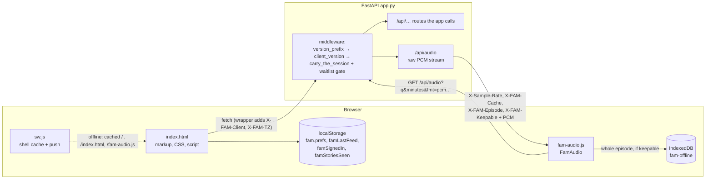
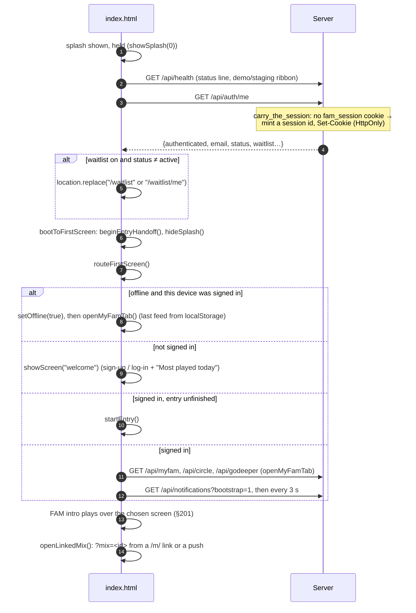
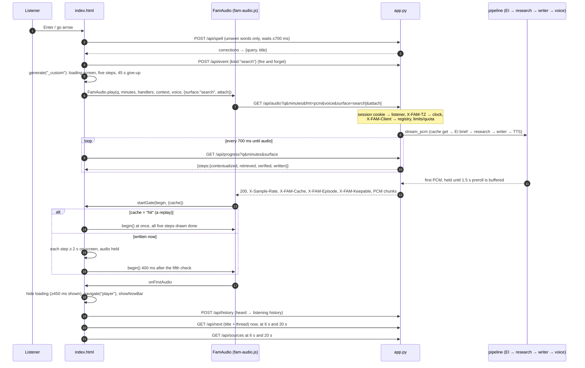

# FAM — Frontend: how the app is wired

| | |
|---|---|
| **Status** | Official documentation, v1 |
| **As of** | 2026-10-05 (code at `e65fe2e`) |
| **Audience** | A new engineer learning how the web client works and how it talks to the backend |
| **Companion docs** | [`BACKEND.md`](BACKEND.md), [`DATA.md`](DATA.md), `CLAUDE.md` (and `docs/claude/`), `SHARING.md`, `WAITLIST.md`, `ACCOUNTS.md`, `MYFAM.md` |

Every number below is labelled. *code* means a constant in the file and line
given. *measured* means a result recorded in `PROBLEMS.md`. *estimate* shows
its working. Where this document and the code disagree, the code wins: fix
this document.

The diagrams are Mermaid. They render on GitHub and in the published HTML
version of these docs.

---

## 1. What the frontend is

FAM's web client is **one HTML file with no build step**. There is no
framework, no bundler and no module system. Markup, CSS and JavaScript sit in
`static/index.html`, and every button is an inline `onclick` that names a
global function.

| File | Lines (code) | What it is |
|---|---:|---|
| `static/index.html` | 18,531 | The whole app. CSS is lines 14-2757, markup is 2759-4336, and the script is 4338-18529. |
| `static/fam-audio.js` | 675 | `window.FamAudio`, the streaming PCM player. **It is the spec for audio on any client** (`audio-no-browser`). The share page and the waitlist page load it too. |
| `static/sw.js` | 84 | The service worker. It keeps the app shell for offline opens and shows push notifications. |
| `static/listen.html` | 331 | The template for a shared episode's landing page at `/s/<id>`. The server fills in its head. |
| `static/waitlist.html` | 1,348 | The waitlist front door (`/waitlist`) and the status page (`/waitlist/me`). |
| `admin_ui/tracker.html`, `thumbnails.html`, `waitlist.html` | — | Admin pages at `/admin`, `/admin/thumbnails` and `/admin/waitlist`. |
| `static/manifest.webmanifest`, `icon.svg`, `icon-*.png`, `apple-touch-icon.png`, `favicon.ico` | — | The installable-app metadata. The icon is the double chevron (§195). `tools/make_icons.py` renders the PNGs from `icon.svg`. |
| `static/reference-ui.html`, `app.js`, `style.css` | — | The original minimal test player, kept for debugging (`README.md`). It is not part of the app. |
| `static/landing/*.jpg` | — | Screenshots used by the waitlist page. |

FastAPI mounts `static/` at `/` (`app.py:7976`), so `/` serves
`index.html`. A few page routes come before that mount:

| Path | Served by | What it is |
|---|---|---|
| `/` | static mount | The app, unless the waitlist gate redirects it |
| `/s/{share_id}` | `app.share_open` (`app.py:3043`) | One shared episode. `listen.html` is rendered with a server-side head. |
| `/m/{mix_id}` | `app.open_shared_mix` (`app.py:4534`) | A 302 redirect to `/?mix=<id>`. The app opens that mix. |
| `/v/{version}/…` | `app.web_release` (`app.py:3802`) | A kept older web release (see §19) |
| `/waitlist`, `/waitlist/me` | `app.py:7751`, `:7761` | `static/waitlist.html` |
| `/admin`, `/admin/thumbnails`, `/admin/waitlist` | `app.py:7319`, `:7504`, `:7859` | Admin page shells. They return 404 when no admin is configured. |



---

## 2. Read this first: the names on screen are not the names in code

**The two personalised tabs swapped names on screen (§185), and the code kept
the old ones.** This is the most common source of confusion for anyone new
to the code.

| What the listener sees | Screen id | `data-tab` | Opened by | History `surface` key | Endpoints |
|---|---|---|---|---|---|
| **DailyFAM** (first tab): rails, Made for you, Trending, … | `screen-myfam` | `myfam` | `openMyFamTab()` | `myfam` | `/api/myfam`, `/api/myfam/section`, `/api/myfam/catalog`, `/api/myfam/search` |
| **myFAM** (second tab): named mixes of followed subjects | `screen-playfam` | `playfam` | `openPlayFAM()` | `dailyfam` | `/api/mixes…`, `/api/topics` |

So in code, **"myfam" means the rails screen, which the listener knows as
DailyFAM**. **"playfam", "mix" and the `dailyfam` history surface mean the
mixes screen, which the listener knows as myFAM.** `daily_edition.py` (the
05:00 Eastern write-ahead of every mix's episodes) belongs to the mixes,
which are labelled myFAM on screen.

A few more cases that follow from this:

- A tile tapped on the rails screen plays with `source: "DailyFAM"`
  (`startBankTopic`), and `historySurface` files it under `myfam`.
- A mix plays with `source: "myFAM"`, and `historySurface` maps that source
  to `dailyfam` (`static/index.html:15320`).
- The history screen's tabs are ordered by surface key, so they read
  All / dailyFAM / myFAM / searchFAM.
- CLAUDE.md and the backend docs use the code names. When a rule says
  "myFAM's rails", it means the screen labelled DailyFAM.

The code names were kept because renaming them would change every stored
history row and every installed client's contract, and the listener would
see no difference (§185, rule `names-swapped`). **Do not rename them.**

Two other aliases:

- **VIBE! is `echo` in code.** `/api/vibe` and `/api/echo` are one handler.
  The DOM keeps `data-echo`, `toggleEcho` and `setEchoed` (`op-social-live`).
  This client calls only `/api/vibe`. Older contracts still name `/api/echo`.
- **The profile tab is "YourFAM"** on screen and `screen-profile` /
  `openProfile()` in code.

---

## 3. Boot: from page load to the first screen

The last lines of the script run the boot (`static/index.html:18519-18528`):

```
showSplash(0);              // hold the splash open until released
paintLengthControls(); paintVoiceMic(); syncWake();
refreshAuth().then(bootToFirstScreen, bootToFirstScreen).then(openLinkedMix);
```



### 3.1 The splash and the FAM intro

- **The splash** (`#splashScreen`) is held open with `showSplash(0)` until
  `/api/auth/me` answers. A fixed timer would either make the listener wait
  for no reason or flash the wrong screen. Whether someone is signed in is
  held in an HttpOnly cookie that the script cannot read, so the page must
  ask the server.
- **The FAM intro** (`beginEntryHandoff` / `playEntryHandoff`,
  `static/index.html:17861-17948`) runs on the Web Animations API. It plays
  every time the app opens, and again when sign-in or sign-up hands over to
  DailyFAM (`finishEntry`). It has four beats lasting about 1.8 s (code,
  sum of delays and durations: last slide starts at 1320 ms and runs 480 ms):
  1. The wordmark appears.
  2. F and M fold into the A, which is the double chevron.
  3. The chevron "charges" from copper to yellow, starting at
     `FAM_INTRO_CHARGE_MS = 700` (code, `:17893`).
  4. The panel slides off to the left.

  The screen underneath is switched **before** the first frame, and the
  overlay has `pointer-events:none`, so nothing waits on the animation.
  Reduced motion, or a browser without `Element.animate`, skips the intro.
  When the intro hands over from sign-in, the panel is a copy of the page
  being left, with every `id` stripped so that no `getElementById` can find
  the copy (§196, §201).

### 3.2 The sign-up gate and the waitlist

- **The app opens on sign-up for anyone not signed in.** `screen-welcome`
  shows Sign Up, Log In and a rotating "Most played today" card
  (`/api/welcome`, played in place as a replay, §197). **"Continue as guest"
  has been withdrawn until FAM is public** (§197). The `skipAccount`
  function and every guest rule are still in the code, so the guest path can
  come back as one line of markup.
- **Sign Up goes to `/waitlist`** on a real server (`openAuth` →
  `signupGoesToWaitlist`, `:17166`). Only a preview, which sets
  `window.FAM_PREVIEW`, keeps the in-app form (`screen-auth`). Log In always
  uses the in-app form (`POST /api/auth/login`).
- **The server enforces the waitlist, not the page.** With `WAITLIST=1`, any
  API call from a listener who is not `active` gets a 403 with
  `X-FAM-Waitlist: /waitlist` (or `/waitlist/me`) (`app._waitlist_refusal`).
  The `fetch` wrapper (below) follows that header with `location.replace`.
  `refreshAuth` does the same when `/api/auth/me` reports a waitlist status.
  App pages (`/`, `/index.html`, `/v/…`, `/m/…`) get a 302. Shared episodes
  and the sign-up samples are let through for exactly their own audio
  (`_shared_episode_request`, `_welcome_sample_request`).
- **The entry flow** after an account exists is identity → interests →
  location. It uses `screen-identity`, `screen-intro` and `screen-location`,
  and runs once. A settings row reopens one of those screens as an editor,
  never as the first run again (`identityMode` / `introMode`,
  `op-profile-hub`).

### 3.3 Identity, the session cookie and the two request headers

- **The browser never names the listener.** The server reads the listener
  from the `fam_session` HttpOnly cookie (`accounts.py:90`). If there is no
  cookie, the server mints one in `carry_the_session` (`app.py:3533`).
  `?user=` is ignored, and the page never requests or reads a bearer token
  (`listener-id-server`). A native client sends the same token as
  `Authorization: Bearer`.
- **Every `/api/` call carries two headers**, added by one wrapper around
  `window.fetch` at the top of the script (`static/index.html:4346-4374`):

| Header | Value | Why |
|---|---|---|
| `X-FAM-Client` | `FAM_CLIENT`, `"web/live"` (code, `:4342`). `tools/cut_release.py` stamps a kept release with its version. | The server records it and checks it against `releases/registry.json`. A `retired` client gets 426, and a `deprecated` one gets `X-FAM-Client-Status: deprecated` (`app.client_version`). |
| `X-FAM-TZ` | `listenerZone()`: a zone pinned in Settings (`fam.prefs.time_zone`), else `Intl…resolvedOptions().timeZone` | The listener's clock (§186, `listener-clock`). "Tonight" and "yesterday" in an episode are written in the listener's time, never the server's. The zone is not part of the cache key. |

`fam-audio.js` uses the same `window.fetch`, so `/api/audio` carries both
headers too. The waitlist page sends `X-FAM-Client: web/waitlist`.

The API also answers at `/api/v1/...` (`app.version_prefix`). The web app
uses the unprefixed `/api/...`. A shipped native app must use `/api/v1`.

---

## 4. The screen system and the navigation stack

### 4.1 Screens

A screen is a `<section class="screen" id="screen-NAME">` inside
`.phone > .frame`. Exactly one screen has `.active` at a time.
`showScreen(name)` (`static/index.html:4506`) works like this:

1. It finds `screen-NAME` **before** deactivating anything. A bad name logs
   an error and shows a toast; it never leaves a blank app.
2. It moves `.active` to that screen.
3. It calls `placeNowBar(screen)`.
4. It stops a welcome sample when the listener leaves the welcome screen.
5. On `welcome` it loads the samples. On `home` it loads trending searches.

A desktop browser shows a "Clickable prototype" banner and restart buttons
above the phone frame (`.top`, line 2761). On a phone the frame fills the
screen.

### 4.2 The stack

```
var stack = ["home"];                      // static/index.html:4474
setTab(root)   → stack = [root]; showScreen(root); updateTabs(root)
navigate(id)   → stack.push(id); showScreen(id)
goBack()       → stack.pop(); showScreen(top || "home")
```

- **Tabs reset the stack.** The five tabs are DailyFAM (`myfam`), myFAM
  (`playfam`), search (`home`, centre), Messages (`messages`) and YourFAM
  (`profile`). **Each tab screen has its own copy of the tab bar** in its
  markup, with `.active` set on the right tab. The mini player is moved in
  above whichever copy is showing.
- **Leaving a screen ends its audio**, except the full player's.
  `setTab` and `goBack` call `stopUnlessMinimised()`, which keeps playing
  only when `audioOwner === "player"`. The other owners are `"playall"`,
  `"reel"` (Explore) and `"welcome"`, and each of those stops when the
  listener leaves.
- **Explore is not a tab** (`three-surfaces`). `openExplore(from)` calls
  `setTab("explore")` but lights the tab it came from (`exploreFrom` is
  `home` or `myfam`). Its back arrow returns there. The player's minimised
  episode is stopped on the way in, because the reel owns the audio there.
- **The player is pushed, not tabbed.** `onGenerationStarted` calls
  `navigate("player")` when the first audio arrives. The down arrow
  (`minimizePlayer`, `:6368`) pops it without stopping playback.
- **The entry screens are not on the stack** (`intro-not-on-stack`).
  Welcome, auth, identity, intro and location are shown with `showScreen`,
  never `navigate`. Anything opened over them returns by name
  (`authReturn`, `identityMode`, `introMode`), not by `goBack()`.

### 4.3 Things that are not screens

These sit over the active screen. They are never on the stack, and Back does
not close them.

| Element | What it is | Opened by |
|---|---|---|
| `#famLoading` | **The one loading screen** for every wait (§5.3) | `generate()`, `showLoading()` |
| `#voiceSearch` | The voice search sheet, drawn over search | `openVoiceSearch()` |
| `#nowBar` | The mini player. It is one element, moved between screens. | `showNowBar()` / `placeNowBar()` |
| `#modalOverlay` | A generic one-field modal | `showModal({title, placeholder, onConfirm})` |
| `#sheetOverlay` / `#sheetCard` | A generic action sheet (the ⋯ menus, length, speed, voice, the queue) | `showActionSheet(items)` |
| `#goDeeperOverlay` | Go Deeper: a suggestion, a text box and a 1-5 minute length | `openGoDeeper()`, `openGoDeeperOn()` |
| `#nextUpOverlay` | The post-episode grid with its countdown | `maybeOfferNextUp()` |
| `#shareOverlay` | Share: targets, contacts, story card | `openShareModal()` |
| `#sourcesOverlay` | The episode's sources | `openSources()` |
| `#vibeCaptionOverlay` | VIBE! with an optional caption (150 characters, code, `maxlength` on `#vibeCaptionInput`) | `toggleEcho()` → `openVibeCaption()` |
| `#storyOverlay` | A friend's vibes, shown as stories | `openStory()` |
| `#reelComments` / `#rcSheet` | Explore's comments sheet | `openReelComments()` |
| `#guestGateOverlay` | "Create a free account to hear this one" | `showGuestGate()` |
| `#limitOverlay` | "You've reached your limit" | `showLimitReached(quota)` |
| `#plansOverlay` | Plans | `openPlans()` |
| `#followerOverlay` | "X started following you" with Follow back | `showFollowerPopup()` |
| `#photoOverlay` | Avatar crop | `openPhotoEditor()` |
| `#gcOverlay`, `#speedLengthOverlay`, `#mixDoneOverlay`, `#newChatOverlay` | Generate config, speed and length, mix finished, new chat | — |
| `#notifBanner` | A drop-down banner for messages and follows | `queueNotification()` |
| `#feedbackOverlay` | The bug-report form. It posts to `/api/feedback` with the screen, build and viewport, and on a player screen the episode's key. | the bug button |
| `#toast` | A message that disappears after 2.2 s (code, `toast()`, `:4580`) | `toast(msg)` |
| `#famHandoff` | The FAM intro panel | §3.1 |

---

## 5. Every screen, what it shows and what it calls

The endpoints were read from the `fetch` calls in each screen's functions.
`/api/event` (taste signals) and `/api/audio` (through `FamAudio`) are called
from many places and are listed only where they are central.

| Screen id | Shown as | What it shows | Endpoints | Key functions |
|---|---|---|---|---|
| `welcome` | Front door | Sign Up / Log In, "Most played today" rotating card | `/api/welcome`, `/api/audio?cached_only=true` | `loadWelcomeSamples`, `playWelcomeSample`, `openAuth` |
| `auth` | Sign up / Log in | Email or phone and password | `/api/auth/login`, `/api/auth/signup` (preview only) | `openAuth`, `submitAuthForm`, `afterAccount` |
| `identity` | "Who you are" | Name, handle, photo, location fields, account rows | `/api/me`, `/api/preferences` | `openIdentity`, `saveIdentity`, `saveIdentityInterests` |
| `intro` | Interests | The A-Z interest catalogue with search, plus typed interests | `/api/preferences` | `renderIntro`, `loadIntroCatalog`, `savePreferences`, `finishIntro` |
| `location` | Where you are | City / region / country | `/api/preferences` | `saveLocation` |
| `home` | **searchFAM** | Search bar, Length and Voice bubbles, trending searches, exploreFAM pill | `/api/searches/trending`, `/api/spell`, `/api/attach`, `/api/voices`, `/api/voices/choice`, `/api/event`, `/api/audio`, `/api/progress` | `runSearch`, `sendSearch`, `runTrendSearch`, `openVoiceSearch`, `openAttachMenu` |
| `myfam` | **DailyFAM** (rails) | Friends' faces row, Pick up where you left off, Made for you / Start here, Trending, Most played today, What your friends are listening to, What you missed last week | `/api/myfam`, `/api/circle`, `/api/godeeper`, `/api/godeeper/dismiss`, `/api/saved` | `openMyFamTab`, `loadMyFamFeed`, `renderMyFamFeed`, `loadGoDeeper`, `startBankTopic` |
| `section` | A rail's View more | Eight tiles at a time; Refresh deals the next eight | `/api/myfam/section` | `openSection`, `loadSectionPage`, `refreshSection` |
| `myfamsearch` | Search DailyFAM (bookshelf button) | The A-Z catalogue of others' cached episodes; typing shows the closest matches | `/api/myfam/catalog`, `/api/myfam/search` | `openMyFamSearch`, `runMyFamSearch`, `playMyFamSearch` |
| `playfam` | **myFAM** (mixes) | Your mixes, public-mix search, a sample mix for guests, the new-mix (+) | `/api/mixes`, `/api/topics`, `/api/mixes/sample`, `/api/mixes/public` | `openPlayFAM`, `loadMixes`, `renderMixList`, `openDailySearch` |
| `mixdetail` | One mix | Topics in order (drag to reorder), listen time, public/private, share, play | `/api/mixes/<id>` (PATCH, DELETE), `/api/mixes/<id>/share`, `/api/push`, `/api/push/subscribe` | `openMix`, `renderMixBody`, `moveMixTopic`, `setMixListenTime`, `playMix` |
| `publicmix` | Someone else's mix | Its topics, (+) to copy it | `/api/mixes/public/<id>`, `/api/mixes/<id>/add` (POST, DELETE) | `openPublicMix`, `addMixFrom`, `removeMixCopy` |
| `newmix` | New mix | Name and cover | `/api/mixes` (POST) | `openNewMix`, `confirmNewMix` |
| `mixpicker` | Edit topics | "In this mix" stack, then the ranked bank | `/api/topics?ranked=1`, `/api/profile`, `/api/mixes/<id>` | `openMixPicker`, `renderMixPicker`, `saveMixPicker` |
| `player` | The full player | §7 | `/api/audio`, `/api/progress`, `/api/next`, `/api/sources`, `/api/transcript`, `/api/episode/card`, `/api/saved`, `/api/vibe`, `/api/history`, `/api/nextup`, `/api/share`, `/api/episode/topic` | `populatePlayer`, `speakText`, `setPlayState`, `openPlayerMenu` |
| `playall` | Album "Play All" | A segmented player for the demo albums | as player | `startPlayAll`, `drawPlayAllTransport` (see §21) |
| `detail` | Album | The demo albums in `BRANCHES` | none | `renderBranch` (see §21) |
| `explore` | **exploreFAM** reel | One searched episode per page, its picture behind; like / comment / vibe / share / save; "Interested?" ✕ / ✓ | `/api/explore`, `/api/audio?cached_only=true`, `/api/episode/stats`, `/api/rate`, `/api/comments…`, `/api/transcript`, `/api/episode/card`, `/api/next?cached_only=true` | `openExplore`, `loadExplore`, `playReel`, `turnReel`, `reelAnswer`, `openReelComments` |
| `explorenew` | Explore New | The whole bank, ranked | `/api/explorenew` | `openExploreNew`, `playExploreNew` |
| `messages` | Messages tab | Conversation list | `/api/messages` | `openMessages`, `renderThreadList` |
| `thread` | A conversation | Messages, shared episodes, typing dots | `/api/messages/thread`, `/api/messages`, `/api/messages/typing`, `/api/person` | `openThread`, `loadThread`, `pollThread`, `sendThreadMessage` |
| `profile` | **YourFAM** | Identity, friends row, messages, interests line, Saved for Later, invite link; a door to sign-up for guests | `/api/profile`, `/api/messages`, `/api/waitlist/me` | `openProfile`, `loadProfile`, `renderProfile`, `renderProfileGate` |
| `friends` | Friends | Followers and following, people search, Invite new users + | `/api/friends`, `/api/friends/seen`, `/api/friends/follow`, `/api/people` | `openFriends`, `loadFriends`, `searchPeople`, `followPerson` |
| `person` | A friend's profile | Only what they published | `/api/person`, `/api/friends` | `openPersonProfile`, `loadPersonProfile`, `renderFriendProfile` |
| `topic` | One interest | Episodes under that interest | `/api/interest` | `openTopic`, `loadTopic` |
| `myvibe` | My Vibes | Your vibes, in folders | `/api/vibes`, `/api/vibe` (DELETE), `/api/vibes/file` | `openMyVibe`, `unvibe` |
| `saved` | Save for Later | Saved episodes in folders | `/api/saved`, `/api/saved/<id>`, `/api/saved/folders…` | `openSaved`, `loadSaved`, `playSaved` |
| `history` | Listening history | All / dailyFAM / myFAM / searchFAM tabs; replays exactly the heard episode | `/api/history` | `openHistory`, `loadHistory`, `playHistory` |
| `settings` | Settings | Every changeable thing (§13) | `/api/plans`, `/api/preferences`, `/api/auth/password`, `/api/auth/logout`, `/api/account` | `openSettings`, `renderSettings` |

---

## 6. The search flow

### 6.1 The search page (`screen-home`, §190, §203)

- **One bar, shaped like Google's.** `#searchInput` is a textarea. The mic
  (`#voiceMicBtn`) and attach (`#attachBtn`) sit inside the bar on the right.
  The go arrow (`#searchGoBtn`) appears only when something is typed or
  attached. Enter also sends. When the question wraps, the bar takes the
  `tall` class: the text spans the full width and the buttons drop beneath
  it (`paintSearchBar`, `:4965`).
- **The Length and Voice bubbles never print the current choice.** The
  menus tick it.
  - Length offers 1-10 minutes (code, `openLengthMenu`, `:7529`).
  - The length goes back to `DEFAULT_LENGTH_MINUTES = 2` (code, `:4485`)
    every time the app comes back into view (`visibilitychange`). The
    playing episode keeps its own length, pinned on its topic.
  - Voice lists `/api/voices`. Choosing one posts `/api/voices/choice`.
  - **Only searchFAM picks a voice** (`op-voice-bank`). Every other surface
    is spoken in the voice the server keeps for that episode.
- **Trending searches** (`loadTrendSearches`, `:4985`).
  - The page asks `/api/searches/trending` when it opens or the box gets
    focus, at most once every `TREND_REFETCH_MS = 60000` (code, `:4936`).
  - It shows at most `TREND_SHOWN = 5` (code, `:4937`), and only while the
    box is empty and nothing is attached.
  - The server returns only questions searched in the last 2 h whose
    episodes are still current, so a tap is a cache hit.
  - A tap sends the same question at the length the episode was written for
    (`runTrendSearch`).
- **Attachments** (`sendAttachment`, `:4801`).
  - A file (read with `FileReader` and sent as base64) or a link goes to
    `POST /api/attach` **when it is added, never at send time**. The
    listener sees a chip while it is read.
  - A failure stays on screen as a failed chip with a sentence, not just a
    toast.
  - Only ids are sent with the search (`&attach=id,id`). An attached episode
    is never cached, queued or replayed (`op-attachments`).
- **Autocorrect at send** (`runSearch` → `acCorrectQuestion`, `:14663`).
  - Every word is spell-checked through `POST /api/spell`. Words already
    asked about come from `AC_CACHE` and cost nothing.
  - The send waits at most `AC_SEND_WAIT_MS = 700` ms (code, `:14657`) for
    words the cache has not seen.
  - Two strings come back. The *title* always takes the corrections, so it
    never shows a misspelling. The *query* keeps any word the listener put
    back with one backspace (`autocorrect-at-send`).
  - Words are also checked one at a time as they are finished, so the send
    usually waits for nothing. This is a spell-check request, **not**
    episode prefetch, which stays removed (`no-typing-prefetch`).
- **The exploreFAM pill** (`#homeExploreBtn`) opens Explore. A swipe from
  right to left pulls the search page away with Explore drawn underneath.
  While the listener peeks, the first card is fetched and drawn
  (`primeExplore`) but not played (§195).

### 6.2 Voice search (§151, §158, §159, §165)

- It uses the browser's `SpeechRecognition` (or `webkitSpeechRecognition`)
  with interim results. **If the browser has no recogniser, no mic is
  shown** (`paintVoiceMic`, `no-dead-controls`).
- `openVoiceSearch()` shows `#voiceSearch`. The words appear in `#vsWords`,
  which is `contenteditable`, so the heard words can be corrected in place
  before searching (§165).
- The animated lines are driven by speech events, not a timer and not a
  second `getUserMedia` stream. On iOS Safari a second stream would stop the
  recogniser.
- **Stopping speech starts a countdown, never a silent search** (§159).
  - After `VOICE_SILENCE_MS = 1600` ms (code, `:7640`) with nothing new
    heard, **Search now** appears and fills over
    `VOICE_AUTO_SEND_MS = 5000` ms (code, `:7641`).
  - The X beside it cancels the automatic search but leaves the button
    pressable.
  - The countdown stops when the app goes to the background.
- `sendVoiceSearch()` puts the words in `#searchInput` and calls
  `runSearch()`. **The server sees a spoken search as a typed one.**
- **"Hey FAM" / "what's up FAM"** (§158) is opt-in per device, under
  Settings → Say "Hey FAM" to search.
  - A second continuous recogniser matches `WAKE_PHRASE` (code, `:7978`)
    and opens voice search with whatever followed the phrase.
  - `syncWake` keeps it off while voice search is open, while the page is
    hidden, during the loading screen and while an episode plays.
    `setPlayState` calls `scheduleWake`.

### 6.3 The tap: from the key press to the first audio

`sendSearch` builds a client-side topic `TOPICS["_custom"]` with a
provisional title from `deriveTitleFromPrompt`, the prompt,
`surface:"search"` and any attachment ids. It records a `search` event and
calls `generate("_custom")`.

`generate` (`:5465`) then does the following:

1. It returns early when the same request is already waiting for its first
   audio (`episodeSignature` = prompt | minutes | voice | parent). One tap
   sends one request.
2. It shows `#famLoading` and starts the five steps (`startGenSteps`).
3. It arms a 45 s give-up timer (code, `:5489`).
4. It calls `populatePlayer`, which fills the player behind the loading
   screen and calls `speakText`.

`speakText` (`:6876`) then:

1. Works out minutes and surface.
2. Calls `trackGenSteps`, which starts polling `/api/progress`.
3. Calls `FamAudio.play(...)` with the handlers `startGate`,
   `onFirstAudio`, `onEnd` and `onError`.



**Is this a product rule?** Yes. The spec is that audio starts within about
a second of a question (`one-sentence-spec`). For **search only**, the owner
amended it (`spec-amended-for-search`): EI and research run before the first
word, and the wait is shown honestly. The other surfaces build their briefs
and scripts before the tap.

### 6.4 The loading screen: five steps from the server's marks (§148)

`#famLoading` is **the only loading screen**. Each screen used to have its
own overlay, and search's overlay id did not exist, so a search showed
nothing at all (see the comment at `static/index.html:2791`).

| Step on screen | Checked when | Source |
|---|---|---|
| Contextualizing your search | `steps.contextualized` | the EI brief is ready (`brief_ready`) |
| Retrieving your information | `steps.retrieved` | the research and live lookups answered (`evidence_ready`) |
| Verifying the relevance | `steps.verified` | the writer's first token (`claude_first_token`) |
| Finalizing your script | `steps.written` | the first sentence went to the voice (`first_sentence`) |
| Generating the audio | the first PCM chunk arrives in the browser | client |

| Constant | Value | Where (code) |
|---|---:|---|
| Minimum time each step is on screen | 2000 ms | `GEN_STEP_MIN_MS`, `:5111` |
| `/api/progress` poll interval | 700 ms | `GEN_STEP_POLL_MS`, `:5112` |
| Pause after the fifth check before audio starts | 400 ms | `GEN_STEP_LAST_BEAT_MS`, `:5114` |
| Minimum time the loading screen is visible once shown | 450 ms | `GEN_MIN_VISIBLE_MS`, `:5044` |
| Give up and toast | 45 s | `generate`, `:5489` |

- **The audio is held** until the fifth check lands. `FamAudio` keeps
  filling its buffer but schedules nothing (`startGate`). So the shortest a
  written episode can start is about 10 s (estimate: 5 steps × 2 s), a cost
  §148 accepted.
- **A replay is never held.** If `X-FAM-Cache: hit`, all five steps are drawn
  done and playback starts at once.
- If `/api/progress` never answers (another worker, or an attachment), the
  arriving audio checks every remaining step.
- **The X** (`cancelGeneration`, `:5257`) aborts the request. The abandoned
  stream is the server's signal to stop writing. The X also puts the
  listener back where they tapped, and no skip is recorded.
- **Note:** `/api/progress` has two meanings. `GET` returns the loading
  steps. `POST` saves a resume position (`noteResume`, §7.6).

---

## 7. The player

### 7.1 Layout: modelled on Spotify (§190, §192, §193)

`screen-player`, from top to bottom:

- **Top row:** a down arrow (`minimizePlayer`, which minimises and never
  stops), the yellow **GO DEEPER** pill, and ⋯ (`openPlayerMenu`).
- **Stage** (`#playerStage`): the episode's 4:3 picture
  (`#playerBg`), centred between GO DEEPER and the title. On the right,
  **share, VIBE! and save** are stacked (`#playerSide`).
- **Title row:** `#p-title`, and the sources cluster `#srcPanel` where
  Spotify's green button is. Where Spotify names the artist there is
  nothing: `#p-src` is kept but hidden.
- **Progress:** a draggable bar (clamped to the audio that has arrived) and
  times.
- **Transport:** −15, play/pause, +15, and next (`#mixSkipBtn`), shown only
  when a playlist or the queue has a next episode.
- **Bottom row:** the speed · length pill (`openSpeedLengthModal`) and the
  queue (`openQueue`).
- **Captions sheet** (`#ccPanel`): shut until it is slid or tapped up. Open
  means on.

**The picture is never missing.** The page uses the tile's own `thumb` if
there is one, else `GET /api/episode/card?q&title`, which borrows a picture
from the category tree (`pick_for_player`). When the card says it borrowed
(`fallback`), the page asks again once the writer's title lands
(`refreshPlayerCard`). The same response gives `searcher` (an `@handle`)
only if that listener set `searches_public` (`player-layout`).

**The ⋯ menu** (`openPlayerMenu`, `:6462`) offers:

- a header (title over searcher)
- Share
- VIBE! / Take back your VIBE!
- Save / Remove
- Closed captions · On/Off
- Add to playlist (a myFAM mix: `/api/episode/topic` then `/api/mixes`)
- Remove from this playlist (only while that mix is playing)
- Add to Queue
- Go to Queue

**There is no "exclude from taste" and no "not interested"** (`no-not-interested`).

**Nothing on the player generates an episode except a button**
(`player-no-autogen`). Changing the length while on the player
(`regenerateAtNewLength`) is a new episode, because length is part of the
script's key.

### 7.2 One transport, four players

Four controls drive the same `FamAudio`:

- the full player
- play-all (`#screen-playall`)
- Explore's reel
- the mini bar

**`setPlayState(playing)` (`:7282`) is the only thing that moves the audio.**
It redraws all four controls, pauses or resumes `FamAudio`, re-arms the wake
word, and on a pause sends the resume position (`transport`). `markPlaying()`
redraws without touching the audio, for when something new starts.

**Adding a fifth player means adding one line to `setPlayState`.**

- **±15 s** call `skipAudio(±15)` → `FamAudio.skip`.
- **The bar** (`makeScrubbable`) seeks with `FamAudio.seek`. It is clamped
  by `FamAudio.seekLimit()`: everything that has arrived, less
  `TAIL_MARGIN = 2.0` s while the episode is still streaming (code,
  `fam-audio.js:50`).
- Both gestures stay (`transport`).

### 7.3 The mini bar (`#nowBar`)

`#nowBar` is **one element** that `placeNowBar(screen)` (`:4531`) moves to
sit just above the active screen's tab bar.

- It is hidden on screens with no tab bar and on Explore.
- It shows the player's picture with the sides cropped (§193).
- Tapping it reopens the player (`openNowPlaying`). Its button pauses
  through `setPlayState`.
- **It has no VIBE! button** (`op-social-live`).
- `audioOwner`, not `nowBarState`, decides whether audio survives
  navigation. The bar can be dismissed while its episode keeps playing.

### 7.4 Captions, sources, title

- **Captions:** while the captions sheet is open, `fetchCaptions` polls
  `/api/transcript` (`live-captions`). The server publishes each sentence as
  it is voiced, keyed on the cache key, with measured `starts`, and never
  generates. `captionIndexNow` picks the sentence from `FamAudio.position()`.
- **Title** (`title-from-content`): the player opens on a provisional title
  (`deriveTitleFromPrompt`). `fetchEpisodeThread` (`GET /api/next`) swaps in
  the brief's title, polled every 2 s until the first audio, and then the
  writer's `<<TITLE:>>` at 6 s and 20 s. A topic marked `titleOverridden`
  (a bank tile, a listener's own title) is never replaced. The same call
  returns the `<<NEXT:>>` line that Go Deeper offers.
- **Sources:** `GET /api/sources` at 6 s and 20 s after the first audio.
  The strip draws each publisher's mark locally and makes no network
  request. Real favicons load only inside the sources popup, with no
  referrer.

### 7.5 Share, VIBE!, save

- **Share** (`openShareModal`): `/api/share` makes a `/s/<id>` link. The
  sheet offers targets, a person (`/api/friends` → `/api/messages`), copy,
  or a story card. The story card is built as SVG, converted to PNG
  (`svgToPngBlob`) and handed to the share sheet (`share-link`).
- **VIBE!** (`toggleEcho`, `:6302`): the first tap opens the caption sheet,
  then `POST /api/vibe {query, minutes, caption}`. Tapping again sends
  `DELETE /api/vibe?q&minutes`. The state comes from the server, because the
  episode may have been vibed from another device.
- **Save for later** (`saveForLater`): a pointer and a toggle on
  `/api/saved` (`save-pointer`). The control opens dark, then
  `refreshSavedState` corrects it from the server.

### 7.6 Go Deeper, the post-episode grid, the queue, resume

- **Go Deeper** (`openGoDeeper`, `:8176`; `next-is-prediction`):
  - It always shows a suggestion: the episode's `<<NEXT:>>` line, else one
    built from the title. It also shows a box and a 1-5 minute length,
    which starts at the length of the episode it follows.
  - **Opening it never stops the episode.** An episode that ends under it
    starts nothing (`goDeeperIsOpen()` short-circuits `onEnd`).
  - Confirming calls `startFollowUp(text, baseKey, minutes)`. This creates a
    new topic with `parentTopic` set to the base episode's title, so the
    writer is told what was already heard.
  - On an Explore card or a shared episode, `openGoDeeperOn` uses that
    episode as the base and reads its suggestion with
    `/api/next?…&cached_only=true`.
- **What's next** (`maybeOfferNextUp`, `:18017`; `post-episode-grid`):
  - Only on `player` and `playall`, never on Explore. Never for a guest's
    sample tile.
  - Four tiles from `/api/nextup`. The lead tile is Go Deeper's own
    suggestion, played as a follow-up. An album's next comes second.
  - The countdown on the lead tile is `NEXT_UP_SECONDS = 15` (code,
    `:18006`). A search box above Back stops it.
  - With fewer than two tiles nothing is offered.
- **The queue** (§190, `queue`): `QUEUE` is client state for this visit
  only and is never stored.
  - Add to Queue is in the player's ⋯ and a DailyFAM tile's ⋯.
  - The queue fixes each entry's surface, length and parent **when the entry
    is added**, so it plays as the episode it was.
  - A full-player episode that ends with something queued plays the next
    entry instead of the grid. A myFAM playlist plays through first.
  - An attachment cannot be queued.
- **Resume** (`noteResume`, `:11151`; `pick-up-rail`):
  - For an account only, the player posts `{query, minutes, seconds,
    duration}` to `/api/progress`. It does so every
    `RESUME_EVERY_MS = 15000` (code, `:11125`) while playing, and at once on
    pause, stop and end.
  - `duration` is the real length once the whole episode has arrived, so
    "under 60% heard" is measured against the real length.
  - "Finished" is 85% heard (`FINISHED_SHARE = 0.85`, code, `:5580`), which
    sends a `complete` event. Abandoning after 5 s sends `skip`.

---

## 8. Audio streaming in the browser (`fam-audio.js`)

**There are no audio files** (`no-audio-files`). The server streams raw
16-bit mono PCM over a chunked response. The browser reads it with the
Fetch streams API and plays it on a Web Audio clock. There is no `<audio>`
`src`, no Blob URL and no MP3.

### 8.1 The request

```
GET /api/audio?q=<question>&minutes=<n>&fmt=pcm
    [&context=<parent/follow-up>]   [&voice=<id>      search only]
    [&topic_id=<bank tile>]         [&cached_only=true Explore, samples]
    [&attach=<ids>]                 [&surface=search|myfam|dailyfam|other|share]
    [&episode=<id>                  history replay, §173]
```

The listener is never a parameter. The cookie rides along.

### 8.2 Response headers the player reads

| Header | Read as | Used for |
|---|---|---|
| `X-Sample-Rate` | `sampleRate`, default 22050 (code, `fam-audio.js:453`) | The Web Audio buffer rate |
| `X-FAM-Cache` | `hit`, `miss` or `off` (`pipeline.py:1321`, `:1388`) | `startGate` info. A `hit` skips the five steps (§148). |
| `X-FAM-Episode` | `FamAudio.episode()` | The listening history stores it, so a row replays **this** episode with `?episode=` and never writes (§173, `heard-is-kept`) |
| `X-FAM-Keepable` | `"1"` only for a production voice, a real script, no attachment | `FamAudio.whole()` returns samples for the offline shelf only when this is set (§161) |

The server also sends measurement headers (`X-Preroll-Seconds`,
`X-First-PCM-Seconds`, `X-Stage-Seconds`, `X-Episode-Marks`). The player
ignores them. `tools/preroll_sweep.py` and `tools/pod_episode.py` read them.
CORS exposes the headers the player needs (`app.py:3500`).

**Preroll is on the server.** `/api/audio` buffers `PREROLL_SECONDS = 1.5`
s of PCM before it sends headers (code, `config.py:1563`). At 150 wpm that
is 3.75 words (estimate, `tests/test_preroll.py`), so a normal opening
sentence meets it on the first chunk.

### 8.3 How it plays

- **Every sample is kept.** Samples are stored in a growing `Int16Array`
  (`append`), about 2.6 MB per minute (estimate: 22,050 × 2 bytes × 60). A
  cursor drives playback, so seek, skip and speed all work on audio that is
  still arriving. A 16-bit sample split across two chunks is carried over
  as an odd byte.
- **Scheduling.**
  - A ticker runs every 80 ms (code, `fam-audio.js:400`). It keeps
    `LOOKAHEAD = 0.35` s scheduled in `SLICE = 0.25` s pieces (code,
    `:28`).
  - When the page is hidden, it queues up to `LOOKAHEAD_HIDDEN = 30` s in
    1 s slices (code, `:38`), because background timers are throttled.
- **The lock screen.** It sets `navigator.audioSession.type = "playback"`
  where that exists. Elsewhere it loops a silent WAV in a media element, so
  iOS keeps audio going behind the lock screen.
- **The start gate.** If `handlers.startGate` is set, the first chunk is
  buffered and nothing plays until the caller runs `begin()` (§6.4).
- **Errors.**
  - A non-2xx response becomes an `Error` with `status`, `refusedBy` (from
    the body's `refused_by`) and `quota`.
  - A request that never reached the server is marked `network = true`, so
    the caller can try the offline shelf (§16).
- **Speed without pitch** (`speed-pitch`). `setRate` accepts 0.5-3×. The
  menu offers 0.5, 0.8, 1, 1.2, 1.5 and 2× (code, `SPEED_OPTIONS`,
  `index.html:7469`).
  - Above or below 1×, samples are time-stretched with **WSOLA**: 1024-sample
    Hann frames, 512 hop, ±160-sample search (code, `fam-audio.js:98-107`).
    Speed changes without the voice changing pitch.
  - At exactly 1× the stretcher is bypassed.
  - "Keep the voice's pitch" in Settings (`setPitchLock`) can switch it off
    per device.
  - `tools/check_stretch.js` verifies both properties in `./dev.sh check`.

### 8.4 Public surface

| Call | Notes |
|---|---|
| `play(query, minutes, handlers, context, voice, opts)` | Streams. `opts` is `{topicId, cachedOnly, attach, surface, episode}`. |
| `playStored(samples, rate, handlers)` | Plays from the device (the offline shelf). Same cursor and scheduler. |
| `fetchAll(url, onProgress)` | Downloads without playing |
| `pause` / `resume` / `stop` / `isPaused` | |
| `skip(s)` / `seek(s)` / `seekLimit()` | Relative and absolute seeks, clamped |
| `setRate(x)` / `getRate()` / `setPitchLock(b)` / `isPitchLocked()` | |
| `position()` / `duration()` (audio received so far) / `isActive()` / `isComplete()` | |
| `whole()` | The whole episode, only when streamed fully **and** keepable |
| `stream()` / `episode()` | Which play is current, and its `X-FAM-Episode` |

---

## 9. The DailyFAM rails screen (code: `myfam`)

`openMyFamTab()` calls `loadMyFamFeed()` and then `setTab("myfam")`.

- **The feed:** `GET /api/myfam?minutes=2[&interests=…]`
  (`BROWSE_MINUTES = 2`, code, `:10768`).
  - The length is sent because whether a tile is "ready" depends on the
    length it would be written at.
  - The server returns `sections`, each with `key`, `topics` and
    `empty_reason`. It also returns `taste_source` and, for a guest,
    `sample` with `sample_note`.
  - **Nothing on the page-load path waits for the server**
    (`tile-title-angle`). The page draws a skeleton first.
- **Rail headings** come from `SECTION_TITLE` (`:10646`):

| Section key | Heading |
|---|---|
| `from_history` | "Made for you, Monday evening" (`madeForTitle`). It reads "Start here, …" while `taste_source` is `startup` or `sample`. |
| `world_trending` | Trending |
| `most_played` | Most played episodes today |
| `followers` | What your friends are listening to (ends in "Find new friends") |
| `missed` | What you missed last week |

- **Above the rails:**
  - The friends' faces row (`/api/circle`, §195), fetched alongside the
    feed and never waited on.
  - **Pick up where you left off** (`/api/godeeper`). It is not drawn until
    something exists to pick up.
- **A card is the episode's picture, its whole title and one hook line**
  (`seedHook`: the tile's `angle` if present, else its `subtitle`).
  - A `ready` mark shows when the episode is already written.
  - Long titles step the font size down (`seedTitleHTML`) instead of
    clamping (§203).
  - Each card has a save button and a ⋯ menu (`openTileMenu`): Add to
    Queue. There is no "not for me" button.
- **Empty rails say why** (`empty_reason`). They are never padded. A guest
  sees a `sample-note` at the top with Sign up.
- **View more** opens `screen-section` with
  `/api/myfam/section?key&minutes&page_size=8&seen=…`
  (`SECTION_PAGE = 8`, code, `:10973`). **Refresh** deals the next eight of
  the same ranking. When the server says `wrapped`, Refresh starts again
  from the top (§165).
- **Tapping a tile** calls `startBankTopic` (`:11559`).
  - A guest's tile with `playable === false` goes to the guest gate
    **before** the GPU is involved.
  - Offline, a tile not on the device toasts.
  - Otherwise it generates with `prompt: t.query` (never the display title)
    and `bankTopicId`, at 2 minutes.
- **The bookshelf button** opens Search DailyFAM (`screen-myfamsearch`): the
  A-Z catalogue (`/api/myfam/catalog`), then `/api/myfam/search` once the
  listener types.
- **The exploreFAM pill** sits beside Made for you (`exploreFamPillHTML`
  copies search's markup, so there is one control).

---

## 10. The myFAM mixes screen (code: `playfam`, mixes)

- **`loadMixes()`** fetches `/api/mixes` together with the topic bank
  (`/api/topics`).
  - **The bank is taken before the 401 branch**, so a guest still sees the
    picker's topics (`op-dailyfam-mixes`).
  - The new-mix (+) stays **hidden until `/api/mixes` says the listener has
    an account**.
  - A guest gets `renderMixesLocked` plus a sample mix (`/api/mixes/sample`).
- **A mix holds subjects and topic ids, never audio.** Subjects look like
  `f:nfl` or `f:nfl~Eagles` (a narrowed focus).
  - Edits are `PATCH /api/mixes/<id>` with `topic_ids`, `public`, or
    `listen_at` / `listen_tz` (`saveMix`).
  - Dragging a topic's handle reorders the mix (`moveMixTopic`, §203).
- **Edit topics** (`screen-mixpicker`) shows what is chosen first ("In this
  mix · n"), then the ranked bank (`/api/topics?ranked=1`). The ranking is a
  sort, not a filter, and does not exclude played topics.
- **Public mixes:** new mixes are public by default. Copies start private.
  - The search bar on this screen lists others' public mixes
    (`/api/mixes/public?q=`).
  - (+) copies one (`POST /api/mixes/<id>/add`). Tapping Added again removes
    it (`DELETE`).
  - Share makes a `/m/<id>` link (`POST /api/mixes/<id>/share`). That link
    opens the app on the mix (`openLinkedMix`).
- **Listen time** (`mix-listen-time`, `setMixListenTime`): the time the
  "ready" push is sent, in the listener's zone.
  - It asks for notification permission, then subscribes
    (`POST /api/push/subscribe`, VAPID key from `/api/push`).
  - The push arrives at `sw.js`, which focuses an open app window and posts
    `open-url`, or opens `/?mix=<id>`.
- **Playing a mix** (`playMix`, `startMixQueue`, `advanceMix`) plays the
  topics in order on the full player. `source: "myFAM"` puts it in history
  as `dailyfam`. Its episodes are written ahead by the 05:00 Eastern edition,
  so a tap is usually a replay.

---

## 11. Explore: the reel (code: `explore`; §147, §195, §203)

- **Only other listeners' *searched* episodes, from the cache.** The source
  is `/api/explore?limit=60`. Playback is
  `FamAudio.play(..., {cachedOnly:true})`, so `&cached_only=true` makes the
  server **refuse instead of generate** on a miss (409). The deck is
  shuffled on the client (`shuffledPool`).
- **Layout:**
  - The picture fills the page under a gradient (`drawReelPicture` →
    `/api/episode/card`).
  - The title is bottom left, over the source line and play count.
  - Like, comment, vibe, share and save run down the right with their
    counts (`/api/episode/stats`, `/api/rate`).
  - ⋯ opens the player's sheet.
  - ±15, the scrub bar and Go Deeper are small, at the bottom.
  - Captions slide up (`toggleReelCC`, which polls its own `/api/transcript`
    for the card on screen).
  - **There is no dislike anywhere.** `/api/rate` still accepts −1 from old
    clients.
- **Turning:** the whole stage follows the finger and slides off; the next
  card comes in from the other edge (`turnReel`).
- **"Interested?":** ✕ records a **skip** and deals the next card. ✓
  records a **pick** (§195). Both are existing event kinds, and nothing is
  hidden.
- **Comments** (`openReelComments`, `:16488`):
  - A sheet over the lower 72%.
  - Comments are keyed `(query, minutes)`, so everyone who hears the episode
    reads one thread.
  - `GET /api/comments?q&minutes` is open to anyone.
    `POST /api/comments {query, minutes, text, parent_id}`, `…/<id>/like`
    and `DELETE /api/comments/<id>` need an account. A 401 redraws the box
    as the sign-up buttons.
  - Replies are one level deep. Text is cut at 500 characters, and the
    server removes slurs.
- **Explore New** (`screen-explorenew`, `/api/explorenew`) is the ranked
  bank. It is reachable but is not a rail.

---

## 12. Social: friends, profiles, messages, vibes

- **Follows are asymmetric. A friend is a mutual follow, worked out on the
  server and never stored** (`op-follow-graph`).
  - The page calls `/api/friends`, `/api/friends/follow` (POST and DELETE)
    and `/api/people?q=`.
  - Opening Friends calls `/api/friends/seen`, which clears the badge.
- **New followers are announced once.** `checkNewFollowers` →
  `#followerOverlay` → `POST /api/friends/announced`. The polling banner
  also keeps a client-side `notifAnnouncedFollows` set, because follows have
  no id to use as a cursor.
- **A friend's profile** (`screen-person`) uses `/api/person?handle=…`. It
  returns only what that person published, with no ids
  (`op-friend-profile`).
- **Messages:** Messages is a tab (§181).
  - The list comes from `GET /api/messages`. A conversation comes from
    `GET /api/messages/thread?with=<id>`. While the thread screen is open,
    the page polls every `THREAD_POLL_MS = 2000` ms (code, `:14399`) with
    `&since=<cursor>`.
  - **The cursor is a row id (`d.head`), never a timestamp, and belongs to
    the client** (`op-social-live`).
  - Sending draws the message at once (optimistic), and the poll removes
    the duplicate by message id.
  - Typing dots come from `/api/messages/typing`.
  - An episode can be sent into a thread (`sendEpisodeToThread`) and played
    from there (`playSharedEpisode`).
- **Drop-down notifications:**
  - `pollNotifications` calls `/api/notifications?since=<cursor>` every
    `NOTIF_POLL_MS = 3000` ms (code, `:18326`), only while the page is
    visible.
  - **The first call is `?bootstrap=1` and announces nothing.** It only
    sets the cursor.
  - Each banner shows for `NOTIF_SHOW_MS = 3000` ms (code, `:18331`).
  - The unread count shows on every copy of the Messages tab
    (`[data-msg-badge]`).
- **Vibes** (`echo` in code): VIBE! appears on every real player and never
  on the mini bar.
  - A friend's vibes play as stories (`#storyOverlay`, `openStory`), with
    the caption drawn under the title.
  - Your own vibes are under My Vibes (`/api/vibes`, with folders via
    `/api/vibes/file`).
  - The YourFAM face row shows friends with vibes first
    (`friends-vibes-first`).

---

## 13. YourFAM, Settings, plans and limits

- **YourFAM** (`screen-profile`) reads `/api/profile`. For a guest it is a
  door: `renderProfileGate` draws `gateActions()`.
  - Interests are **one line that scrolls sideways**. Edit profile holds the
    top five, ranked by taste.
  - Friends, messages (`/api/messages`), Saved for Later, Find new friends
    and the invite link (`/api/waitlist/me`) are also here.
- **Settings** (`renderSettings`, `:12820`) gathers everything the listener
  can change. Each row is an editor:
  - Name and handle
  - Profile picture
  - Where you are
  - Time zone (pins `X-FAM-TZ`)
  - Your interests
  - Listening history
  - My Vibes
  - Save for Later
  - Default speed
  - Keep the voice's pitch
  - Voice for your searches
  - Say "Hey FAM" to search
  - Subscription
  - Show my name on episodes I searched (`searches_public`)
  - Signed in as, Change password, Log out, Delete account (`DELETE /api/account`)
  - Sign up / Log in for guests
- **Plans** (`openPlans` → `/api/plans`): the listener's current plan and
  every tier's limits, worded with the server's numbers. **There is no
  checkout.** Choosing a plan says so (`choosePlan`). The note under the
  plans comes from the server's `enforced` flag (§204).
- **Gates.**
  - **`gateActions()` is the one pair of Sign up / Log in buttons** behind
    every account gate (`account-gates-kept`). `openAuth` records where it
    was opened from and returns there.
  - A guest's tap on an episode that has not been made goes to
    `#guestGateOverlay`. The server refuses with `refused_by: "account"`
    (403, `app.py:6906`), or the page knows up front from
    `playable === false`.
- **Limits.** Quotas are enforced in production (`ENFORCE_QUOTAS=1`,
  `tiers-off`).
  - `/api/audio` answers 429 with `X-FAM-Quota` and
    `X-FAM-Refused-By: quota`. The exception handler copies both into the
    body (`app.py:7632`), so `FamAudio` gets `err.quota`.
  - `onGenerationFailed` → `showLimitReached(quota)` shows the server's own
    `title` and `message`. The bar is drawn only if `limit` and `used` are
    real numbers. The reset time is shown **in the listener's clock**
    (`resetWhen`).
  - A `pace` refusal (429 `X-FAM-Refused-By: pace`) is a toast.

---

## 14. How the frontend reads server state instead of inventing it

These patterns repeat across the code. Keep them when adding a screen.

| Rule | Where it shows |
|---|---|
| **Failures look like failures** (`failures-visible`) | A feed, section, catalogue or comments list that fails to load says so, often with Try again. It never shows an empty state that claims "nothing here". |
| **No placeholder pretends to be data** | `planLabel()` shows "—" until `/api/plans` answers. Save and VIBE! start dark and are corrected from the server. The limit bar is hidden without real numbers. |
| **A control with nothing behind it is not drawn** (`no-dead-controls`) | The mic is hidden without speech recognition. The new-mix (+) is hidden until there is an account. Next is hidden with no queue or playlist. |
| **The server's words** | Limit titles and messages, `empty_reason`, `sample_note`, plan notes and the waitlist redirect target all come from the server. |
| **Server marks, not timers** | The five loading steps (§6.4). |
| **Nothing personal is sent as an id** | No `user=`. A friend is looked up by handle. |
| **Late answers are dropped** | Request sequence counters (`mfsReq`, `sectionState.req`, `PLAYER_CARD.key`, `speakSeq`, `FamAudio.stream()`) discard a response for a screen or episode the listener has already left. |
| **Health is read, not assumed** | `/api/health` at boot sets the demo, staging or key-rejected status line, and `genStatusNote` on the loading screen. |

---

## 15. Client-side storage

| Store | Key | What | Cleared |
|---|---|---|---|
| Cookie (HttpOnly, set by the server) | `fam_session` | The session token. The script cannot read it. | On log out (server) |
| `localStorage` | `fam.prefs` | Per-device preferences: entry state, time zone pin, wake word, pitch lock, speed and similar | — |
| `localStorage` | `famLastFeed` | The last DailyFAM page drawn, for opening offline | On log out |
| `localStorage` | `famSignedIn` | Whether this device was signed in, for opening offline | On log out |
| `localStorage` | `famStoriesSeen` | Which friends' stories were watched | On log out |
| IndexedDB | `fam-offline` (`meta`, `audio`) | Whole episodes as PCM (§16) | On log out |
| Cache Storage | `fam-shell-v1` | `/`, `/index.html`, `/fam-audio.js` | When the service worker version changes |
| Memory | `QUEUE`, `TOPICS`, `AC_CACHE`, … | Per visit | On reload |

Everything that must persist or be shared lives on the server.
`forgetOfflineCopies()` empties the device on log out and also unsubscribes
push.

---

## 16. Offline (§161)

- **`OfflineShelf`** (`static/index.html:6676`) is IndexedDB `fam-offline`.
  It is keyed `normalised query | minutes | normalised context` and holds
  the PCM plus its sample rate.
  - Limits: `MAX_EPISODES = 40` and `MAX_BYTES = 250 MB` (code, `:6679`).
    The least recently played episodes are evicted first.
  - **An episode is kept automatically**, with no download button. Once
    `FamAudio.isComplete()` and the server marked the stream `X-FAM-Keepable`,
    `speakText`'s `keepWhenWhole` watcher stores `FamAudio.whole()`. A
    placeholder tone and attachments are never kept.
- **Offline detection** combines `navigator.onLine` with failed requests
  (`setOffline`).
  - Offline, DailyFAM draws `famLastFeed`. Cards not on the device are faded
    (`not-offline`) and say so when tapped.
  - An audio request that fails with `network` plays from the shelf
    (`playFromDevice` → `FamAudio.playStored`).
- **`sw.js`** caches only the shell, network first.
  - Online, every request goes to the server as normal.
  - It never touches `/api/` or audio.
  - It is registered only on https, localhost or 127.0.0.1, so previews run
    without it.
  - It also handles `push` and `notificationclick` for mix-ready pushes.

---

## 17. Share pages, mix links and the waitlist page

- **`/s/<id>` (one shared episode, `share-link`).**
  - `app.share_open` loads `static/listen.html` once, then
    `sharing.render_landing` writes the head on the server: Open Graph tags
    with an absolute `/api/share/card` image, and the share payload as JSON
    for the script.
  - The page plays exactly that episode: `FamAudio.play(question, minutes,
    …, {surface:"share"})`. The waitlist gate lets that request through only
    for a shared `(q, minutes)` with nothing attached
    (`_shared_episode_request`).
  - Every other control is a `data-door` to the App Store or the front
    door. "Join FAM for free" is always drawn.
  - The page counts opens through `POST /api/share/<id>/open`.
  - A dead link returns a 404 page that says so; it does not redirect.
  - Its smoke run is `tools/smoke_landing.py`, built by
    `preview/build_share_preview.py`.
- **`/m/<id>`** redirects to `/?mix=<id>`, and `openLinkedMix` opens the
  mix with its (+).
- **`/waitlist`, `/waitlist/me`** (`static/waitlist.html`, §183, §192,
  §198-§200):
  - A single page with "what FAM is" sections, the three rotating sign-up
    samples (`/api/welcome`, played with `fam-audio.js` as replays), and
    the join form (`POST /api/waitlist/join`).
  - The status page shows the place in line, an invite link to Move up the
    list, and Edit your profile (`/api/me`, `/api/preferences`,
    `/api/account`).
  - A join from `/waitlist` always starts the account waitlisted.

---

## 18. Admin pages

All three are shells with no data in their HTML. Every number is fetched
from `/api/admin/...`, and those endpoints check the admin credential on
every call (`_require_admin`). Each page signs in through
`POST /api/admin/login`. Loading a page ends any admin session the browser
brought with it. Each is served `no-store` and `noindex`, and returns 404
when no admin is configured.

| Page | File | Calls |
|---|---|---|
| `/admin` (tracker) | `admin_ui/tracker.html` | `/api/admin/tracker`, `/schema`, `/ask`, `/query`, `/feedback`, `/voices`, `/pronunciations`, `/logout` |
| `/admin/thumbnails` | `admin_ui/thumbnails.html` | `/api/admin/thumbnails`, `/decide`, `/run` |
| `/admin/waitlist` | `admin_ui/waitlist.html` | `/api/admin/waitlist`, `/grant`, `/cutoff` |

---

## 19. Versioned web releases and installed clients (§172)

- **`tools/cut_release.py --platform web`** does three things:
  1. It records every `/api/` path the client names, and the JSON shape of
     each bare GET, in `releases/contracts/web-<version>.json`.
  2. It copies `index.html` and `fam-audio.js` into `releases/web/<version>/`,
     stamped with `FAM_CLIENT = "web/<version>"` and with the service worker
     removed.
  3. It adds an entry to `releases/registry.json`.
- **The only kept release today is `web 2026.09.29`, status `supported`**
  (list, `releases/registry.json`).
- **`/v/<version>/`** serves the archive against the current server. Only
  files in its manifest are served, a retired release gets a 410, and
  responses are `Cache-Control: no-cache`.
- **CI replays each contract** against every later commit. Fix a break by
  keeping the old field, never by editing the contract (`old-clients`).
- **`X-FAM-Client`** tells the server which release is calling. `retired`
  gets 426 with `update_url`. `deprecated` gets `X-FAM-Client-Status`.
  `/api/client-status` answers the same question for a native app at launch.

---

## 20. Testing and previews

**What `./dev.sh check` runs for the frontend, in order:**

| Step | Tool | What it catches |
|---|---|---|
| Interface parses | `tools/check_js.py` | A syntax error in any inline `<script>` (with `node --check`, or a bracket balance when node is missing), and **any top-level name declared twice**. The later declaration silently wins, so a button wired to the first does the wrong thing (`js-dup-names`). |
| Interface is styled | `tools/check_css.py` | Every class the markup or script puts in the DOM must have a CSS rule. Deleted CSS has broken the app twice (`css-deletion`). Classes used only as JS hooks are listed in `HOOKS`. |
| Speed leaves the voice alone | `node tools/check_stretch.js` | WSOLA keeps pitch and duration |
| Phone preview | `preview/build_preview.py` | Builds the **fixture** preview: `preview/fam-preview.html`, and `fam-artifact.html` for Artifact publishing |
| | `preview/build_live_preview.py` | Builds the **live-DB** preview: `preview/fam-live.html` and `fam-live-artifact.html` |
| | `preview/build_share_preview.py`, `tools/build_loading_demo.py` | The share landing preview and the loading-screen demo |
| Smoke | `tools/smoke_preview.py` | Runs against **both** `fam-preview.html` and `fam-live.html` in headless Chromium |
| | `tools/smoke_landing.py` | The share landing page |

- **The fixture build** replaces every `fetch` with canned JSON baked in at
  build time.
- **The live-DB build** replaces only that layer with a small API on the
  Artifact `db` capability. State persists and is shared by everyone who
  opens the page.
  - The session token lives in `localStorage`, because a published page has
    no cookie of its own.
  - `/api/audio` is silence of the right length in both builds.
  - `/api/voices`, `/api/health`, `/api/plans`, `/api/sources` and
    `/api/transcript` come from fixtures.
  - The live build is republished to the bookmarked URL as part of every
    change (`ship-loop`).
- **Both shims set `window.FAM_PREVIEW = true`**, which keeps Sign Up in the
  app. Under a browser driver every play is a replay unless
  `window.famPreviewWrites` is set. That flag is how the smoke run walks the
  five steps.
- **The previews are good for layout and flow, and useless for writing
  quality or latency** (`preview-fixtures`). Nothing in them calls Claude or
  a voice.
- **The smoke run has 91 checks** (measured,
  `grep -c '^        check(' tools/smoke_preview.py` at this commit). They
  range from "The app opens on the front door, not on myFAM" to "One
  transport for one episode", "The loading screen checks off five steps",
  "Offline fades what is not on the device" and "The player's menu and the
  queue". **A smoke check is an interface contract. Add one when you add a
  screen or control.** `dev.sh` exits non-zero when any browser check fails.
- **`tools/shots.py before|after|--compare`** photographs every surface from
  `fam-artifact.html`, so you can show a refactor did not change anything
  visible. Explore and the player's scrubber move by themselves, so compare
  against two captures of the same build.
- **pytest covers the interface by reading its source.** Many packet tests
  (`tests/test_packet_*.py`, `test_interface_181.py`,
  `test_entry_handoff.py`) assert on the markup and script text of
  `static/index.html`.

---

## 21. Oddities a newcomer will meet

These were found while writing this document. Each one is real at this
commit.

1. **Legacy demo albums.** `TOPICS` (about 60 hand-written demo topics),
   `BRANCHES` (myMorning, Culture Trends, AI Updates), `screen-detail`,
   `renderBranch`, the album menus and the `screen-playall` segmented player
   are from the original prototype. **Nothing navigates to `detail`**: no
   `navigate("detail")` exists, and `renderBranch` runs only from
   `refreshTopicList` and `promoteRecoTopic`, which are themselves called
   only from inside that screen. So `playall` is reachable only through it.
   `setPlayState` and the next-up grid still handle `playall`. `TOPICS` is
   also the runtime registry for every played episode (`_custom`, `bank_…`,
   `queue_…`, `deeper_…`, `hist_…`). Do not delete it.
2. **Stale comments about the guest door.** The `ENTRY` markup comment
   (`static/index.html:2839`) and `routeFirstScreen`'s comment still
   describe "Continue as guest" as present. It was withdrawn in §197, and
   the button's own comment says so.
3. **A stale comment on limits.** `showLimitReached` says "While the tier
   system is switched off nothing refuses". Quotas have been enforced in
   production since §204.
4. **The offline shelf keeps *streamed-complete* episodes, not *heard*
   ones.** The comment says "heard to the end", and CLAUDE.md says "finished
   episodes". The code stores an episode once the whole stream has arrived
   (`FamAudio.isComplete()`) and is keepable, whether or not it was listened
   to.
5. **`setPlayState`'s replay restarts the progress clock at
   `selectedLengthMinutes`**, the *search* length, not the episode's own
   (`currentPlayMinutes`). On a replay of a non-search episode this can
   briefly show the wrong total. Unverified whether it is visible.
6. **The web client ignores `X-FAM-Client-Status` and 426.** The server
   sends both (§19). `index.html` reads neither, so a deprecated or retired
   web release would get no update prompt, only failed calls. Retired web
   releases are not served at all, which mostly covers this.
7. **CORS lists methods GET, POST, DELETE and OPTIONS, and only
   `X-FAM-Client` among the custom headers** (`app.py:3496`). The app uses
   `PATCH` (mix edits) and sends `X-FAM-TZ`. Same-origin web pages and
   native apps are not subject to CORS, so this affects only a future
   cross-origin web client.
8. **`static/app.js` and `static/reference-app.js` are byte-identical.** Only
   `app.js` is loaded (by `reference-ui.html`). `reference-app.js` is
   unreferenced.
9. **`/api/progress` serves two unrelated jobs**: GET returns the loading
   steps, POST saves a resume position (§6.4).
10. **The share page's audio request carries no `X-FAM-Client`.**
    `listen.html` loads `fam-audio.js` without the app's `fetch` wrapper,
    so the server counts it as an unnamed client.

---

## Appendix: API endpoint → frontend callers

What `static/index.html` calls, by path. `/api/audio` is called only from
`fam-audio.js`.

| Endpoint | Called from |
|---|---|
| `/api/health` | boot status line |
| `/api/auth/me`, `/login`, `/signup`, `/logout`, `/password` | `refreshAuth`, `submitAuthForm`, `logOut`, `changePassword` |
| `/api/account` | `confirmDeleteAccount` |
| `/api/me` | `saveIdentity`, `saveAvatar` |
| `/api/preferences` | `loadPrefChoices`, `savePreferences`, `saveIdentityInterests` |
| `/api/profile` | `loadProfile`, `loadProfileQuietly`, `openMixPicker` |
| `/api/welcome` | `loadWelcomeSamples` |
| `/api/audio` | `FamAudio.play` (search, tiles, mixes, history, queue, Explore, samples) |
| `/api/progress` | `pollGenSteps` (GET), `noteResume` (POST) |
| `/api/spell` | `acAsk`, `acCorrectQuestion` |
| `/api/attach` | `sendAttachment`, `removeAttachment` |
| `/api/searches/trending` | `loadTrendSearches` |
| `/api/voices`, `/api/voices/choice` | `paintVoiceControls`, `voiceItem` |
| `/api/event` | `recordFamEvent` |
| `/api/next` | `fetchEpisodeThread`, `openGoDeeperOn` |
| `/api/sources` | `fetchEpisodeSources` |
| `/api/transcript` | `fetchCaptions`, `fetchReelCaptions` |
| `/api/episode/card` | `askPlayerCard`, `drawReelPicture` |
| `/api/episode/topic` | `openAddToMix` |
| `/api/episode/stats` | `refreshReelStats` |
| `/api/history` | `noteListen`, `retitleListen`, `loadHistory` |
| `/api/nextup` | `buildNextUpTiles` |
| `/api/myfam`, `/section`, `/catalog`, `/search` | `loadMyFamFeed`, `loadSectionPage`, `loadMyFamCatalog`, `runMyFamSearch` |
| `/api/circle` | `loadMyFamCircle` |
| `/api/godeeper`, `/dismiss` | `loadGoDeeper`, `dismissGoDeeper` |
| `/api/topics` | `loadMixes`, `reloadTopicBank` |
| `/api/mixes…` (incl. `/public`, `/sample`, `/<id>/add`, `/<id>/share`) | the mixes screens |
| `/api/push`, `/api/push/subscribe` | `loadPushState`, `subscribeToPush` |
| `/api/explore`, `/api/explorenew` | `loadExplore`, `primeExplore`, `loadExploreNew` |
| `/api/rate` | `rateReel` |
| `/api/comments…` | the reel's comments sheet |
| `/api/vibe`, `/api/vibes`, `/api/vibes/file` | `toggleEcho`, `sendVibe`, `unvibe`, `loadMyVibe`, `fileInFolder` |
| `/api/saved…`, `/api/saved/folders…` | the Save for Later functions |
| `/api/share` | `loadShareTargets` |
| `/api/friends…`, `/api/people`, `/api/person` | the friends and profile functions |
| `/api/messages`, `/thread`, `/typing` | the messages functions |
| `/api/notifications` | `startNotificationPolling`, `pollNotifications` |
| `/api/interest` | `loadTopic` |
| `/api/plans` | `loadPlan`, `openPlans` |
| `/api/waitlist/me` | `loadInviteLink` |
| `/api/feedback` | the bug-report form |
