# FAM — Onboarding: how everything works, in the order to learn it

| | |
|---|---|
| **Status** | Official documentation, v1 |
| **As of** | 2026-10-05 (code at `Main` after §207: quotas enforced in production) |
| **Audience** | A new engineer or technical operator, in their first week |
| **Companion docs** | [`BACKEND.md`](BACKEND.md) (server wiring), [`FRONTEND.md`](FRONTEND.md) (app wiring), [`DATA.md`](DATA.md) (stores), [`FINANCIAL.md`](FINANCIAL.md) and [`SCALING_TIMELINE.md`](SCALING_TIMELINE.md) (costs), [`PRODUCT_HISTORY.md`](PRODUCT_HISTORY.md) (every owner request), [`algorithm/ALGORITHM.md`](algorithm/ALGORITHM.md) (ranking, generated) |

This is the first document to read. It gives you the mental model and tells
you where the detail is. It does not repeat the references. When this page
and a reference disagree, the reference wins. When a reference and the code
disagree, the code wins.

---

## 1. What FAM is

**FAM is social information, not social media** (§199, the owner's words,
"above all else"). Plenty of information reaches people every day. Keeping up
with it takes work: searching, reading, scrolling, an hour-long podcast for
the ten minutes you care about. So people miss things, and the next morning
they are outside the conversation. FAM turns the things a listener cares
about into short audio stories, when they want them and for as long as they
have. Copy, onboarding and features are judged against that frame.

What you hear is a **generated episode**. Claude writes it from fresh research
and Chatterbox reads it aloud on a rented GPU. Nothing is pre-recorded, and
FAM keeps no audio files. Raw PCM streams to the player.

**The one-sentence spec:** *type a question, and within about a second audio
starts giving the answer.* Seconds in front of the first word are wrong.

**The amendment, for search only** (§82, §108, §129, at the owner's
direction). On searchFAM, three things now run before the first word:

1. Episode intelligence (EI) decides what to search for.
2. Retrieval finishes.
3. The writer reasons before it speaks (`EFFORT=low`).

So search starts several seconds after the tap. The screen shows an honest
five-step wait while that happens. The owner chose this because the writing
is the product: a fast episode about the wrong thing is worth less than a
slower one about the right thing. The other surfaces pay none of this cost.
Their briefs and scripts are built before anyone taps. **Latency is answered
by starting earlier, never by filling the gap.** That means no preamble, no
filler and no cover voice.

Two further facts shape most decisions:

- **The writing is the product, and it is not yet good enough.** Most open
  work is about inputs (the brief, the evidence packet, `examples/`), not
  about the prompt (§82, §108).
- **Nobody has heard an episode in the production voice end to end.** That
  listening test is the next move (`RUNPOD_PRODUCTION.md`).

---

## 2. Vocabulary

Learn these words before reading code. A `§` number is a section of
`PROBLEMS.md`. A bracketed ID such as `[transport]` is a rule in `CLAUDE.md`.

### The product

| Term | Meaning |
|---|---|
| **Episode** | One generated audio story: a question, a length in minutes, a script and the PCM spoken from it. It is satisfied first and curious second. It is a story, not decoration. It lands on its most concrete line and stops, with no tease (`[satisfy-first]`, `[endings-do-not-tease]`). |
| **searchFAM** | The search screen. You type or speak a question, choose a length (default 2 min, reset on every return to the app), and get an episode. It is the only surface where a model writes on the tap. |
| **myFAM** (code name) | The rails screen. Its rails are Made for you, Trending, Most played episodes today, friends, What you missed last week and Pick up where you left off. **The listener sees "DailyFAM" here** (§185). |
| **DailyFAM** (code name) | Named **mixes** of followed subjects, plus the A to Z catalogue. **The listener sees "myFAM" here** (§185). Code, ids, routes, history keys and these docs keep the code names. |
| **Explore** | A reel of other listeners' *searched* episodes, replayed from the cache only. It has comments, vibes and saves, and it never generates (§203). It is opened by the exploreFAM pill. |
| **Rail** | One horizontal row of four tiles on the rails screen (`SECTION_SIZE`). "View more" shows eight at a time. |
| **Tile** | A title and an angle. It is scripted on tap unless already written or kept. |
| **Mix** | A DailyFAM list of subjects or topic ids, such as `f:nfl` or `f:nfl~Eagles`. **It never holds audio.** It is public by default, and a (+) copy starts private. |
| **Go Deeper** | The follow-up offered during and after an episode. It shows the predicted next question, a box and a length from 1 to 5 minutes. Opening it never stops the playing episode. |
| **NEXT** | The writer's `<<NEXT: ...>>` line, a prediction of the likeliest follow-up. It is stored beside the script and served free by `/api/next`. The episode never mentions it. |
| **Post-episode grid** | Four recommendations after an episode. The first auto-starts in 15 s. |
| **Vibe** | A listener reposting an episode to friends, optionally with a caption. It shows as a 24-hour story. **In code it is `echo`** (`/api/vibe` and `/api/echo` are one handler). |
| **Queue** | Add to / Go to Queue. It is client state only. |
| **Saved for later** | A pointer and a toggle. There is no download button. |

### The machinery

| Term | Meaning |
|---|---|
| **EI / brief** | Episode intelligence (`episode_intelligence.py`). One Claude call turns the typed question into a `Brief`: the retrieval query, the recency window, the story shape and the cautions. It may say a request is `outcome_dependent`. It never asserts a fact. If it fails, the raw query is used and `Brief.degraded` records that. |
| **Research ladder** | `research.ladder()`: Exa, then Exa without the recency window, then GDELT. No rung raises an error, and every fallback is recorded. The model never searches the web itself; that was deleted in §135. |
| **Packet** | The evidence handed to the writer. Each source carries a date and a credibility grade, **never a hostname**. Recency filters the sources; credibility sorts them. |
| **Live facts** | `live_facts.py`. Scores, prices and results come from a provider (API-Sports, Finnhub, Polymarket), use a closed status vocabulary, and are enforced fresh in code. The model never supplies them. |
| **Writer** | `script_generator.py`. A streaming Claude call with no tools. It emits sentences plus stripped control lines: `<<TITLE:>>`, `<<NEXT:>>`, `<<CATEGORY:>>` and `<<SAY: Name = respelling>>`. |
| **`key_for` / `bucket_for`** | `pipeline.key_for` and `pipeline.bucket_for` are the **only** cache key. Prefetch and live requests write the same cache under the same key. A new field that changes an episode goes there and nowhere else. |
| **Cache hit / miss** | A hit is an exact key, or a near match by stored embedding (`CACHE_VECTOR`, on by default). A hit with kept audio plays from SQLite with no Claude and no GPU. A miss runs the whole pipeline. |
| **Kept audio** | zlib PCM stored beside its script in `scripts.db` (§132). It is production voice only, whole episodes only, capped by `AUDIO_CACHE_MAX_MB`, and evicted LRU. This is not an audio file. |
| **Kept a week / current** | A cached episode is replayable for a week from `sourced_at`. Whether it is *current* is `ttl_for`, which is decided by the evidence the script was built on, never by the words of the question. |
| **Prefetch** | Warms **briefs** (by default) for likely taps when myFAM is drawn. Warming whole scripts is opt-in. It never warms anything personal and never competes with a live listener. |
| **Live story pool** | Stories the background sweeps collect: GDELT news, sports and markets. They feed Made for you and What you missed. Trending does not use it. |
| **Evergreen bank** | The fixed set of timeless tiles. It is what a guest's page shows. An account sees live stories plus the "Start here" set instead. |
| **Trending edition** | Ten GNews stories with their episodes written ahead at 05:00 and 17:00 Eastern. There is no fallback source. It is ranked by `topics.rank_world` on popularity and country only. |
| **DailyFAM edition** | `daily_edition.py`. At 05:00 Eastern it writes every followed mix's episodes ahead, with EI. |
| **Voice ladder** | `voice_control.ladder()`. It discovers the RunPod worker's address and verifies it with a real call. It never starts or stops a pod. |
| **Placeholder tone** | What plays when no Chatterbox is reachable. `/api/health` reports `interim: true`. There is no second voice. |

### Accounts and operations

| Term | Meaning |
|---|---|
| **Listener** | A server-minted id held in a cookie or a bearer token. An **account** is credentials attached to that id. You can listen without one. |
| **Tier / plan** | `free`, `plus` or `unlimited` (`entitlements.TIERS`). A tier is what you may *spend*, never what you may *reach*. Every tier has every feature. |
| **Quota** | The per-tier episode and Explore counts (`quotas.py`). **Enforced in production only** (`ENFORCE_QUOTAS=1` on `fam`, §207). Admins are `unlimited`. There is no checkout yet. |
| **Waitlist** | `WAITLIST=1` closes the app to every account that is not `active`. A `/waitlist` join is always waitlisted. Admins grant access. |
| **Staging** | `fam-staging`, which follows the `staging` branch. **It spends nothing and cannot be configured to.** Episodes there are a sample script read in the tone. |
| **Preview** | `static/index.html` built into a single HTML file that runs against fixtures (`fam-artifact.html`) or a live database (`fam-live-artifact.html`, the bookmarked artifact). It is good for layout and flow. It tells you nothing about writing quality or latency. |
| **§ numbers** | Sections of `PROBLEMS.md`, the engineering log (§1 to §207 so far). `PROBLEMS_INDEX.md` lists each with its line offset. |
| **Rule IDs** | `[transport]`, `[no-filler]` and the rest. One line each in `CLAUDE.md`, with full text under `<!-- rule:ID -->` in `docs/claude/*.md`. A `> **Current:**` note marks text that a later rule overrides. |
| **Packet** (owner sense) | A batch of owner requests with a date, such as "the 10.5 packet" (§203). This is a different sense from the evidence packet. |

---

## 3. The architecture, and one episode through it

### 3.1 One picture

```mermaid
flowchart LR
  subgraph Clients
    WEB["Web app<br/>static/index.html"]
    IOS["iOS app (coming)<br/>native client of the same API"]
    PAGES["/s/&lt;id&gt; share page<br/>/waitlist page"]
  end
  subgraph Render["Render: 'fam' (prod) and 'fam-staging'"]
    APP["app.py (FastAPI)"]
    PIPE["pipeline.py → script_generator.py<br/>EI · research · live_facts"]
    BG["Background loops: stories, trending_bank,<br/>daily_edition, categories, prefetch,<br/>local_news, weather, thumbnails, outbox"]
    DB[("SQLite stores<br/>on one disk at /data")]
  end
  subgraph Writing
    CL["Claude<br/>(EI, writer, composer, admin Q&A)"]
  end
  subgraph Evidence
    EXA[Exa]
    GD["GDELT<br/>(breaker, optional proxy)"]
    GN[GNews]
    AS[API-Sports]
    FH[Finnhub]
    PM[Polymarket]
    WX[NWS / Open-Meteo]
    RSS[Local RSS feeds]
  end
  subgraph Other
    GEM["Gemini / Imagen<br/>tile pictures"]
    VL[Viral Loops]
  end
  subgraph RunPod
    TTS["Chatterbox worker<br/>voice_worker/"]
  end
  WEB & IOS & PAGES -- "HTTPS JSON + raw PCM stream" --> APP
  APP --> PIPE --> CL
  PIPE --> EXA & GD & AS & FH & PM & WX & RSS
  PIPE -- "~33-word chunks" --> TTS
  TTS -- PCM --> PIPE
  APP <--> DB
  BG --> CL & GN & GD & AS & FH & PM & WX & RSS & GEM
  BG --> DB
  APP -- "outbox, retried" --> VL
```



Points to hold on to:

- **One web service, one disk.** Every store is SQLite on the Render disk at
  `/data`. A service cannot be scaled out by adding instances (`STAGING.md`).
  [`DATA.md`](DATA.md) lists the stores.
- **The voice is the only GPU work.** Render has no GPU.
  `VOICE_BACKEND=remote` sends text to a Chatterbox worker on RunPod
  (`REMOTE_VOICE.md`).
- **The client is thin about decisions.** The listener id, the date and
  length of a DailyFAM tap, the refusal wording and every gate are decided
  on the server. The iOS app will be a native client of the same API, not a
  web view (`[ios-native-client]`).

### 3.2 The life of one search episode, in ten steps

[`BACKEND.md`](BACKEND.md) has the timed stage table and every call site.
[`FRONTEND.md`](FRONTEND.md) has the player and loading screen.

1. **Send.** The listener types or speaks a question and presses go. The
   whole text is spell-corrected (`autocorrect.correct_text`), and the app
   calls `GET /api/audio?q=…&minutes=N` with `X-FAM-Client` and `X-FAM-TZ`.
2. **Who and how much.** The server takes the listener from the cookie or
   bearer token (`_listener`), never from a parameter. It checks the
   waitlist gate, applies the rate limit, reserves quota (a refusal is a 429
   with `X-FAM-Quota`, `X-FAM-Refused-By: quota` and a sentence naming what
   the listener was doing), picks the voice, and wakes the GPU without
   waiting.
3. **The cache.** `key_for(plan)` gives the exact key, then a near match by
   embedding is tried. A hit with kept audio streams straight from SQLite,
   with no Claude and no GPU. The steps below run only on a miss.
4. **The brief.** EI makes one Claude call, or a brief already warmed by
   prefetch is used. If EI fails, the raw query is used and the failure is
   recorded.
5. **The evidence.** The research ladder (Exa, then Exa wider, then GDELT)
   and, for sports, markets and elections, the live-facts lookup run
   concurrently. A local question uses the local-news ladder instead (town
   RSS, then county, then Exa on known outlets, then weather; never GDELT).
   If a question depends on current events and nothing comes back, it is
   refused and refunded. An evergreen question is never refused.
6. **The writer.** It holds the brief and the packet before its first token.
   It has no tools and reasons first. It streams sentences, and the opening
   is decided last. `OpeningGuard` drops meta-disclaimers and logs each one.
7. **To speech.** Sentences become spoken text (numbers expanded, hard names
   respelled from `<<SAY:>>` and the `/admin` lexicon). They are chunked at
   about 33 words and sent to Chatterbox with four in flight.
8. **To the ear.** After 1.5 s of preroll the server sends headers and
   streams raw 16-bit PCM. The app's five loading steps tick off from the
   server's own marks (`/api/progress`) and hold the audio to the fifth.
   Captions publish each sentence as it is voiced (`live_captions.py`), and
   the title swaps from a derived one to the writer's `<<TITLE:>>`.
9. **Kept.** At the end the script, title, NEXT, sources and audio are
   written under the key (`scripts.db`). One metering row records what this
   listener's episode actually cost. History stores the `episode_id` so a
   replay plays this exact episode.
10. **What next.** Go Deeper offers the stored NEXT line through `/api/next`
    at no cost. When the episode ends, the post-episode grid counts down
    15 s. Plays, finishes, skips, saves and vibes become events that feed the
    taste model, but only for account holders.

The rails and mixes follow the same steps from step 3 onward. The difference
is *when*. Trending and DailyFAM editions are written at 05:00 and 17:00 or
05:00 Eastern, and myFAM briefs are warmed when the page is drawn. A browse
tap usually starts at step 3 with a hit, or at step 5 with its brief ready.
Explore stops at step 3: if the card is no longer cached, it says so.

---

## 4. The rules newcomers break

These are settled. Do not undo one without discussing it with the owner.
Before you touch code that a rule covers, read the full text:
`grep -n 'rule:ID' docs/claude/*.md`.

**Audio and the opening**
- No MP3 and no audio files. PCM streams. Kept audio is zlib PCM in SQLite, and the device's offline shelf is IndexedDB. `[no-audio-files]`
- Nothing speaks before its material has arrived, and no setting buys that back. `[nothing-before-material]`
- No filler, ever, and no setting for it. No preamble to cover a wait. `[no-filler]` `[latency-start-earlier]`
- Duration is a ceiling, not a quota. End early rather than pad. `[duration-ceiling]`
- One transport: `setPlayState` alone moves audio. Leaving the player never stops it. `[transport]`
- A speed change must not change the voice (WSOLA). `[speed-pitch]`

**Research and truth**
- Every episode is researched. The ladder lives in `research.ladder()`, and the model never searches the web. `[always-researched]`
- A layer that adds quality must not subtract availability. If EI fails, use the raw query and say so. `[ei-before-search]`
- Never state a current fact without fresh, authoritative evidence, and never infer one from absence. `[live-facts]` `[missed-not-absent]`
- Started is not finished. Status comes from dated evidence. `[started-not-finished]`
- The packet carries date and grade, never the hostname. `[recency-credibility]`

**Caching and keys**
- `key_for` and `bucket_for` are the only key. Prefetch writes the same cache under the same key. `[prefetch-same-key]`
- TTL comes from what the script was built on, never from the question's words. Do not fix it by adding keywords. `[ttl-from-evidence]`
- Authorship is provenance. It never goes in `key_for` or `EpisodePlan`. `[authorship-provenance]`
- An attached episode is never cached. `[op-attachments]`

**Identity and accounts**
- A listener id is never accepted from the client. `?user=` is ignored. `[listener-id-server]`
- An account gates what is kept, never what is heard, except under the waitlist. `[account-gates-kept]` `[waitlist-gate]`
- A tier is spend, never reach. Every tier has every feature. `[tier-spend]`

**Environments and clients**
- Staging spends nothing and cannot be configured to. `[zero-spend-staging]`
- Every installed client keeps working. Add, never remove or rename. Never edit a contract to make CI pass. `[old-clients]`
- A credential is never typed by a human and never written into source. `[credentials-fetched]` `[fam-home-dir]`
- Open every new store through `data_path("VAR", ...)` so the disk list covers it. `[storage-durability]`

**Honesty**
- Failures must be visible. Announcing one is not enough if the thing keeps a record. `[failures-visible]`
- Verify, do not inspect. Readiness checks perform the real action. `[verify-not-inspect]`
- A control with nothing behind it is worse than no control, and never fabricate people. `[no-dead-controls]`
- No "not interested" and no dislike anywhere. `[no-not-interested]` (§203)
- Prefetch-on-typing-pause was removed at the owner's request. Do not add it back. `[no-typing-prefetch]`

---

## 5. A five-day curriculum

Each day lists what to read, what to do, and the questions you should be able
to answer by the end. Write your answers down. If you cannot answer a
question, the reading named that day has the answer.

### Day 1: run it and learn the frame

**Read.** `CLAUDE.md` in full; this document; `docs/claude/product.md`
("What FAM is" and "The one-sentence spec"); `START_HERE.md`;
`DEVELOPMENT.md`.

**Do.**
1. Set up and get a green baseline (section 6.1). Count the smoke behaviours
   with `grep -c '^        check(' tools/smoke_preview.py` and confirm the run
   printed that number twice.
2. Open `preview/fam-preview.html` on your phone. Visit every tab. Note where
   the screen name differs from the code name (§185).
3. If you have an Anthropic key, run `./demo.sh` and play one search episode.
   Listen to its last two sentences.

**You understand it when you can answer:**
- Why does search wait several seconds when the spec says about one second,
  and why do the other surfaces not wait?
- What does the listener see on the screen whose code calls it `myFAM`?
- What does `/api/health` report when there is no voice, and what plays?
- Why is the preview useless for judging an episode?

### Day 2: trace a search

**Read.** [`BACKEND.md`](BACKEND.md) (the search pipeline and its timing
table); `docs/claude/constraints.md` (`nothing-before-material`,
`always-researched`, `ei-before-search`, `live-facts`,
`ttl-from-evidence`); `LIVE_FACTS.md`; §108 and §129 in `PROBLEMS.md` (find
the offsets in `PROBLEMS_INDEX.md`).

**Do.**
1. `python write.py "who won the last Eagles game" --minutes 3`. Read the
   brief printed above the script, then judge the brief and the script
   separately. Run it again with `--no-ei` and compare.
2. In `pipeline.py`, find `key_for` and `bucket_for`. List every field that
   changes the key.
3. Follow `/api/audio` in `app.py` down to `stream_pcm`, and mark where each
   of the ten steps in section 3.2 happens.

**You understand it when you can answer:**
- What happens when Exa returns nothing for a question about last night's
  game? And for a question about how tides work?
- Where would a new field that changes the episode go, and why only there?
- Why is the hostname kept out of the packet?
- What does `OpeningGuard` drop, and where does it record the drop?
- On a cache hit with kept audio, which outside services are called?

### Day 3: the browse surfaces and ranking

**Read.** `MYFAM.md`; `TRENDING.md`; `docs/claude/open-problems.md` (myFAM,
taste, scoring, Made for you, DailyFAM mixes);
[`algorithm/ALGORITHM.md`](algorithm/ALGORITHM.md); the "where each section
comes from" part of [`BACKEND.md`](BACKEND.md); [`FRONTEND.md`](FRONTEND.md)
for the rails screen, mixes, Explore and the player.

**Do.**
1. `python tools/seed_demo.py --dry-run`, then seed a local database if you
   have a key. Open the rails screen signed out, then signed in.
2. Call `GET /api/myfam` and read `taste_source`. Explain each rail's
   contents from the algorithm document.
3. Find `rank_world` and the Made for you ranker in `topics.py`. Find one
   constant that `tests/test_algorithm_docs.py` fingerprints.

**You understand it when you can answer:**
- Why does Trending never draw from the live story pool, and what does it
  show when GNews is unset?
- When can a live story reach Made for you, and what tops up the rail when
  there are too few?
- Which rails may invent a tile to reach four, and which never do?
- What does a mix hold? What happens at 05:00 Eastern?
- Why can Explore never generate an episode, and where is that enforced?

### Day 4: data, accounts and costs

**Read.** [`DATA.md`](DATA.md); `ACCOUNTS.md`; `WAITLIST.md` (How it works
and Decisions); `METERING.md`; [`FINANCIAL.md`](FINANCIAL.md);
[`SCALING_TIMELINE.md`](SCALING_TIMELINE.md); `STAGING.md`; §207.

**Do.**
1. List every SQLite store and the environment variable that pins it to
   `/data`. Check your list against `tests/test_data_paths.py`.
2. Run `python tools/usage_report.py --days 30` against a local database
   that has some episodes in it. Read which lines are *billed*, *priced* and
   *assumed*.
3. Read `/api/health` locally and find `environment`, `storage`, `quotas`,
   `licences` and `gdelt`.

**You understand it when you can answer:**
- What erases accounts on a Render deploy, and which command detects it?
- What does a free listener get per day in production, and how does an
  admin move someone to `plus`?
- Why is the GPU cost never folded into a per-listener average?
- What must be bought before FAM charges money, and which health field says
  it is done?
- What does staging do when someone adds `ANTHROPIC_API_KEY` to it?

### Day 5: ship a small change

**Read.** `docs/claude/workflow.md` in full; `.github/workflows/ci.yml`.

**Do.** Pick a small, real change, such as a wording fix in an empty state
or a missing test. Then run the ship loop end to end (section 6.4): branch,
change, `./dev.sh check`, rebuild and republish the preview to the same
URL, then write a summary with the URL. Add a `PROBLEMS.md` section if the
change taught you something. Open the PR against `staging`, not `Main`.

**You understand it when you can answer:**
- Why must a check added to `dev.sh` also be added to `ci.yml` by hand?
- What happens if you publish the preview without `downloads` in its
  capabilities?
- Why does CI on 3.12 sometimes disagree with a green local run on 3.11, and
  what do you do about it?
- How do you add a new rule so that `tests/test_claude_md.py` stays green?

---

## 6. How to work

### 6.1 Setup and the baseline

```sh
pip install -r requirements.txt
pip install playwright                    # otherwise the browser smoke test skips itself
python -m playwright install chromium
pip install -r requirements-docs.txt      # optional: lets dev.sh rebuild the algorithm PDF and deck
./dev.sh check
```

A complete run ends with `all checks passed` **twice**, once per preview
build, plus the landing page's `all N landing behaviours passed`. Every skip
announces itself. Tests need no API key and no speech engine.

**Before starting work, check CI on `Main`** (`[ci-green-first]`). CI has
been red for ten merges without anyone noticing, twice. The answer tells you
whether a failure you hit is yours.

### 6.2 The everyday commands

| Command | What it is for |
|---|---|
| `./dev.sh` | Tests, checks, both previews, then serve on your LAN with a phone address |
| `./dev.sh check` | The same without the server. Run it on every change |
| `./demo.sh` | The real product with real episodes. It refuses to start quietly broken (no key or no voice); `--anyway` overrides |
| `python tools/seed_demo.py` | Fills Explore and the crowd rails on a fresh database (costs model calls) |
| `python write.py "<query>" --minutes 3` | **The loop for writing quality.** Prints the brief above the script, with no audio. `--no-ei` compares |
| `python tools/ei_eval.py` | The milestone check for EI |
| `python setup_key.py` | Stores the Anthropic key once per machine in `~/.fam/` |
| `python verify_voice.py` | Proves this machine can speak. `--fingerprint` measures voice drift |
| `python tools/demo_preflight.py` | What this machine will actually do: writing, speech, research, cache |
| `python diagnose_api.py` | Why the Anthropic API is unreachable |
| `tools/shots.py`, `tools/check_css.py`, `tools/check_js.py` | Prove an interface refactor is neutral. Deleting CSS has broken the app twice |

**To improve the writing**, use `write.py` with a key. `examples/` is the
strongest lever, so prefer adding an example over adding a rule.

### 6.3 Branches, staging and CI

```
feature branch --PR--> staging --(batched PR)--> Main
                          |                        |
                    fam-staging (zero spend)   fam (production)
```

- Develop on the branch your session is assigned. Do not open a PR unless
  asked.
- `staging` deploys to `fam-staging`. Production follows `Main` and gets
  `staging` in batches. Back up production's `/data` before any batch that
  changes a database.
- CI (`.github/workflows/ci.yml`) runs on Python 3.12. It runs the tests,
  `check_js`, `check_stretch`, `check_css`, all three preview builds, and
  both smoke drivers against both previews and the landing page. It also
  replays every installed client's contract (`tests/test_client_contracts.py`).

### 6.4 The ship loop (every change, without being asked)

1. `./dev.sh check`, all of it.
2. Rebuild the live preview (`python preview/build_live_preview.py`; `dev.sh`
   does this too) and **republish `preview/fam-live-artifact.html` to the same
   URL**: `https://claude.ai/code/artifact/c8bd86aa-e61e-4262-a1c8-b9c8d8d6645e`,
   with `capabilities: {"db": {}, "downloads": true}`. Pass both: passing
   `db` alone revokes `downloads`. From a new conversation, read that URL
   first, then publish with it as `url`.
3. Reply with a short summary and the preview URL.
4. If something cannot be automated, give the exact command.

When you change code these docs describe, update the doc in the same change
(`docs/README.md`, "Keeping them current"). The algorithm documents rebuild
themselves (`tools/algorithm_docs.py`). Never edit them by hand.

### 6.5 History, the log, and rules

- **`PROBLEMS.md` is the engineering log.** It is about 15,600 lines. Add a
  new numbered section for anything that taught you something. Do not start
  separate notes.
- **To find history**, look up the section in `PROBLEMS_INDEX.md`, which
  gives the line and length of each, and read it by offset. Regenerate the
  index with `python tools/problems_index.py`. A test fails when the index
  is stale.
- **To find a rule's reasoning**, run `grep -n 'rule:ID' docs/claude/*.md`.
- **To add or change a rule**, put the reasoning in the right
  `docs/claude/*.md` file under a new `<!-- rule:ID -->` marker, then add one
  line to `CLAUDE.md` ending in `[ID]`. `tests/test_claude_md.py` fails if
  the two sets of IDs disagree, or if `CLAUDE.md` grows past its 40,000-byte
  budget. History goes in the topic file and `PROBLEMS.md`, never in the
  core.
- **A setting is settled only where it is copied.** `.env.example` must agree
  with `config.py` (`tests/test_env_example.py`).

---

## 7. Operating production

### 7.1 The two services

Both are created from `render.yaml`, which is a Render Blueprint. A service
made by hand in the dashboard gets **no disk**, and every deploy then erases
its accounts.

| | `fam` | `fam-staging` |
|---|---|---|
| Branch | `Main` (autoDeploy on until the App Store) | `staging` |
| `FAM_ENV` | `production` | `staging` (spend guard plus network guard) |
| Disk | `fam-data` at `/data` | `fam-staging-data` at `/data` |
| Keys | every paid key, set in the dashboard or `FAM_SECRETS` | none, and any that arrive are removed |
| Quotas | `ENFORCE_QUOTAS=1` | off (code default) |
| Voice | `VOICE_BACKEND=remote`, RunPod | placeholder tone |

They share nothing: no disk, key, admin token or voice worker.

### 7.2 The environment variables that matter

| Variable | What it does |
|---|---|
| `ANTHROPIC_API_KEY`, `EXA_API_KEY` | Writing and research. Without the first, every episode is the demo script |
| `MODEL` | The writer model (`claude-sonnet-5` in `render.yaml`) |
| `VOICE_BACKEND`, `REMOTE_VOICE_TRANSPORT`, `RUNPOD_ENDPOINT_ID`, `RUNPOD_API_KEY`, `RUNPOD_POD`, `VOICE_REGISTRY_TOKEN`, `VOICE_WORKER_PORT`, `VOICE_ALLOW_PLAIN_HTTP` | Where the voice is and how it is found (`REMOTE_VOICE.md`) |
| `ENFORCE_QUOTAS`, `FREE_EPISODES_PER_DAY` (5), `FREE_EXPLORE_PER_DAY` (25) | Tier limits (§207) |
| `WAITLIST`, `VIRAL_LOOPS_CAMPAIGN_ID`, `VIRAL_LOOPS_API_TOKEN` | The pre-launch gate and its vendor (`WAITLIST.md`) |
| `FAM_ADMIN_ACCOUNTS`, `FAM_ADMIN_TOKEN` | Who can open `/admin` (by account), and the token for terminals. With neither set, admin routes return 404 |
| `GNEWS_KEY`, `GNEWS_DAILY_REQUESTS`, `GNEWS_PLAN` | Trending's only source, its daily ceiling, and the plan bought |
| `API_SPORTS_KEY`, `FINNHUB_KEY`, `FINNHUB_PLAN`, `LIVE_ELECTIONS_PROVIDER`, `STORIES_POLYMARKET` | Live facts and the story pool |
| `GDELT`, `GDELT_PROXY_URL` | The story pool's news source and its static-IP proxy (§207) |
| `OPEN_METEO_API_KEY` | Weather outside the US, the NWS fallback, and place names (§194) |
| `GEMINI_API_KEY`, `THUMBNAILS` | Tile pictures (`THUMBNAILS.md`) |
| `FAM_SECRETS` | Where to fetch credentials from (`CREDENTIALS.md`). Precedence is env, then `FAM_SECRETS`, then `.env`, then `~/.fam/env` |
| `PUBLIC_BASE_URL` | Only when a custom domain sits in front of the Render host |

### 7.3 Reading `/api/health`

```sh
curl -s https://<host>/api/health | python -m json.tool
```

| Field | Read it for |
|---|---|
| `build` | Which commit is serving. After a merge, this should be the merge commit |
| `environment` | `name`, `zero_spend`, `network_guard`, `credentials_removed`, `blocked_connections` |
| `storage` | Which stores are `ephemeral` and would be erased by the next push |
| `mode`, `api_key_configured`, `credentials` | Live or demo mode, and where the working key came from |
| `tts` | The voice engine. `interim: true` means the placeholder tone |
| `research`, `episode_intelligence`, `search_mode_source`, `writer_effort` | Whether researched episodes can run, whether EI is on, and where each setting came from |
| `live_facts`, `live_sources`, `stories`, `trending`, `trending_bank`, `daily_edition` | Whether each feed is configured and actually refreshing |
| `gdelt` | `failures_in_a_row`, `paused_until`, `last_error`, `via_proxy` (the breaker, §207) |
| `local_news`, `weather`, `thumbnails` | §194 and §160 |
| `quotas`, `tiers` | Whether limits are enforced, and the tier catalogue |
| `licences` | Each provider's plan. `commercial_ready` answers "may we charge money?" |
| `waitlist` | The gate and `outbox_pending` for Viral Loops |
| `clients` | Which client versions have called since boot. Read this before retiring one |
| `prefetch` | Budgets and spend. It reports `None`, not `0`, for anything unknown |
| `sharing` | `link_host`: `env`, `request` or `none` |

### 7.4 The admin pages

All three ask for an admin account's email and password on **every** load.
Being signed in to the app does not open them.

| Page | What is on it |
|---|---|
| `/admin` | The live tracker over every store. "Ask the database" (a recipe, or one read-only SELECT that Claude writes). New accounts. Top searches. **Outside services, requests per day**, with licence flags in red. Newest accounts. The voice bank. How names are said (the pronunciation lexicon) |
| `/admin/waitlist` | The waitlist table, grant one or the top N, the cutoff, and Viral Loops outbox status |
| `/admin/thumbnails` | Tile pictures waiting for a decision |

### 7.5 Admin endpoints from a terminal

Use `FAM_ADMIN_TOKEN` in the `X-Admin-Token` header. Without the token, or
with a wrong one, these routes answer 404 by design.

```sh
HOST=https://<host>
TOKEN=<FAM_ADMIN_TOKEN>

# Move an account between plans (free | plus | unlimited). Takes effect on their next request.
curl -s -X POST "$HOST/api/admin/plan" -H "X-Admin-Token: $TOKEN" \
  -H 'Content-Type: application/json' -d '{"who": "person@example.com", "plan": "plus"}'

# The waitlist, then let people in: by listener id, or the top N by place.
curl -s "$HOST/api/admin/waitlist" -H "X-Admin-Token: $TOKEN" | python -m json.tool
curl -s -X POST "$HOST/api/admin/waitlist/grant" -H "X-Admin-Token: $TOKEN" \
  -H 'Content-Type: application/json' -d '{"user_ids": ["<listener id>"]}'
curl -s -X POST "$HOST/api/admin/waitlist/grant" -H "X-Admin-Token: $TOKEN" \
  -H 'Content-Type: application/json' -d '{"top": 50}'
curl -s -X POST "$HOST/api/admin/waitlist/cutoff" -H "X-Admin-Token: $TOKEN" \
  -H 'Content-Type: application/json' -d '{"cutoff": 500}'

# Usage and abuse flags, as JSON (the same numbers as tools/usage_report.py).
curl -s "$HOST/api/usage?days=30&flagged=true" -H "X-Admin-Token: $TOKEN" | python -m json.tool
```

`who` accepts an email, a phone number or a listener id. Admin accounts
(`FAM_ADMIN_ACCOUNTS`) are always `unlimited`, derived from the account, so
they need no plan change. Look at the waitlist table before you grant the
top N, because nothing about a signup is verified.

### 7.6 Operational tools

| Tool | Use |
|---|---|
| `python tools/storage_doctor.py --url <host>` | Exit 1 means a store will be erased by the next push |
| `python tools/usage_report.py --days 30 [--price 4.99] [--flagged]` | Real marginal cost per listener, its distribution, and the fixed GPU floor kept separate |
| `python tools/prefetch_report.py --live` | Whether prefetch pays for itself |
| `python tools/stories_report.py` | Whether the story pool's sources are answering |
| `python tools/gdelt_probe.py` | Whether GDELT answers, from this address or through the proxy |
| `python tools/verify_live.py`, `python tools/verify_weather.py` | Live facts and weather against the real providers |
| `python tools/voice_doctor.py`, `python tools/probe_remote_voice.py` | Why the voice is not answering |
| `python tools/replay_episodes.py --from <prod> --to <staging>` | Copy kept episodes to staging, where they replay for free |
| `python tools/wipe_demo_data.py --url <host> [--all] --yes` | Remove seeded data. It never touches accounts, credentials or metering |
| `python tools/cut_release.py ...` | Record a client release and its contract (`STAGING.md`) |

### 7.7 Where costs are watched

- **Per listener, real:** `tools/usage_report.py` and `/api/usage` read the
  metering ledger, which is written at spend time from the providers' own
  usage figures (`METERING.md`).
- **Per outside service, per day:** `/admin`, under **Outside services,
  requests per day**. Each sport on API-Sports has its own row and budget
  (§180).
- **Prefetch:** the budget block in `/api/health` (`PREFETCH_DAILY_DOLLARS`).
- **The plan and its triggers:** [`FINANCIAL.md`](FINANCIAL.md) for unit
  costs and [`SCALING_TIMELINE.md`](SCALING_TIMELINE.md) for when to change
  each service. Every cost figure so far comes from synthetic runs. Replace
  them with a real month as soon as there is one.

### 7.8 What to buy before charging money (§207)

There is no checkout yet. Before one exists:

1. **GNews Essential.** Then set `GNEWS_PLAN=essential`,
   `GNEWS_DAILY_REQUESTS=950` and `GNEWS_MAX_ARTICLES=25`. The free plan is
   for development only.
2. **Finnhub commercial.** Then set `FINNHUB_PLAN=commercial`. The free plan
   is for personal use only.
3. **Open-Meteo API Standard.** Set `OPEN_METEO_API_KEY` and keep
   `OPEN_METEO_KEYLESS=0`. The keyless endpoint is non-commercial.
4. **API-Sports Pro** for the sports the product leads with, one plan per
   sport (§180).
5. **A static-IP proxy for GDELT** (QuotaGuard Static), if GDELT is wanted.
   Verify it with `tools/gdelt_probe.py`, because the proxy's address pair is
   shared with its other customers.

The test is `/api/health` → `licences.commercial_ready: true`. The rest of
the launch checklist (RunPod workers, Render plan and disk, Anthropic tier,
Exa top-up) is in [`SCALING_TIMELINE.md`](SCALING_TIMELINE.md).

---

## 8. Where to look things up

| Question | Look in |
|---|---|
| What is settled, and why | `CLAUDE.md`, then `docs/claude/constraints.md` |
| Where the product is going; what makes an episode | `docs/claude/product.md` |
| Open problems: voice, myFAM, taste, social, profile, identity | `docs/claude/open-problems.md` |
| The iOS app and the open decisions | `docs/claude/next-phase.md`, `IOS_APP.md` |
| Shipping, sessions and environment traps | `docs/claude/workflow.md`, `DEVELOPMENT.md` |
| How the server is wired; latency by stage; every outside call | [`BACKEND.md`](BACKEND.md) |
| How the app is wired; screens, player, previews | [`FRONTEND.md`](FRONTEND.md) |
| What is stored, where, and for how long | [`DATA.md`](DATA.md) (`DATABASE.md` for the reasoning; it is older) |
| How ranking works, with the real constants | [`algorithm/ALGORITHM.md`](algorithm/ALGORITHM.md) |
| What something costs; when to upgrade a provider | [`FINANCIAL.md`](FINANCIAL.md), [`SCALING_TIMELINE.md`](SCALING_TIMELINE.md), `METERING.md` |
| Whether the owner asked for something, and whether it still holds | [`PRODUCT_HISTORY.md`](PRODUCT_HISTORY.md), then the § in `PROBLEMS.md` |
| Why something broke before | `PROBLEMS_INDEX.md`, then `PROBLEMS.md` by offset |
| The rails, the story pool, the startup set | `MYFAM.md` |
| Trending | `TRENDING.md` |
| Live scores, prices and elections | `LIVE_FACTS.md`, `PROVIDER_ROLLOUT.md` |
| Local news and weather | `LOCAL_NEWS_AND_WEATHER.md` |
| Sources panel and provenance | `PROVENANCE.md` |
| Accounts, tiers, quotas, public API | `ACCOUNTS.md` |
| Friends, sharing, saving | `SHARING.md` |
| The waitlist | `WAITLIST.md` |
| The voice on RunPod; finding the worker | `REMOTE_VOICE.md`, `RUNPOD_PRODUCTION.md`, `VOICE_OPTIONS.md` |
| Deploying; disks; renaming the host | `DEPLOY.md`, `render.yaml` |
| Staging, releases and old clients | `STAGING.md`, `releases/registry.json` |
| Credentials | `CREDENTIALS.md` |
| Tile pictures | `THUMBNAILS.md` |
| Every setting and its default | `config.py`, `.env.example` |
| What a running server is doing | `/api/health`, `/admin` |
